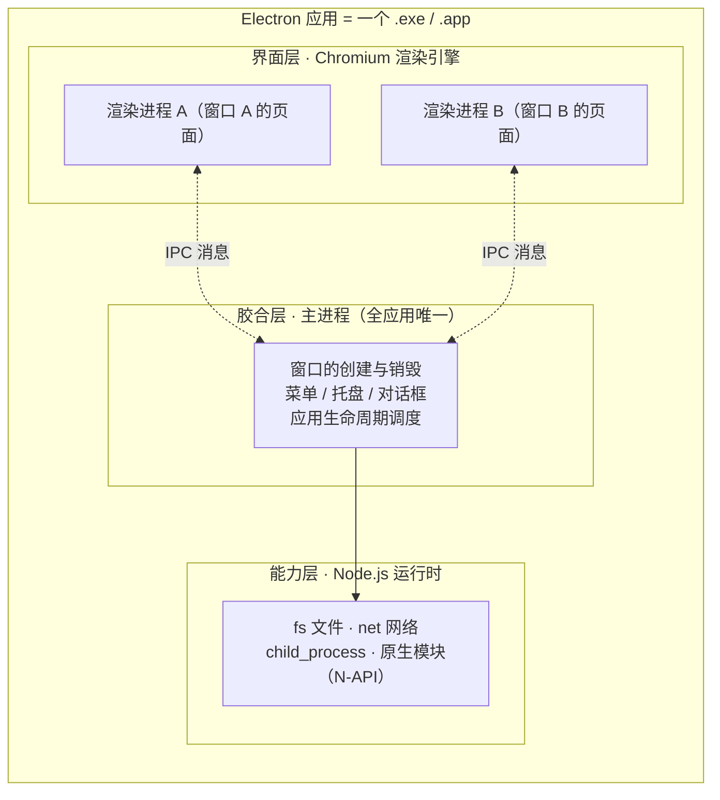

# Electron 是什么

> **一句话本质：Electron 是一个「应用外壳框架」——把 Chromium 渲染引擎和 Node.js 运行时打包进同一个可执行文件，让你用 Web 技术写界面、用 Node 能力调系统，产出一个跨平台的桌面应用。**

读完这一篇，你会得到三个判断力：看清 Electron 内部的三层结构（后续所有章节都建立在这个结构上）；能对照自己的需求判断「该不该用 Electron」；能跑起来一个最小应用，并且说出每一行代码的职责。

## 心智模型：一个可执行文件里的三层世界

把一个 Electron 应用拆开看，里面是三层职责分明的结构：



| 层 | 由谁提供 | 干什么 | 不干什么 |
| --- | --- | --- | --- |
| 界面层 | Chromium | 渲染 HTML/CSS、执行页面 JS，每个窗口一个进程 | 不直接碰文件系统、不调系统 API（默认配置下） |
| 胶合层 | Electron 主进程 | 管窗口生命周期、串起系统 API、协调所有渲染进程 | 不画界面（主进程没有 DOM） |
| 能力层 | Node.js | 文件读写、网络、子进程、加载 C++ 原生模块 | 不决定「谁能用它」——这由胶合层控制 |

这套结构回答了 Electron 的根本问题：**浏览器没有的能力（读写磁盘、调系统对话框、常驻托盘），由谁补上？** 答案是 Node 补能力、主进程做调度、渲染进程专心画界面。三层之间的通信规则（为什么只能 IPC、为什么默认禁 Node），是[进程模型](/guide/02-process-model)一章的主题。

## 谁在用 Electron

判断一个技术方案是否值得投入，先看它的存量用户：

- **Visual Studio Code**：微软的编辑器，大概是 Electron 最成功的门面，证明了大型、长周期、高性能要求的工具型应用可以跑在 Electron 上
- **Slack / Discord**：长期驻留、多团队/多服务器、语音视频，典型的「重通信客户端」形态
- **Figma 桌面版**：设计工具对渲染性能要求极高，桌面版承担了比浏览器 Tab 更重的实时协作负载
- **Notion / Obsidian / 1Password**：知识管理与密码管理类，核心诉求是本地数据与系统级集成

这份名单说明两件事：Electron 能承载生产级的严肃软件；同时这些应用大多是「每天开着不关」的重客户端——这正是 Electron 的舒适区。

## 与其他桌面方案对比

Electron 不是唯一选择。同样用 Web 技术做桌面应用，主流还有三条路：

| 维度 | Electron | Tauri | NW.js | 系统 WebView（WebView2 / WKWebView） |
| --- | --- | --- | --- | --- |
| 内核来源 | 自带 Chromium，版本随 Electron 锁定 | 系统 WebView（Windows 用 WebView2，mac 用 WKWebView） | 自带 Chromium | 谁的壳就用谁的 |
| 包体积 | 大（100MB+ 起步，含完整 Chromium 与 Node） | 小（几 MB 到十几 MB，不带内核） | 大（同量级） | 小（复用系统组件） |
| 内存 | 较高（Chromium 全套 + Node） | 较低 | 较高 | 最低 |
| 原生能力 | Node 直接调，生态最全（N-API 模块海量） | Rust 后端，能力强但要写 Rust | Node 直接调 | 自己写绑定层，最费工 |
| 一致性 | 三平台渲染结果一致（内核锁定） | 依赖用户系统 WebView 版本，存在差异 | 一致 | 各平台行为差异大 |
| 生态成熟度 | 十年积累，打包/更新/崩溃收集方案齐全 | 快速成长中 | 维护放缓 | 按平台各自为战 |
| 学习成本 | 前端技能 + Node 即可 | 前端 + Rust 基础 | 同 Electron | 需要各平台原生开发知识 |

注意没有「谁赢」这一栏。体积和内存上 Electron 是劣势，内核一致性和生态上是优势——**你是在为自己的应用选择成本结构，而不是在选「更先进的那个」**。

## 什么场景该用 / 不该用

**该用：**

- 应用会长期驻留用户桌面（通信、协作、编辑器、监控面板类），首屏体积不是决策重点
- 团队是 Web 技术栈，需要一套代码覆盖 Windows / macOS / Linux
- 需要深度系统集成：全局快捷键、托盘、协议唤起、屏幕捕获、多窗口编排
- 界面复杂多变，但底层能力相对稳定（用 Web 画复杂界面最省人力）

**不该用（或先掂量）：**

- 一次性小工具、对安装包体积极其敏感（导流安装的场景）——Tauri 或原生方案更合适
- 极致性能的图形/音视频处理管线——渲染进程里跑不动的东西最终会逼你写 C++，那时 Electron 的「Web 开发效率」红利消失大半
- 纯内容展示类「套壳网站」——如果只是把线上站点包起来，先问自己一个 PWA 或浏览器书签是不是已经够了

::: exp
一个真实的选型判断：**长生命周期的大型桌面客户端（需要深度系统集成、多媒体、多窗口编排），Electron 仍是稳妥选择；轻工具类应用，Tauri 值得优先评估。** 判断依据不是「哪个技术新」，而是三件事：你的团队有没有 Rust 技能储备（Tauri 的原生能力要写 Rust）；你的应用生命周期有多长（五年以上的大型应用，Electron 十年积累的更新、签名、崩溃收集方案能省大量自建成本）；你的用户环境是否可控（内核锁定意味着你不用排查「某用户系统 WebView 版本太旧」这类问题）。技术选型里，「生态已经踩过的坑」往往比「新方案的性能数字」更值钱。
:::

::: pitfall
新手最常见的认知偏差：把 Electron 理解成「给网站套个壳」，于是 `main.js` 里直接 `win.loadURL('https://你的线上地址')` 完事。这样做的问题会在三个月后集中爆发：断网就白屏（没有本地容错页）、线上一个 XSS 就能通过不安全的 IPC 链摸到用户磁盘（见[安全模型](/guide/04-security)）、用户关掉窗口应用就没了（没处理生命周期）。Electron 的正确打开方式是「**本地优先**」：界面资源打包在应用内，网络数据通过受控的 IPC 通道进出，而不是把整个应用押在一个远程页面上。
:::

## 最小可运行示例：30 行看懂全貌

下面这个应用只有一个窗口、一个按钮，但五脏俱全——它就是后续所有章节的骨架。三个文件放在同一目录：

```text
my-app/
├── package.json
├── main.js        # 主进程入口：应用的心脏
├── preload.js     # 桥梁脚本：连接主进程与页面
└── index.html     # 界面：就是普通网页
```

**package.json**——告诉 Electron 从哪启动：

```json
{
  "name": "my-app",
  "version": "1.0.0",
  "main": "main.js"
}
```

`main` 字段指向主进程入口。Electron 启动后第一件事就是加载并执行这个文件。

**main.js**——主进程，逐段精讲：

```js
// 从 electron 包解构出两个对象：
// app 控制应用生命周期，BrowserWindow 用来创建窗口
const { app, BrowserWindow } = require('electron')
const path = require('node:path')

// 窗口创建逻辑封装成函数，因为「创建窗口」会发生多次：
// 首次启动一次、macOS 点 Dock 图标再进一次
const createWindow = () => {
  const win = new BrowserWindow({
    width: 800,
    height: 600,
    webPreferences: {
      // preload 脚本在页面加载前执行，
      // 是页面获得「受控系统能力」的唯一入口
      preload: path.join(__dirname, 'preload.js')
    }
  })

  // 加载本地文件。生产应用应始终 loadFile 本地资源，
  // 而不是 loadURL 远程页面（原因见上方坑位）
  win.loadFile('index.html')
}

// ready 事件：Electron 底层初始化完成，此时才能创建窗口。
// whenReady() 是 promise 风格的等法，比 app.on('ready') 更利于链式编排
app.whenReady().then(() => {
  createWindow()

  // macOS 专属：应用常驻内存，点 Dock 图标但窗口已全关时，
  // 需要重建窗口（Windows/Linux 上应用早就退出了）
  app.on('activate', () => {
    if (BrowserWindow.getAllWindows().length === 0) createWindow()
  })
})

// 所有窗口关闭时触发。Windows/Linux 的惯例是「关窗即退出」，
// macOS 的惯例是「关窗但应用还在」，所以这里区分平台
app.on('window-all-closed', () => {
  if (process.platform !== 'darwin') app.quit()
})
```

这 30 行里藏着本站认知篇的全部主题：`whenReady` 与 `window-all-closed` 是[生命周期](/guide/03-lifecycle)的入口；`webPreferences` 是[安全模型](/guide/04-security)的旋钮；主进程与页面「不在一个世界」是[进程模型](/guide/02-process-model)的核心。

**preload.js**——桥梁，先记住形态，细节在[安全模型](/guide/04-security)展开：

```js
// contextBridge 把主进程的能力「翻译」成一个受控对象挂到 window 上，
// 页面拿到的是白名单接口，而不是 Node 的全部能力
const { contextBridge, ipcRenderer } = require('electron')

contextBridge.exposeInMainWorld('desktop', {
  // 页面只能调用你声明的接口，传什么参数、发到哪个频道都由你把关
  getAppInfo: () => ipcRenderer.invoke('app:get-info')
})
```

**index.html**——界面，与普通网页唯一的区别是多了一个 `window.desktop`：

```html
<!DOCTYPE html>
<html lang="zh-CN">
<head>
  <meta charset="UTF-8" />
  <title>我的第一个 Electron 应用</title>
</head>
<body>
  <h1>Hello Electron</h1>
  <button id="btn">获取应用信息</button>
  <script>
    // 注意：这里用的是 preload 暴露的 window.desktop，
    // 而不是任何 Node API——页面里根本没有 Node
    document.getElementById('btn').addEventListener('click', async () => {
      const info = await window.desktop.getAppInfo()
      console.log(info)
    })
  </script>
</body>
</html>
```

运行方式：

```bash
# 初始化并安装 electron（仅为开发依赖，不打进应用）
npm init -y
npm install --save-dev electron

# 启动
npx electron .
```

窗口弹出来的那一刻，实际发生的事是：主进程启动 → Chromium 初始化 → 渲染进程拉起 → preload 执行 → 页面加载。这条链路每一环的细节，接下来三章逐一展开。

## 延伸阅读

- [Electron 官方文档首页（含介绍与核心概念）](https://www.electronjs.org/docs/latest/)
- [安装指南（各平台依赖与镜像源）](https://www.electronjs.org/docs/latest/tutorial/installation)
- [官方示例库（各种能力的最小可运行样例）](https://www.electronjs.org/docs/latest/tutorial/examples)
- [BrowserWindow API（窗口的全部配置项）](https://www.electronjs.org/docs/latest/api/browser-window)
