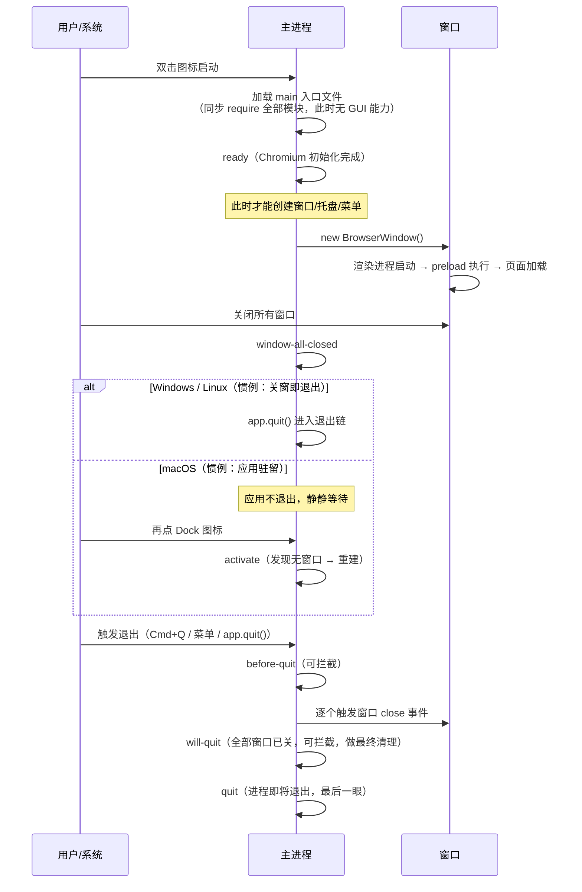

# 应用生命周期

> **一句话本质：一个 Electron 应用就是一条 `app` 事件流——从 `ready` 到 `quit`，启动顺序、窗口重建、退出时机、清理钩子，全部的坑都藏在这条流的触发条件里。**

读完这一篇，你可以准确地回答四个问题：代码为什么不能在 `ready` 之前建窗口；关掉最后一个窗口后应用为什么「还活着」（或该不该活着）；用户点退出时哪些钩子会依次触发、哪些清理逻辑该放哪个钩子；第二实例启动时如何把参数转交给已在运行的实例。这些答案组成了桌面应用区别于网页的「生命感」。

## 心智模型：一张事件时序图



把这张图钉在脑子里，下面每一节都是在展开其中一段。

## 启动阶段：ready 之前不要碰 GUI

主进程入口文件被加载时，Electron 还没有完成底层初始化——创建窗口、托盘、菜单这些 GUI 能力要等 `ready` 事件。在 `ready` 之前调用它们，轻则报错，重则直接崩溃。

```js
const { app, BrowserWindow } = require('electron')

// ✗ 错误：顶层直接建窗口。模块加载发生在 ready 之前，
// 大概率抛 "Cannot create BrowserWindow before ready"
// const win = new BrowserWindow()

const createWindow = () => {
  const win = new BrowserWindow({ width: 800, height: 600 })
  win.loadFile('index.html')
}

// 方式一：promise 风格（推荐，便于链式编排启动序列）
app.whenReady().then(createWindow)

// 方式二：事件风格（完全等价）
// app.on('ready', createWindow)
```

两个实战细节：

1. **模块顶层代码 = 启动期同步代码**。入口文件顶部 `require` 的每个模块都会同步执行，任何一个模块顶层有重活（读大文件、建网络连接），用户看到窗口的时间就被拖长。原则：模块顶层只做声明，活儿搬进函数。
2. **`ready` 前不是什么都不能干**。注册协议、解析命令行参数、抢占单实例锁（见下文）恰恰应该放在 `ready` 之前——越早判断「我是不是第二实例」，越早退出，用户感知越好。

## 运行阶段：window-all-closed 与 activate

### window-all-closed：三个平台的分歧点

所有窗口关闭时触发一次。此时你的应用是否退出，**应该遵循平台惯例而不是个人喜好**：

```js
app.on('window-all-closed', () => {
  // Windows / Linux：用户关掉最后一个窗口，预期就是应用退出
  if (process.platform !== 'darwin') {
    app.quit()
  }
  // macOS：什么都不做。应用继续驻留，
  // 等用户从 Dock 重新进入（下一次 activate）
})
```

### activate：macOS 的「复活」入口

macOS 上用户点 Dock 图标时触发。若此时没有任何窗口（用户之前把窗口全关了），按惯例要重建一个：

```js
app.on('activate', () => {
  // 有窗口就什么都不做（只是切回前台）
  // 没窗口就重建主窗口
  if (BrowserWindow.getAllWindows().length === 0) {
    createWindow()
  }
})
```

`activate` 在每次点 Dock 时都会触发（包括应用已在前台时），所以判断条件「当前窗口数是否为 0」不可省略，否则会开出重复窗口——这是新手在 macOS 上最常见的 bug 之一。

### 顺带一提：窗口关闭 ≠ 窗口销毁

macOS 惯例里「关窗口」往往只是隐藏。如果你希望窗口关闭后可以快速恢复（保留 DOM 状态），可以拦截 `close`：

```js
win.on('close', (e) => {
  if (!app.isQuitting && process.platform === 'darwin') {
    e.preventDefault()      // 阻止真正销毁
    win.hide()              // 只隐藏，DOM 状态还在
  }
})
// activate 时不用 createWindow，改为 win.show() 复活
```

`app.isQuitting` 不是官方 API，而是下文「拦截退出：最小化到托盘」小节里自己维护的标记。

## 退出阶段：一条链上的四个钩子

正常退出（`app.quit()`、菜单退出、Cmd+Q）会依次经过：

| 事件 | 触发时机 | 典型用途 | 能否拦截 |
| --- | --- | --- | --- |
| `before-quit` | 退出流程开始，**窗口尚未关闭** | 询问「有未保存修改吗」；拦截退出改为最小化到托盘 | 能（preventDefault） |
| 各窗口 `close` | 退出流程逐个关窗 | 二次确认保存；阻止某个窗口被关 | 能（preventDefault） |
| `will-quit` | 所有窗口已关，进程退出前 | 最终清理：flush 日志、停后台任务、释放单例锁 | 能（preventDefault） |
| `quit` | 即将退出，回天乏术 | 记录退出码、打点统计 | 不能 |

钩子顺序决定逻辑归属：**「拦不拦」问 before-quit，「收不收尾」问 will-quit**。

```js
// 收尾逻辑的标准位置：will-quit
// （放 window-all-closed 里在 macOS 上永远不会执行——那里根本不退出）
app.on('will-quit', async (e) => {
  // 清理是异步的？先拦一下，做完再走
  e.preventDefault()
  await flushLogs()          // 把缓冲日志写盘
  await stopBackgroundJobs() // 通知后台任务退出
  app.exit(0)                // 清理完成后显式退出
})
```

### 拦截退出：最小化到托盘

很多常驻型应用（下载器、IM）的惯例是「点关闭不退出，收进托盘」：

```js
const { app, Tray, Menu } = require('electron')

// 自维护的「真的要退出」标记
app.isQuitting = false

app.on('before-quit', (e) => {
  if (!app.isQuitting) {
    e.preventDefault()   // 拦下这次退出
    mainWindow.hide()    // 假装被关闭，实际收进托盘
  }
  // isQuitting 为 true 时放行，走正常退出链
})

// 托盘菜单里的「退出」项：
// quit: () => { app.isQuitting = true; app.quit() }
```

注意这个模式的配合关系：`before-quit` 拦截 + 窗口 `close` 事件里也要判断 `isQuitting`（否则点窗口红叉会直接销毁窗口）。两个钩子共享一个标记，这是该模式的固定套路。

## 退出不止一条路：四种路径的差别

| 路径 | 触发方式 | before-quit / will-quit | 适用场景 |
| --- | --- | --- | --- |
| 正常退出链 | `app.quit()`、Cmd+Q | ✅ 依次触发 | 一切用户主动退出 |
| 立即退出 | `app.exit(code)` | ❌ 全部不触发 | 清理完成后收尾；致命错误快速止损 |
| 渲染进程崩溃 | 页面崩溃（OOM、bug） | 不触发（主进程健在） | 监听后重建窗口或引导重启 |
| 主进程崩溃 / 被系统杀 | 原生崩溃、OOM Killer | ❌ 没有任何机会 | 只能靠崩溃收集（Minidump）事后分析 |

渲染进程崩溃的处理是常被忽略的一环——主进程还活着，正是自救的窗口：

```js
const { app, BrowserWindow } = require('electron')

const win = new BrowserWindow({ width: 800, height: 600 })

// Electron 9+：渲染进程消失（崩溃或被杀）时触发
win.webContents.on('render-process-gone', (_e, details) => {
  console.log('渲染进程异常退出', details.reason)
  // reason: 'oom'（内存耗尽）、'crashed'（崩溃）、'killed' 等

  if (details.reason === 'oom') {
    // 大内存页面 OOM 重载大概率还会 OOM，应引导用户或降级
    showErrorDialog('内存不足，建议关闭部分标签页后重试')
  } else {
    // 普通崩溃：重载页面自救
    win.webContents.reload()
  }
})
```

::: exp
两条生产验证过的经验。**第一，清理逻辑永远放 `will-quit` 而不是 `window-all-closed`**——后者在 macOS 上根本不触发（应用驻留），而前者在所有平台的正常退出链上都会经过。日志 flush、数据库关闭、注销全局快捷键这些收尾动作，位置错了就是「Windows 上正常、Mac 上丢数据」的跨平台 bug。**第二，Windows 关机/注销走的不是普通退出链**：系统留给应用的时间预算极短，且不保证完整跑完 before-quit → will-quit（历史上存在过 Windows 专属的 `session-end` 事件，如今已从官方文档移除，不要再依赖它）。正确姿势是把「关键数据随时可丢」当作前提：平时就写穿落盘，而不是攒在内存里等关机时从容保存——用户会替你验证「来不及」三个字怎么写。
:::

::: pitfall
`app.exit(0)` 是「立刻死，不告别」：所有窗口立即关闭，`before-quit`、`will-quit`、`quit` 一个都不触发。它适合的场景恰恰是——你已经在上游钩子里做完了所有清理，需要确保进程确定性退出时（比如 `will-quit` 里 `preventDefault` 后做完异步清理，用 `app.exit(0)` 收刀）。最常见的翻车姿势是在业务代码里随手 `app.exit()` 当「重启应用」用，结果未保存状态、缓冲日志、后台任务全部横死。分不清两者时，默认用 `app.quit()`——它会走完整个事件链，给每个钩子执行的机会。
:::

## 单实例模式：第二实例的参数转交

桌面应用的一个基本预期：双击图标两次，不应该开出两个应用（两个实例抢锁文件、抢托盘、抢端口）。解法是 `requestSingleInstanceLock`：

```js
const { app, BrowserWindow } = require('electron')

// 请求单实例锁。返回 false 说明已经有一个实例在运行，
// 此时最正确的动作是尽快退出，把舞台让给老实例
const gotTheLock = app.requestSingleInstanceLock()

if (!gotTheLock) {
  app.quit()
} else {
  // 老实例在这里监听「第二实例启动」事件
  app.on('second-instance', (_e, argv, workingDirectory) => {
    // 第二实例的完整命令行参数在 argv 里。
    // 典型场景：用户在文件管理器双击了关联文件，
    // 或通过自定义协议（myapp://open?file=xx）唤起
    const deepLink = argv.find((arg) => arg.startsWith('myapp://'))

    if (deepLink && mainWindow) {
      mainWindow.webContents.send('open-from-deeplink', deepLink)
    }

    // 无论有没有参数，都把窗口拉到用户面前
    if (mainWindow) {
      if (mainWindow.isMinimized()) mainWindow.restore()
      mainWindow.show()
      mainWindow.focus()
    }
  })

  // 正常启动流程放在拿到锁之后
  app.whenReady().then(() => {
    mainWindow = new BrowserWindow({ width: 800, height: 600 })
    mainWindow.loadFile('index.html')
  })
}
```

这个模式把「第二实例」从一个 bug 变成了一个功能入口：从浏览器唤起、从文件双击唤起、从命令行唤起，全部经由 `second-instance` 的 `argv` 进入老实例。`requestSingleInstanceLock` 本身也支持传 `additionalData`（一个随锁附带的对象），用于第二实例给老实例带私货（如唤醒来源标记），需要更复杂上下文时用它替代解析裸 argv。

## 延伸阅读

- [app API 文档 · Events 章节（本章所有事件的权威定义）](https://www.electronjs.org/docs/latest/api/app)
- [进程模型（生命周期发生在哪个进程）](https://www.electronjs.org/docs/latest/tutorial/process-model)
- [BrowserWindow API（close 事件与窗口生命周期）](https://www.electronjs.org/docs/latest/api/browser-window)
- [官方示例库（含单实例等常见模式）](https://www.electronjs.org/docs/latest/tutorial/examples)
