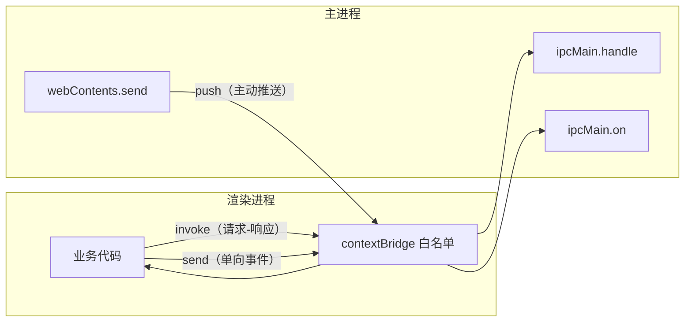

# IPC 通信

> **一句话本质**：Electron 的进程之间是两台「隔着一根电缆的机器」——IPC 是唯一的电缆，你能传什么、传多快、怎么不短路，就是本章全部内容。

读完本章你会获得：三种官方通信模式的选型判断、一套可直接抄走的生产级 IPC 工具箱（安全发送、反向请求、跨进程共享对象、高频事件批量下发），以及通道命名与类型安全的演进方向。

## 心智模型：一根电缆，三种走线方式



| 模式 | API 组合 | 语义 | 适用 |
|---|---|---|---|
| 请求-响应 | `invoke` / `handle` | 返回 Promise，支持错误传播 | 90% 的场景：读文件、弹对话框、调系统 API |
| 单向事件 | `send` / `on` | 触发即忘 | 日志上报、状态通知、埋点 |
| 主进程推送 | `webContents.send` / `on` | 服务端主动 | 数据变更广播、后台任务进度 |
| 端口直连 | `MessageChannelMain` / `postMessage` | 长期专用通道 | 渲染进程之间、高频流式数据 |

**为什么只有这几种**：进程间数据要经过**结构化克隆算法**序列化——函数、Class 实例、DOM 节点、`Proxy` 都传不过去。能传的是 JSON 能表达的东西加少数例外（`ArrayBuffer`、`MessagePortMain`）。这不是限制，是安全边界的一部分：渲染进程被攻破时，攻击者拿不到主进程的代码，只能拿到你显式暴露的接口。

## 机理与最小示例

### 模式一：invoke / handle（默认选择）

```js
// 主进程 main.js
const { ipcMain, dialog } = require('electron')

ipcMain.handle('fs:chooseFile', async (_event, filters) => {
  // handle 的返回值会 resolve 渲染进程的 invoke Promise
  // 抛出的 Error 会 reject（message 会被序列化传回）
  const { canceled, filePaths } = await dialog.showOpenDialog({
    filters: filters ?? [{ name: '图片', extensions: ['png', 'jpg'] }]
  })
  return canceled ? null : filePaths[0]
})
```

```js
// preload.js —— 永远做白名单转发，永不透传 ipcRenderer
const { contextBridge, ipcRenderer } = require('electron')

contextBridge.exposeInMainWorld('api', {
  chooseFile: (filters) => ipcRenderer.invoke('fs:chooseFile', filters)
})
```

```js
// 渲染进程
const file = await window.api.chooseFile()
```

### 模式二：send / on（事件）

```js
// 主进程：向窗口推送
win.webContents.send('update:progress', 0.6)

// preload：事件订阅要返回取消函数，防止泄漏
contextBridge.exposeInMainWorld('events', {
  onProgress: (cb) => {
    const listener = (_e, progress) => cb(progress)
    ipcRenderer.on('update:progress', listener)
    return () => ipcRenderer.removeListener('update:progress', listener)
  }
})
```

### 模式三：MessagePort（两个渲染进程直连）

两个窗口之间高频通信时，让流量绕开主进程——主进程只做一次「介绍」：

```js
// 主进程：牵线后即离场
const { port1, port2 } = new MessageChannelMain()
win1.webContents.postMessage('pair:port', null, [port1])
win2.webContents.postMessage('pair:port', null, [port2])
// port1/port2 一经传递，主进程不可再用
```

官方教程：[MessagePorts in Electron](https://www.electronjs.org/docs/latest/tutorial/message-ports)。

## 生产级 IPC 工具箱

以下模式来自真实大型客户端的沉淀，按需取用。

### 守卫一：永远不裸调 `webContents.send`

窗口关闭的瞬间，主进程如果还在向它发消息，会抛出 `Object has been destroyed` 直接带崩主进程。这是多窗口应用的第一个崩溃来源。

```js
// utils/send.js —— 所有跨进程发送的唯一出口
function isSafeWebContents(wc) {
  return wc && !wc.isDestroyed() && !wc.isCrashed()
}

function send(wc, channel, ...args) {
  if (!isSafeWebContents(wc)) {
    // 记录 error 级日志后静默返回：窗口已死，这条消息本来也不该送达
    console.error(`[ipc] drop ${channel}: webContents unavailable`)
    return false
  }
  wc.send(channel, ...args)
  return true
}
```

::: exp 实战经验
把 `wc.send` 全部收敛到一个带守卫的函数里，是大型 Electron 代码库最便宜的稳定性投资——上线后这类崩溃直接归零。配套纪律：**业务代码永远不 import `webContents`，只 import 封装层**。
:::

### 守卫二：主进程反向调用渲染进程（自研 invoke）

`invoke` 是单向的：只有渲染进程能发起。当主进程需要向 UI 要数据（「这个危险操作用户确认了吗？」），需要自己搭一条反向 RPC：

```js
// 主进程 → 渲染进程的请求-响应
let invokeId = 0

function invokeRenderer(wc, channel, payload, timeout = 10_000) {
  return new Promise((resolve, reject) => {
    if (!isSafeWebContents(wc)) return reject(new Error('wc gone'))
    const id = ++invokeId
    const replyChannel = `${channel}:reply:${id}`
    // 用 once：回执只应到达一次
    ipcMain.once(replyChannel, (_e, { ok, data, error }) => {
      clearTimeout(timer)
      ok ? resolve(data) : reject(new Error(error))
    })
    const timer = setTimeout(() => {
      ipcMain.removeAllListeners(replyChannel)
      reject(new Error(`invokeRenderer timeout: ${channel}`))
    }, timeout)
    wc.send(channel, { id, payload })
  })
}

// 渲染进程侧（preload 暴露）：
// ipcRenderer.on('ask:confirm', (_e, { id, payload }) => {
//   const ok = await showConfirmDialog(payload)
//   ipcRenderer.send(`ask:confirm:reply:${id}`, { ok })
// })
```

三个不可省的细节：**递增 id**（并发请求不错乱）、**once**（天然防重复回执）、**超时清理**（渲染进程卡死时主进程不至于泄漏监听器）。

### 守卫三：高频事件的节流批量下发

渲染进程对接原生 SDK（IM 消息、行情推送、传感器数据）时，回调风暴每秒可达几十上百次。逐条 `send` 会把渲染进程的消息队列打爆，表现为 UI 卡顿。解法是**攒批**：

```js
// 主进程：150ms 时间窗内的高频回调合并成一次下发
function createThrottledSender(wc, channel, flushWindow = 150) {
  let queue = []
  let timer = null
  return (item) => {
    queue.push(item)
    if (timer) return          // 窗口内：只入队
    timer = setTimeout(() => { // 窗口外：批量 flush
      timer = null
      const batch = queue
      queue = []
      send(wc, channel, batch) // 用守卫版 send
    }, flushWindow)
  }
}

// 用法：SDK 回调 → sender(message)，渲染进程一次收到 messages: []
```

::: exp 实战经验
150ms 是消息类场景的实测甜点值：用户对「消息到达」的延迟感知阈值在 200ms 左右，再大的窗口会有可感知的迟滞，再小则批量化收益骤减。数据推送类（进度条）可放宽到 500ms，交互回路类（打字回显）不要用批量化。
:::

### 模式：跨进程共享对象（Proxy 桥）

设置项、登录态这类「两端都要读写」的状态，手写 get/set IPC 会产生几十条通道。用 `Proxy` 把 IPC 藏在对象语义后面，业务代码当普通对象用：

```js
// 主进程侧
const watchers = new Set()          // 已连接的渲染端
const store = { theme: 'dark', autoStart: true }

function setSharedObject(wc, obj) {
  return new Proxy(obj, {
    set(target, key, value) {
      target[key] = value
      // 写入即广播：所有观察的渲染端同步更新
      for (const w of watchers) send(w, 'store:changed', { key, value })
      return true
    }
  })
}
// 渲染端 getSharedObject 返回反向 Proxy：本地写 → send 回主进程
```

这是 Electron 版的「跨进程 reactive store」。注意它的边界：适合**低频、小体积**的配置类状态；大对象高频写入会退化为 IPC 风暴，那不是它的战场。

### 技巧：多窗口场景定位「调用方自己的窗口」

多个窗口复用同一组通道时（每个小窗都要「最小化我自己」），主进程用 `BrowserWindow.fromWebContents(e.sender)` 找到发起者，同一通道服务所有窗口：

```js
ipcMain.handle('win:minimizeSelf', (e) => {
  const win = BrowserWindow.fromWebContents(e.sender)   // 谁调用，操作谁
  win?.minimize()
})
```

比给每个窗口生成专属通道名干净得多。注意返回的 `win` 用前判空（窗口可能刚好已销毁）。

### 模式：启动参数直传（additionalArguments）

preload 执行最早的时序里，很多 IPC 通道还没就绪。把「启动即需要」的参数（用户数据路径、渠道号、初始路由）通过命令行参数传给渲染进程，是最可靠的通道：

```js
// 主进程建窗口时
new BrowserWindow({
  webPreferences: {
    additionalArguments: [`--app-data=${userDataPath}`, `--app-channel=stable`]
  }
})

// 渲染进程解析（process.argv 末尾就是这些参数）
const args = Object.fromEntries(
  process.argv.filter(a => a.startsWith('--app-'))
    .map(a => [a.slice(6).split('=')[0], a.split('=')[1]])
)
```

这是替代已废弃的 `remote` 模块、且不依赖任何 IPC 时序的标准做法。

## 通道设计规范

```js
// ❌ 演进失控型：散落的动词短语
'user-login'  'hideCurrentWindow'  'showSaveDialog2'

// ✅ 域前缀 + 常量枚举：一眼看出归属，重构可全局搜索
const IPC = {
  FsChooseFile: 'fs:chooseFile',
  FsSaveDialog: 'fs:saveDialog',
  WinHide: 'win:hide',
  StoreChanged: 'store:changed',
}
```

::: exp 实战经验
通道命名不必一步到位，但**新代码必须走「域前缀 + 枚举常量」**，老通道在路过时顺手迁移。类型安全同理：先用 TS 类型约束 preload 暴露的 API 签名（渲染层 `window.api` 的 `.d.ts`），通道 payload 类型可以后补——把类型定义集中在桥接层，业务层永远只见类型化接口。
:::

::: pitfall 坑位警报
三个常见坑：
1. **preload 里透传 ipcRenderer**（`exposeInMainWorld('ipc', ipcRenderer)`）等于放弃所有安全边界——渲染进程被 XSS 后攻击者可调用任意通道。
2. **handle 通道重复注册**会直接抛异常导致主进程崩溃，模块热重载/窗口重建场景要 `removeHandler` 或模块级单例。
3. **send 大对象**：结构化克隆是同步开销，超过几 MB 的数据（图片、音视频帧）应该走文件路径或 `ArrayBuffer` + `postMessage` transfer（零拷贝），而不是塞进 IPC payload。
:::

## 延伸阅读

- [Electron IPC 教程](https://www.electronjs.org/docs/latest/tutorial/ipc) —— 三种模式的官方姿势
- [contextBridge API](https://www.electronjs.org/docs/latest/api/context-bridge) —— 桥接层的能力边界（什么能暴露、什么不能）
- [MessagePorts 教程](https://www.electronjs.org/docs/latest/tutorial/message-ports) —— 渲染进程直连与零拷贝传输
- [webContents API](https://www.electronjs.org/docs/latest/api/web-contents) —— `send`/`postMessage`/`executeJavaScript` 的差异
