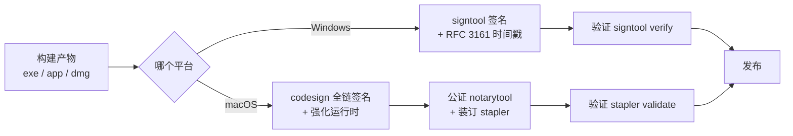
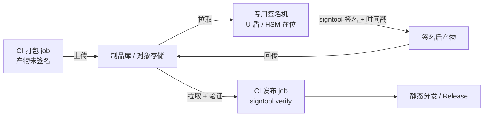

# 签名与公证

> **一句话本质**：签名的唯一作用是向操作系统证明「这个文件来自可验证的发布者」——不签名的代价是 Windows SmartScreen 警告、杀软误报率飙升，以及 macOS 直接拒绝运行。

读完本章你会获得：三平台签名机制的对照心智模型、Windows 与 macOS 的完整实操命令链、证书无法进 CI 时的远程签名架构（官方 hook 接入点），以及签名链上最容易被漏掉的环节。

## 心智模型：三平台机制对照

| 平台 | 机制 | 不签名的代价 | 关键动作 |
|---|---|---|---|
| Windows | Authenticode（OV / EV 证书） | SmartScreen「未知发布者」警告，杀软误报率显著升高 | `signtool` 签名 + 时间戳 |
| macOS | 全链签名 + 公证（notarization） | Gatekeeper 直接拦截，他人机器上无法打开 | `codesign` → `notarytool` → `stapler` |
| Linux | 无系统级强制 | 个别分发渠道有自选要求 | 可选 |



**证书类型（Windows）**：OV（组织验证）证书签出的应用需要靠下载量积累 SmartScreen 信誉，初期仍可能弹警告；EV（扩展验证）证书签出的应用**即时**获得 SmartScreen 信誉。这也是 EV 证书贵的核心原因。

## Windows 实操：signtool 与时间戳

```powershell
# 对安装器签名：
# /fd 文件摘要算法；/tr 时间戳服务器（RFC 3161）；/td 时间戳摘要算法
signtool sign /fd SHA256 /td SHA256 /tr http://timestamp.digicert.com ^
  /a "dist\MyApp-setup.exe"

# 发布前必须验证（/pa 用系统默认策略校验完整证书链）
signtool verify /pa /v "dist\MyApp-setup.exe"
```

要签的文件清单——比多数人想象的长：

- 安装器（setup.exe / .msi）
- 应用主程序 exe
- **NSIS 卸载器**（构建期生成，容易被遗忘）
- 随包分发的所有独立可执行文件（外置更新器、原生工具等）
- 自动更新体系里的**增量补丁文件**（如果更新器会校验签名，见下文实战经验）

## macOS 实操：签名 → 公证 → 装订

前提：在 Apple Developer 后台申请 **Developer ID Application** 证书（分发到商店之外用），并创建 App 专用密码用于公证。

```bash
# 1. 全链签名：--deep 由内到外；--options runtime 启用强化运行时（公证的硬性前提）
codesign --force --deep --options runtime --timestamp \
  --sign "Developer ID Application: COMPANY NAME (TEAMID)" \
  "dist/MyApp.app"

# 2. 验证签名完整性
codesign --verify --deep --strict --verbose=2 "dist/MyApp.app"

# 3. 凭据一次性存入钥匙串（避免明文密码进脚本）
xcrun notarytool store-credentials NOTARY_PROFILE \
  --apple-id "you@example.com" --team-id TEAMID

# 4. 提交公证并等待结果（--wait 会阻塞到出结论）
xcrun notarytool submit "dist/MyApp.dmg" \
  --keychain-profile NOTARY_PROFILE --wait

# 5. 装订公证票据：让离线机器也能验证（不装订 = 首次运行必须联网验证）
xcrun stapler staple "dist/MyApp.dmg"
xcrun stapler validate "dist/MyApp.dmg"
```

打包工具能替你做掉大部分：electron-builder / Forge 都支持配置证书后自动走「签名 → 公证 → 装订」全链。手工命令链的价值在于**理解每一步在验证什么**，出问题时知道从哪一步开始查。

## CI 远程签名架构（重点）

**场景**：证书私钥在硬件 U 盾 / HSM 里，或被策略限定只能在一台受管控的签名机上使用——私钥不能导出进 CI 环境。



**现代接入点**（不要自己 fork 打包工具魔改）：

```js
// forge.config.js —— Forge 7 / @electron/packager 的 windowsSign 钩子
// 每个待签文件都会回调一次，把签名动作完全代理给外部服务
module.exports = {
  packagerConfig: {
    windowsSign: {
      hookFunction: async (signParams, filePath) => {
        await remoteSign(filePath)  // 你的实现：上传 → 签名机签名 → 回传替换
      }
      // 或者用 hookModulePath 指向一个模块，避免配置文件里写实现
    }
  }
}
```

- Forge / packager：`windowsSign` 的 `hookFunction` / `hookModulePath` 是官方预留的远程签名口子。
- electron-builder：macOS 公证常用 `afterSign` 钩子接公证工具；Windows 签名可以配置自定义 sign 命令转发给签名服务。
- [`@electron/windows-sign`](https://www.npmjs.com/package/@electron/windows-sign)：官方抽出的 Windows 签名工具库，CI 里没有证书时也能构建出完整的签名链路（包括对接 Azure Trusted Signing 等托管服务）。

**签名后必须验证再发布**——这一步省不得：

```bash
signtool verify /pa /v app-setup.exe        # Windows：校验证书链与时间戳
codesign --verify --deep --strict MyApp.app # macOS：校验签名完整性
spctl -a -t exec --verbose MyApp.app        # macOS：模拟 Gatekeeper 检查
```

## Fuses：把完整性开关烧进可执行文件

Fuses 是编译进 Electron 可执行文件的开关，与签名配合使用才构成完整的完整性防线。与完整性最相关的两个：

```bash
# 读取 / 写入 fuses
npx @electron/fuses read --app MyApp.exe
npx @electron/fuses write --app MyApp.exe \
  --enable OnlyLoadAppFromAsar \
  --enable EnableEmbeddedAsarIntegrityValidation
```

- `EnableEmbeddedAsarIntegrityValidation`：启动时校验 asar 的完整性哈希，被篡改即拒绝启动。
- `OnlyLoadAppFromAsar`：禁止从散目录加载应用，配合上面的校验形成闭环。

注意：fuses 写入发生在**签名之前**（它修改了可执行文件本体），顺序错了签名就失效。

::: exp
整包签名链里最容易漏签的是两类「非主程序」文件：**增量更新补丁**和**外置 updater.exe**。心理上它们属于「更新体系」不属于「安装包」，但 SmartScreen 不做这种区分——漏签哪个，用户更新时就弹哪个的警告。发布前用脚本枚举产物里所有可执行与补丁文件逐一 `signtool verify`，比人工记忆清单可靠。

另一条排期经验：远程签名流水线（上传 → 签名机排队 → 签名 → 回传 → 验证）全流程额外耗时约 5~8 分钟，发布窗口和自动化超时阈值都要把这个计入，别按本地签名估算时间。
:::

::: pitfall
三个签名事故高发位：

1. **Windows 签名不加时间戳 = 证书过期后所有历史安装包报警**。时间戳（RFC 3161）的作用是证明「签名发生在证书有效期内」——没有它，证书一过期，用户机器上早就装好的应用也会开始弹警告。时间戳服务免费，但参数要显式传。
2. **macOS 只签 app 不公证**：签名只是第一步，macOS 10.15+ 的 Gatekeeper 对未公证应用默认直接拒绝打开。症状是「我自己机器上能跑（安装时点了允许）」，到用户机器上就拦——本地验证必须用 `spctl` 模拟陌生机器。
3. **签名后修改内容导致哈希不匹配**：哪怕改一个字节，签名即失效。铁律的顺序是：所有内容处理（补丁生成、资源注入、fuses 写入）全部完成 → 签名 → 验证 → 发布。任何「签完再顺手改点东西」都是事故。
:::

## 延伸阅读

- [代码签名官方教程](https://www.electronjs.org/docs/latest/tutorial/code-signing) —— 三平台签名要求与工具链总览
- [Mac App Store 提交指南](https://www.electronjs.org/docs/latest/tutorial/mac-app-store-submission-guide) —— 含公证（notarization）流程细节
- [@electron/windows-sign](https://www.npmjs.com/package/@electron/windows-sign) —— 官方 Windows 签名库（hook 与托管签名服务对接）
- [electron/fuses](https://github.com/electron/fuses) —— 可执行文件级开关的完整清单
- [electron-builder 代码签名](https://www.electron.build/docs/features/code-signing/) —— builder 生态的签名集成方式（macOS 公证、Windows 各证书类型分页）
