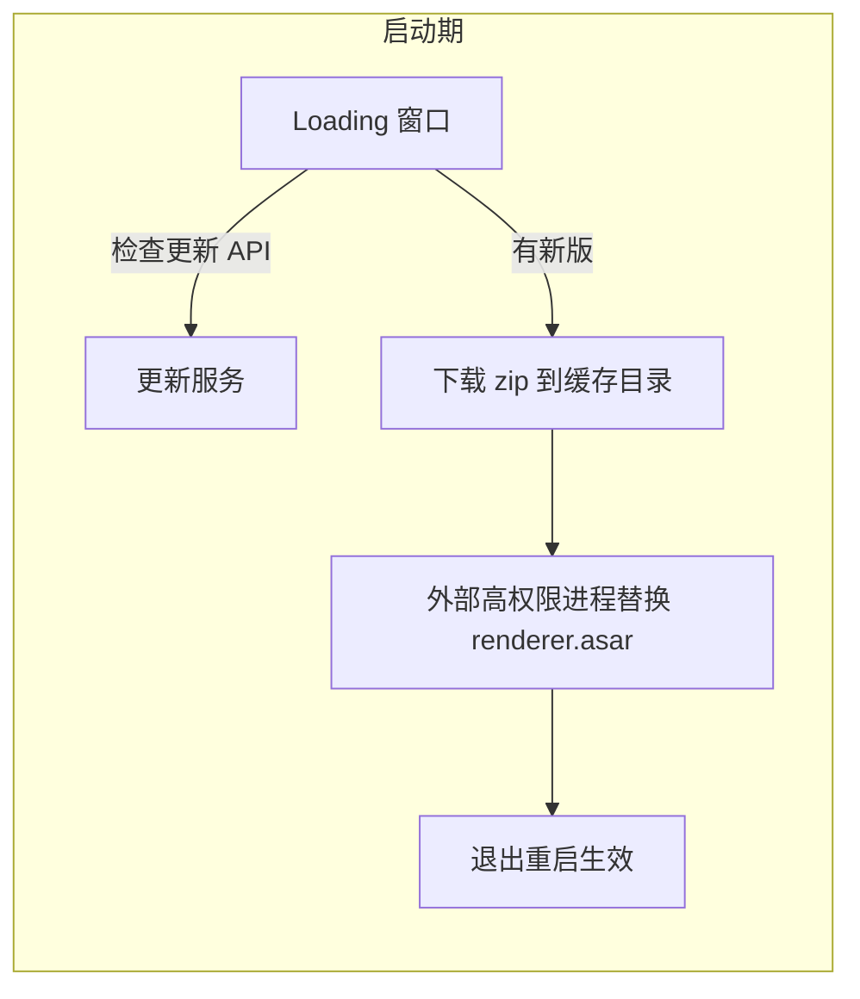

# 自动更新与热修复

> **一句话本质**：更新问题的本质是「如何安全地替换一个正在运行的程序」——把它拆成四层（整包更新 / 增量更新 / 渲染层热更新 / 运行时补丁），每层解决一个不同的时效需求。

读完本章你会获得：electron-updater 标准接入、增量更新的最小可行方案、渲染层热更新的完整架构（来自生产客户端的四件套设计），以及为什么「运行时补丁」要慎重的设计教训。

## 心智模型：四层时效光谱


| 层 | 替换什么 | 时效 | 代价 |
|---|---|---|---|
| 整包更新 | 整个安装目录 | 慢，需重装/重启 | 最稳，万能 |
| 增量更新（bsdiff） | 变更文件的二进制差量 | 中 | 需构建期生成补丁 |
| 渲染层热更新 | 单独打包的 renderer.asar | 快 | 架构上要拆主/渲染产物 |
| 运行时补丁（patch.js） | 内存中的 JS 逻辑 | 最快 | 安全与可维护性成本高 |

**核心决策**：不是四层都要做。多数应用只需要第一层；用户量大、发版频繁的应用加第二层；渲染层 bug 高发的团队值得第三层；第四层是极端场景的手术刀。

## 第一层：整包更新（electron-updater 标准链）

```yaml
# electron-builder.yml —— 声明更新源（generic 即静态文件服务器）
publish:
  - provider: generic
    url: https://your-cdn.example.com/releases/${os}/
```

```js
// 主进程
const { autoUpdater } = require('electron-updater')

function initUpdater() {
  autoUpdater.autoDownload = true
  autoUpdater.checkForUpdatesAndNotify()

  autoUpdater.on('update-downloaded', async () => {
    const { response } = await dialog.showMessageBox({
      type: 'info',
      message: '新版本已就绪',
      buttons: ['立即重启', '稍后']
    })
    if (response === 0) autoUpdater.quitAndInstall()
  })
}
```

要点：
- Windows（NSIS）与 macOS（需签名 zip）开箱即用；Linux 用 AppImage。
- `latest.yml` / `latest-mac.yml` 是版本清单，和安装包放同一目录，静态服务器即可，不需要后端。
- **差分下载**是内置的：electron-updater 会优先尝试下载 blockmap 差量。

官方教程：[Updates](https://www.electronjs.org/docs/latest/tutorial/updates)。

## 第二层：增量更新（构建期 bsdiff）

用户带宽有限（国内几十 MB 安装包、高频发版）时，全量下载不可接受。最小可行增量方案不依赖任何 SaaS：

```text
构建期：新版本发布时，对最近 N 个历史版本各生成一份补丁
  1. 下载旧版全量包解压
  2. 新旧目录逐文件 MD5 比对
  3. 差异文件中 > 1MB 的用 bsdiff 生成 .patch，小文件直接拷贝
  4. 输出 files.json 清单（路径 → patch/whole 标记）+ 打包 zip

运行期：客户端按「当前版本 → 目标版本」请求补丁
  下载 → 校验 → 逐文件应用 → 写入版本号 → 重启
```

::: exp 实战经验
两个生产级细节：
1. **补丁要覆盖「最近 N 个版本」而不是只有上一个**——用户不会每次都及时更新，跳版本是常态，N 取 3 是性价比点。
2. **增量包里要内嵌目标版本的最新渲染层产物**（如果你的渲染层可以独立热更，见下节）。否则增量用户升上来的主程序带着一份过期渲染层，两套更新体系互相踩。
:::

## 第三层：渲染层热更新（asar 整包替换）

把**渲染层单独打成 `renderer.asar`**，作为 `extraResources` 随安装包分发。运行时检测到新版直接替换这个文件——主程序不动、不重装、不用 UAC。

这是生产客户端验证多年的架构，完整四件套如下。

### 架构



### 件一：双版本号体系

```js
// 客户端持有两个版本号，查询 API 时同时上报
const CLIENT_VERSION = app.getVersion()   // 安装包版本（主程序）
let inlineVersion = '0.0.0'               // 渲染层热更版本（renderer.asar 内的 assets.json 记录）
// 服务端决策：只推热更（渲染层够修）还是必须整包升级（主进程也变了）
```

### 件二：版本缓存（免重复下载）

```js
// 按热更版本号分目录缓存下载产物
// userData/hot-update/v1.2.3/renderer.asar
// 启动时若缓存版本 > 当前安装的 inlineVersion，直接用缓存替换，跳过下载
```

### 件三：文件签名（防「替换到一半」的脏状态）

```js
// asar 替换是非原子操作：拷贝中途断电/崩溃会留下半个文件
// 用「安装目录 update.cfg 的 mtimeMs + 安装路径」组合做指纹：
// 指纹不匹配 = 上次替换未完成 → 丢弃缓存重新走完整流程
```

### 件四：外部进程替换（绕开文件锁）

运行中的 `renderer.asar` 被进程锁定，且 Windows 安装目录写权限需要管理员——**主进程自己替换不了自己正在用的文件**：

```text
方案：schtasks /create /tn replace_asar ...（Windows 计划任务）
以高权限独立进程执行拷贝 → 主进程 app.quit() → 计划任务完成替换 → 用户重启应用
```

::: pitfall 坑位警报
两个 asar 相关的隐蔽坑（都来自真实事故）：
1. **Electron 对 asar 内容有读取缓存**——替换 asar 文件后，不重启进程的话，部分读操作仍命中旧缓存。所以替换后必须 `app.quit()` 重启，不要试图热替换后 `loadFile` 刷新。
2. **构建期从 asar 内读文件要绕开 asar 虚拟文件系统**：`process.noAsar = true` 包住读取逻辑，否则 `fs.readFile` 会走 asar 拦截层拿到意外结果。用完记得改回 `false`。
:::

### 启动期更新的时序策略

更新检查放在 Loading 窗阶段，但**不能让更新阻塞启动**：

```js
// 同步等待更新，但 60 秒兜底：超时放行进主界面，包下次启动生效
await Promise.race([applyHotUpdate(), sleep(60_000)])
startMainWindow()
```

### 自建更新源：generic provider + 动态 latest.yml

electron-updater 的 generic provider 只需要一个返回 `latest.yml` 的 HTTP 端点——把它做成**动态生成**的端点，就获得了灰度发布能力，不需要任何 SaaS：

```text
请求：GET /releases/latest_win.yml
请求头：x-app-version: 3.2.1   ← autoUpdater.requestHeaders 携带
       x-channel: beta          ← 灰度/渠道标记（客户端 --prefer-staging 参数注入）

服务端（几十行 Express）：
  读配置中心 → 按版本/渠道/百分比 决定 返回哪个版本的 yml
  → 大安装包 URL 直接 302 到 CDN
  → Cache-Control: no-store（更新清单永远不能被缓存！）
  → 配置中心挂了 → fallback 返回静态兜底 yml（降级容错）
```

配套节奏：更新检查 30 分钟防抖 + 互斥锁防并发；除定时外挂 `browser-window-focus` 事件触发（用户不开后台也能及时检查）；**更新流程在首屏加载完成后才初始化**，不抢启动资源。

## 第四层：运行时补丁（设计参考 + 教训）

秒级止血的思路：下发一个 IIFE 补丁脚本，在渲染层启动时执行，覆盖指定函数/常量。设计要点（来自一份完整但最终未落地的生产设计文档）：

- **白名单 API**：补丁只能通过 `meta`（版本窗口）/ `data`（静态数据覆盖）/ `func`（函数包装）/ `flag`（功能开关）四个口子操作——不是任意 eval。
- **版本窗口**：`minAppVersion / maxAppVersion` 限定适用范围，防止旧补丁打到新版本上。
- **完整性**：SHA-256 校验 + CDN 下载 3 秒超时静默跳过（补丁失败绝不能影响启动）。
- **适用矩阵**：静态数据映射表 ✅、轻逻辑修正 ✅、UI 结构变更 ❌、涉及鉴权加密 ❌。

::: exp 实战经验（反面）
为什么这套设计最终没有落地？因为与第三层相比：渲染层热更新已经能分钟级修复且「改完即生效于下次重启」，而运行时补丁的 eval 本质让安全评审成本、测试矩阵（补丁 × 版本组合爆炸）双双失控。**教训：更新体系做三层以内，把「快一分钟的止血」交给渲染层热更 + 服务端开关（feature flag），而不是运行时代码注入。**
:::

## 更新失败的兜底

任何更新机制都要回答「更新链路本身坏了怎么办」：

| 故障 | 兜底 |
|---|---|
| 更新服务器不可达 | 静默降级继续启动，下次再试（更新永远不能阻塞使用） |
| 下载文件损坏 | zip/asar 校验失败即弃缓存重下 |
| 替换进程失败 | 文件签名检测（件三）自动回退完整流程 |
| 新版本启动即崩 | 版本回退标记：崩溃连续 N 次后拉起旧版/提示重装 |

## 延伸阅读

- [Updates 官方教程](https://www.electronjs.org/docs/latest/tutorial/updates) —— 各平台更新机制总览
- [autoUpdater API](https://www.electronjs.org/docs/latest/api/auto-updater)
- [electron-updater 文档](https://www.electron.build/auto-update)（electron-builder 生态）
- [Squirrel.Mac / Squirrel.Windows](https://github.com/Squirrel/Squirrel.Windows) —— Electron 默认更新器的底层
- [bsdiff / bspatch](https://www.daemonology.net/bsdiff/) —— 二进制差分工具鼻祖
