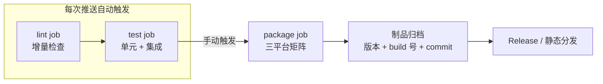

# CI/CD 与无头测试

> **一句话本质**：Electron CI 的特殊问题只有一个——GUI 依赖显示器；Linux 无头环境用 xvfb 虚拟出一个 X server 即可解决，其余都是常规 Node 流水线。

读完本章你会获得：xvfb 的原理解释、一份可直接抄的 GitHub Actions 三平台矩阵 workflow、打包 job 的拆分与手动触发策略、产物命名与静态分发 URL 的设计范式，以及「不同 job 用不同 Node 版本」这类看似技术债实则正确决策的论证。

## 心智模型：流水线分层



核心原则：**变更频率不同的动作分到不同 job**。lint 和单元测试每次推送都要跑（分钟级、高频）；打包是「准生产动作」——产物要进分发渠道、要消耗签名配额，按需手动触发；E2E 冒烟跟着打包走。

## xvfb：为什么无头环境跑不了 Electron

Linux 上 Chromium 的渲染进程与 GPU 进程在启动时需要连接一个 X server（`DISPLAY` 环境变量指向的显示服务）。开发者本机有桌面会话所以无感；CI 容器里没有物理显示器，Electron 启动即报 `Missing X server` / `cannot open display` 然后以非零码退出。

**Xvfb（X virtual framebuffer）** 是一个在内存中实现的 X server：完整实现了 X11 协议，只是不把画面投到任何真实屏幕上。对 Electron 来说，「有 display 可以连」这件事就成立了。

```bash
# xvfb-run 包一层：-a 自动挑选空闲的 display 号，避免并发任务冲突
xvfb-run -a npm test
```

容器环境还有两个常见搭配：

```bash
# 容器内 user namespace 受限时，Chromium 沙箱初始化会失败，需关沙箱
xvfb-run -a npx electron --no-sandbox main.js
```

- `--no-sandbox` 只建议在 CI 容器里用，不要带进生产配置。
- 用 Playwright 跑 Electron 时，Playwright 自带 xvfb 处理（Linux 上自动包一层），无需手动 `xvfb-run`。

官方文档：[Testing on Headless CI](https://www.electronjs.org/docs/latest/tutorial/testing-on-headless-ci)。

## GitHub Actions 完整 workflow

```yaml
# .github/workflows/build.yml —— 三平台矩阵：lint / test / package 分离
name: build

on:
  push:
    branches: [master]
  workflow_dispatch: {}        # 支持手动触发（打包 job 依赖它）

jobs:
  lint:
    runs-on: ubuntu-latest
    steps:
      - uses: actions/checkout@v4
        with:
          fetch-depth: 0        # 增量 lint 需要完整的 diff 基准（见下文）
      - uses: actions/setup-node@v4
        with: { node-version: 22 }   # lint 环境可以追新
      - run: npm ci
      - run: npm run lint

  test:
    strategy:
      matrix:
        os: [ubuntu-latest, windows-latest, macos-latest]
    runs-on: ${{ matrix.os }}
    steps:
      - uses: actions/checkout@v4
      - uses: actions/setup-node@v4
        with: { node-version: 22 }
      - run: npm ci
      - run: xvfb-run -a npm test
        if: runner.os == 'Linux'        # 只有 Linux 需要 xvfb
      - run: npm test
        if: runner.os != 'Linux'

  package:
    needs: [lint, test]                 # 前置关卡通过才有资格打包
    if: github.event_name == 'workflow_dispatch'   # 只手动触发
    strategy:
      matrix:
        include:
          - { os: windows-latest, target: win }
          - { os: macos-latest, target: mac }
          - { os: ubuntu-latest, target: linux }
    runs-on: ${{ matrix.os }}
    steps:
      - uses: actions/checkout@v4
      - uses: actions/setup-node@v4
        with: { node-version: 20 }      # 打包环境刻意锁版本（见下文）
      - run: npm ci
      # 缓存 Electron 二进制：打包 job 从 10 分钟压到 3 分钟的关键
      - uses: actions/cache@v4
        with:
          path: ~/.cache/electron       # Windows 是 %LOCALAPPDATA%\electron\Cache
          key: electron-${{ hashFiles('package-lock.json') }}
      - run: npm run dist
      - uses: actions/upload-artifact@v4
        with:
          name: app-${{ matrix.target }}
          path: |
            dist/*.exe
            dist/*.dmg
            dist/*.AppImage
      - uses: softprops/action-gh-release@v2
        if: startsWith(github.ref, 'refs/tags/v')   # 打 tag 才发 Release
        with:
          files: dist/*
```

## 版本与产物管理

**产物命名规范**——文件名本身就是元数据：

```text
MyApp_2.1.0_b1024_a1b2c3d.exe
      │     │      └── commit 短 hash（8 位足够定位代码）
      │     └── CI 构建号（可追溯流水线日志）
      └── 语义化版本
```

**latest 指针文件**：静态分发目录里维护一个稳定的「最新版」入口，客户端更新检查与 QA 取包共用同一份真相：

```json
// https://dl.example.com/myapp/win/latest.json —— 永远指向最新 build
{
  "version": "2.1.0",
  "build": 1024,
  "commit": "a1b2c3d",
  "url": "https://dl.example.com/myapp/win/MyApp_2.1.0_b1024_a1b2c3d.exe"
}
```

**静态分发 URL 设计**：稳定入口（`/win/latest.json`）+ 按 build 号归档（`/win/b1024/`）两级结构。稳定入口给机器读，归档目录给人查——排查「某个用户某个版本的问题」时能直接取到当时的确切产物。

## 环境锁版本哲学

「两个 job 用不同 Node 版本」乍看是不一致的技术债，实际是正当决策：

| job | Node 版本策略 | 理由 |
|---|---|---|
| lint / test | 可以追新 | 尽早暴露新版 Node 的行为变化，失败成本只是红一条 CI |
| package | 刻意锁旧、稳定优先 | 原生依赖（node-gyp 编译）对 Node 头文件版本敏感；V8 快照 / 字节码产物跨版本不兼容；打包环境的任何微小变化都会直接进入分发产物 |

打包环境升级应该是一次**显式的、单独验证的变更**（打出包 → 全量冒烟 → 再切），而不是某天跑流水线时被 Node 小版本升级悄悄带着走。

## 增量 lint：大仓遗留代码不挡新提交

有历史包袱的仓库里，全量 lint 必然是红的——存量问题不该阻塞增量提交。做法是只检查本次变更触碰的文件：

```bash
# 只 lint diff 涉及的文件（BASE_BRANCH 按团队主线分支定）
git diff --name-only origin/master...HEAD -- '*.js' '*.ts' | xargs -r npx eslint
```

关键前提：**diff 基准 commit 必须在浅克隆的可见历史里**。CI 默认浅克隆（`fetch-depth: 1`）拿不到 `origin/master...HEAD` 的合并基，必须设 `fetch-depth: 0` 或给一个足够大的深度。这是增量 lint「本地好好的、CI 上随机挂」的第一嫌疑人。

::: exp
QA 取包效率是被多数团队低估的工程问题。一套验证有效的设计：

1. 打包产物固定命名 `{app}_{env}_latest.exe` 覆盖上传到静态服务（latest 永远覆盖，历史版本在 build 归档目录）——测试同学拿到的是一个**永不变化的 URL**，收藏夹点一下就是最新包。
2. 构建日志末尾打印完整下载 URL（含 build 号归档链接）——从 IM 里点开日志就能取包，不用进 CI 系统翻制品页。
3. E2E 报告（HTML 报告、Playwright trace、失败截图）也归档到同一个静态服务，按 build 号索引——排查失败用例时，报错信息里带 build 号即可直达当时的完整现场。
:::

::: pitfall
1. **GitHub Actions 的 mac 签名**：证书导入 keychain 要用密码（`security import cert.p12 -P $KEYCHAIN_PASSWORD`），密码必须进 repo secrets；导入后还要 `security unlock-keychain` + `set-key-partition-list`，否则签名时报 `errSecInteractiveModeNotSupported`（CI 无交互界面，keychain 请求授权直接失败）。
2. **不缓存 Electron 二进制**：每次打包都从网络重新拉 ~100MB 平台 zip，打包 job 从 3 分钟膨胀到 10 分钟。`actions/cache` 缓存 `~/.cache/electron`（Windows 路径不同）是回报率最高的一行配置。
3. **xvfb 的错误形态**：没有包 xvfb-run 时，症状是 Electron 测试「无报错信息地静默失败」或进程挂起——因为渲染进程等不到 display。CI 里显式 `apt-get install xvfb`（GitHub Actions 的 ubuntu runner 已预装，自建 runner 常没有）。
:::

## 延伸阅读

- [Testing on Headless CI](https://www.electronjs.org/docs/latest/tutorial/testing-on-headless-ci) —— 无头环境的 xvfb 与浏览器参数官方指南
- [Automated Testing](https://www.electronjs.org/docs/latest/tutorial/automated-testing) —— 官方测试工具链（Playwright / WebdriverIO）总览
- [electron-builder 仓库的 CI 配置](https://github.com/electron-userland/electron-builder/tree/master/.github) —— 一个大型 Electron 工程的三平台流水线真实样例
- [GitHub Actions 文档](https://docs.github.com/actions) —— matrix / cache / artifact 机制参考
