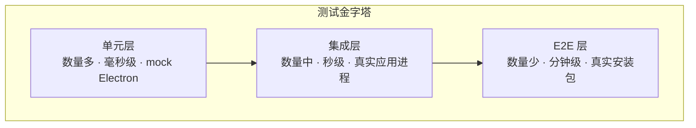

# 测试实践

> **一句话本质**：Electron 测试的难点是「三层代码三种测法」——主进程纯逻辑用单元测试、跨进程契约用集成测试、完整用户路径用 Playwright 驱动真实应用做端到端。

读完本章你会获得：一套按层分治的测试策略、Playwright 驱动 Electron 的完整示例与配置要点、mock Electron 模块的两种方式、适合规则引擎的数据驱动测试模式，以及「源码扫描式守卫」这类非常规但高效的手段。

## 心智模型：三层测试策略

| 层 | 测什么 | 工具 | 速度 | 反馈内容 |
|---|---|---|---|---|
| 单元测试 | 纯函数 / 规则引擎 / 工具函数（不碰 Electron API） | Vitest | 毫秒级 | 逻辑错了 |
| 集成测试 | 真实启动的应用：窗口创建、IPC 契约、启动关键路径 | Playwright `_electron` | 秒级 | 组装错了 |
| E2E 冒烟 | 完整安装包的安装 / 升级 / 卸载、核心用户流程 | Playwright + 安装脚本 | 分钟级 | 交付物错了 |



分层的依据不是「测试种类」这个教条，而是 Electron 的进程结构：主进程里大量逻辑本质是纯 JS（可以廉价地单测），窗口与 IPC 组装逻辑只有真实进程里才能验证（集成层），而安装包本身的完整性（签名、升级链）只有拿到产物才能验证（E2E 层）。

## 单元层：Vitest 与 mock Electron 的两种方式

主进程代码里总有一部分逻辑需要 Electron API（`app.getPath`、`ipcMain` 等），单测它们有两条路。

**方式一：Vitest alias 把 `electron` 指向 mock 实现**——适合被测代码已经直接 import electron 且不便改动的情况：

```js
// vitest.config.js —— 把 electron 模块整体替换为 mock
import { resolve } from 'node:path'
export default {
  resolve: {
    alias: {
      electron: resolve(__dirname, 'tests/mocks/electron.ts')
    }
  }
}
```

```ts
// tests/mocks/electron.ts —— 只 mock 被测代码用到的那部分
import { vi } from 'vitest'

export const app = {
  getPath: (name: string) => `/tmp/electron-mock/${name}`,  // 稳定可断言的假路径
  getVersion: () => '0.0.0-test'
}
export const ipcMain = {
  handle: vi.fn(),   // 可断言「注册了哪些通道」
  on: vi.fn()
}
```

**方式二：依赖注入分层**——把「纯逻辑」与「Electron API 调用」写进不同模块，API 以参数形式传入。这是长期更健康的路线：

```js
// 方式二的形态：getConfig 不 import electron，路径由调用方注入
function getConfig(basePath) {
  return readJson(`${basePath}/config.json`)
}
// 生产代码：getConfig(app.getPath('userData'))
// 单元测试：getConfig('/tmp/fixtures')  —— 完全不需要 mock
```

::: exp
主进程窗口管理 / IPC 转发层的自动化覆盖普遍薄弱，这是行业现状而非个别团队的失败——这一层太薄（胶水代码）又太依赖真实进程。性价比最高的动作是**把「可测的纯逻辑」从主进程抽到独立模块**：版本比较、更新决策、配置合并、路径计算……抽完后这些逻辑的单测成本归零，剩下的胶水层交给集成测试兜底。先抽离、后补测，顺序不能反。
:::

## 集成层：Playwright 驱动真实应用

这是 Electron 测试的核心武器：Playwright 直接启动你的真实应用（不是 jsdom、不是 mock），对窗口做真实点击，还能进主进程取状态。

```js
// tests/app.spec.js —— 最小完整示例
const { test, expect, _electron } = require('@playwright/test')

test('app 启动并显示标题', async () => {
  // _electron.launch 启动真实的 Electron 主进程
  const app = await _electron.launch({ args: ['main.js'] })

  const win = await app.firstWindow()          // 等第一个渲染窗口出现
  await expect(win.getByRole('heading')).toContainText('Hello')

  await app.close()
})
```

**配置要点**：

```js
// playwright.config.js
module.exports = {
  testDir: 'tests',
  workers: 1,                    // Electron 应用多为单实例设计，串行执行
  retries: process.env.CI ? 1 : 0,
  use: {
    trace: 'retain-on-failure',  // 失败用例保留 trace，可回放每一步
    screenshot: 'only-on-failure'
  },
  reporter: [['html', { open: 'never' }]]  // HTML 报告归档给 CI（见 CI/CD 章）
}
```

- `workers: 1`：Electron 应用常见单实例锁（`second-instance` 事件）与共享的用户数据目录，并发跑多个实例会互相干扰。
- **在主进程上下文执行代码**——这是 `_electron` 区别于普通浏览器测试的核心能力：

```js
// evaluate 的入参会注入主进程的 Electron 模块（真实环境，非 mock）
test('只应存在一个主窗口', async () => {
  const app = await _electron.launch({ args: ['main.js'] })
  const count = await app.evaluate(({ BrowserWindow }) =>
    BrowserWindow.getAllWindows().length
  )
  expect(count).toBe(1)
  await app.close()
})
```

## 数据驱动测试：用例在 fixtures，测试文件 20 行

规则引擎类逻辑（条件求值、版本比较、配置合并）的用例天然是「输入 → 期望」表，把用例放 JSON、测试逻辑只写一遍：

```json
// tests/fixtures/version-cases.json —— 用例即数据，产品和测试都能读懂
[
  { "name": "低于最低版本",     "current": "1.0.0", "min": "1.2.0", "expected": false },
  { "name": "等于最低版本",     "current": "1.2.0", "min": "1.2.0", "expected": true },
  { "name": "带预发布号",       "current": "1.3.0-beta.1", "min": "1.2.0", "expected": true }
]
```

```js
// tests/version.spec.js —— 逻辑只写一遍，用例增删不动代码
const cases = require('./fixtures/version-cases.json')

for (const c of cases) {
  test(`版本比较：${c.name}`, () => {
    expect(meetsMinVersion(c.current, c.min)).toBe(c.expected)
  })
}
```

新增边界用例只改 JSON，不碰测试代码；失败时用例名直接告诉你哪个语义错了。

## 源码扫描式守卫：无法 import 的模块也能测

大型遗留工程里存在无法在测试环境 import 的巨型主进程文件（依赖连环、副作用多）。对这类模块，「读源文件断言关键守卫存在」是一种务实的兜底：

```js
// tests/guards.spec.js —— 守卫测试：断言关键安全/行为开关还在
const fs = require('node:fs')

test('主进程必须显式启用 contextIsolation', () => {
  const src = fs.readFileSync('main.js', 'utf-8')
  expect(src).toContain('contextIsolation: true')
})

test('禁止在渲染进程开 nodeIntegration', () => {
  const src = fs.readFileSync('main.js', 'utf-8')
  expect(src).not.toContain('nodeIntegration: true')
})
```

它测不了行为，但能防止「重构时某个安全开关被顺手删掉」这类回归——对无法单测的存量代码，这是零改造成本就能获得的保护网。

::: exp
集成测试要跑真实后端接口时，务必用**专用测试账号 + 专用上报分流**（独立的日志 DSN、埋点环境、监控命名空间）。否则：测试流量污染生产监控大盘，一次全量回归能把线上指标打出异常尖峰；测试账号产生的脏数据混进生产库，排查「神秘用户行为」半天才发现是自己人。测试环境与生产环境的边界要在测试基建层强制，不能靠用例作者自觉。
:::

::: pitfall
1. **Playwright launch 的 cwd 影响相对路径解析**：`_electron.launch({ args: ['main.js'] })` 里若主进程代码用了相对路径（`loadFile('renderer/index.html')`、`readFile('config.json')`），它们基于 **launch 时的 cwd** 而非测试文件位置——本地跑通过、CI 上挂掉多半是这个。主进程内一律用 `path.join(__dirname, ...)` 构造路径，或 launch 时显式传 `cwd`。
2. **`app.close()` 不等子进程清理完毕**：close 返回时主进程可能还没 flush 日志文件、子进程（原生服务、spawn 的工具）可能仍在退出中。断言「日志文件已写入」这类用例要在 `evaluate` 里轮询直到内容出现（`expect.poll` 或手动 `waitFor`），而不是 close 后立刻读文件。
:::

## 延伸阅读

- [Automated Testing 官方教程](https://www.electronjs.org/docs/latest/tutorial/automated-testing) —— 官方推荐的测试工具链与选型
- [Testing on Headless CI](https://www.electronjs.org/docs/latest/tutorial/testing-on-headless-ci) —— Linux 无头环境跑 Electron 测试的官方方案
- [Playwright Electron API](https://playwright.dev/docs/api/class-electron) —— `_electron` 的完整 API（launch / evaluate / firstWindow）
- [Vitest 文档](https://vitest.dev/) —— alias、mock 与数据驱动测试的基础设施
- [CI/CD 与无头测试](/guide/14-cicd) —— 本站配套章节：测试在流水线里的分层与报告归档
