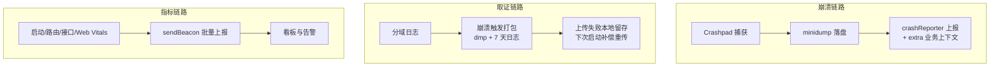
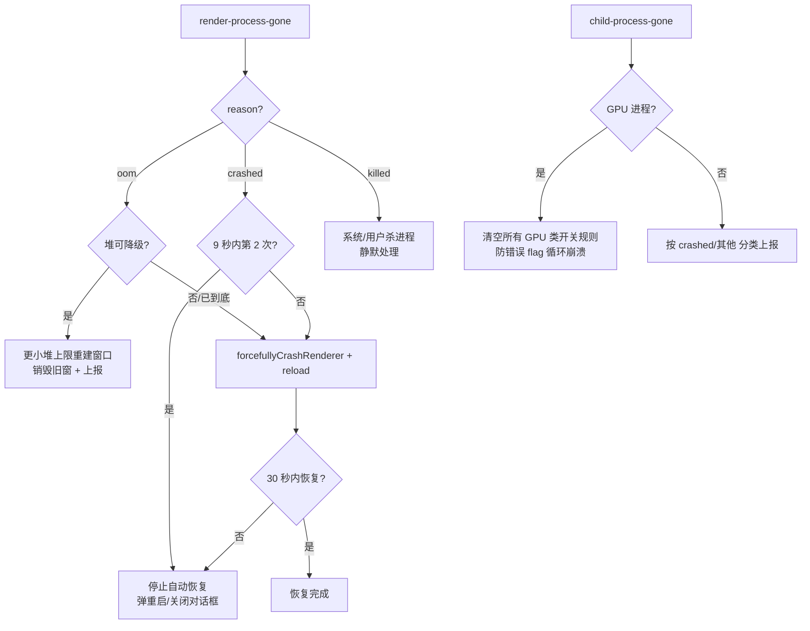

# 监控与可观测性

> **一句话本质**：桌面应用的监控要回答三个问题——「崩了没有」（崩溃采集）、「为什么崩」（取证回捞）、「用户感觉如何」（性能指标）；三者走完全不同的数据链路，缺一块就是盲区。

读完本章你会获得：Crashpad/crashReporter 的接入要点、崩溃恢复的完整决策树（含防崩溃循环）、minidump 与日志的捆绑回捞流水线、Sentry 三端桥接模式、性能事件的四通道埋点设计，以及质量指标四象限。

## 心智模型：三条数据链路



## 一、崩溃采集：crashReporter 与 minidump

Electron 内置 Crashpad（Chromium 的崩溃捕获系统）。任何进程崩溃时会生成 **minidump**（进程崩溃瞬间的内存/线程/栈快照，`.dmp` 文件）：

```js
// 主进程尽早启动（越早，能捕获的崩溃越多）
const { crashReporter } = require('electron')
crashReporter.start({
  submitURL: 'https://your-collector.example.com/minidump',
  uploadToServer: true,
  extra: {                    // 每份 dump 附带业务上下文——分析时救命的字段
    appVersion: app.getVersion(),
    channel: 'stable',
    // 建议再加：用户 id（脱敏 hash）、OS 版本、GPU 型号、渠道号
  }
})
```

- `extra` 字段随 dump 一起上报，是「事后归因」的关键：没有它，你只有一串崩溃栈。
- 自建收集端可以只做一个接收 minidump POST 的简单服务；用 Sentry 则直接用 `@sentry/electron`（内部同样走 minidump，但带符号化、聚合、告警全家桶）。
- 本地 dump 位置：`app.setPath('crashDumps', dir)` 可自定义——回捞流水线要用它。

官方文档：[crashReporter](https://www.electronjs.org/docs/latest/api/crash-reporter)、[Crashpad 报告指南](https://www.electronjs.org/docs/latest/tutorial/crash-reporting-adoption)。

## 二、崩溃恢复决策树（生产级）

采集之外，**崩溃发生时应用怎么活下来**同样重要。这是从真实客户端提炼的完整决策逻辑：



配套实现要点：

```js
// 主进程崩溃循环检测：滑动时间窗计数
const crashTimes = []
function isCrashLoop() {
  crashTimes.push(Date.now())
  while (crashTimes.length && Date.now() - crashTimes[0] > 9000) crashTimes.shift()
  return crashTimes.length >= 2
}

// 「当前窗口聚焦才弹窗，否则静默 reload」——不打断正在别的窗口工作的用户
// 强制重载：forcefullyCrashRenderer() + reload()
// 30 秒未恢复 → dialog.showMessageBox 给用户选择
```

::: exp 实战经验
两个容易被漏掉的分支：①**退出过程中的 unresponsive 不算故障**——用户已经点了退出，别再弹恢复框，直接强制退出；②**GPU 进程崩溃要联动清掉 GPU 相关的命令行开关规则**（如果你的应用有远程下发 GPU flag 的机制）——否则一个错误的 flag 会让 GPU 进程陷入「崩-拉起-再崩」死循环，清规则等于自动回滚。
:::

## 三、崩溃取证：minidump + 日志捆绑回捞

minidump 只有崩溃瞬间的栈，缺上下文。生产做法是「**平时分域记日志，崩溃时打包回捞**」：

```text
平时：log4js/winston 分域落盘（main / renderer / crash / http / 网络模块 各自文件）
      渲染进程日志经 IPC 转发到主进程统一落盘——保证崩溃后日志完整
      滚动策略：单文件 1MB × 2 个备份（体积可控）

事发：崩溃事件触发 zip 打包
      内容 = minidump(s) + 各域近 7 天日志（上限 50MB）
      上传成功 → 删包删 dump（防无限重传）
      上传失败 → 留在 userData，下次启动按文件名里的元数据补偿重传
```

```js
// 渲染层日志转发（preload 暴露）
contextBridge.exposeInMainWorld('logger', {
  info: (domain, msg) => ipcRenderer.send('log:message', { domain, level: 'info', msg })
})
```

::: exp 实战经验
把「日志回捞」做成主动能力而不只是被动上传：支持按用户 id 从管理后台触发「下次启动时上传日志包」——很多线上问题（用户环境特殊、驱动异常）只有完整日志才能定位。上传通道用 sendBeacon/gzip 批量，弱网失败静默降级 gif 打点。
:::

## 四、Sentry 集成：三端桥接模式

`@sentry/electron` 的关键认知：**主进程 init 一次，渲染进程复用主进程的上报通道**（IPC 模式），不要在渲染进程再配 DSN：

```js
// 主进程
Sentry.init({ dsn: MAIN_DSN, maxBreadcrumbs: 20 })

// preload（渲染进程不配 DSN！）
import * as Sentry from '@sentry/electron/preload'
Sentry.init({
  anrDetection: { captureStackTrace: true },  // 主进程 ANR 检测
  // breadcrumbs 精细控制：console 关掉防日志爆炸，dom/fetch/xhr 保留
})

// 框架集成延迟注入：渲染层框架（Vue/React）的集成事后挂进 preload 实例
// preload 暴露一次性注入口：
contextBridge.exposeInMainWorld('addSentryIntegration', (factory) => {
  Sentry.addIntegration(factory(Sentry))   // 用后即删，防重复
})
// 业务入口：window.addSentryIntegration(S => SentryVueIntegration(...))
```

生产环境工程细节：

- **sourcemap**：构建时 `@sentry/webpack-plugin` 上传后删本地 map（防泄露源码路径）。
- **双 DSN 分流**：大版本升级期新旧版本（或测试/生产）各用一个 project，对比崩溃趋势互不污染。
- **错误指纹**：`beforeSend` 里对环境类错误（EPERM/ENOENT）设自定义 fingerprint 聚合，否则同一个「文件无权限」会散成一万个 issue。
- **debugger 互斥**：Sentry 的部分采集走 `webContents.debugger`（CDP），与 DevTools 独占冲突——线上排查开 DevTools 前先 `Debugger.disable`（见[调试章节](/guide/15-debugging)）。

## 五、采集基建：给「所有窗口」统一注入监控

崩溃与性能采集代码通常放在各窗口的 preload 里——但业务会开新窗口、子窗口、webview，逐个配置必漏。生产做法是**在主进程统一注入采集 preload**，一处配置覆盖全部 webContents：

```js
// 方案 A：session 级预加载（Electron 支持给 session 附加多个 preload）
app.whenReady().then(() => {
  const monitorPath = path.join(__dirname, 'monitor-preload.js')
  for (const ses of [session.defaultSession /* , 其他自定义 session */]) {
    const existing = ses.getPreloads()      // 保留业务已配置的 preload！
    ses.setPreloads([monitorPath, ...existing])
  }
})
// 限制：只作用于「未自定义 preloads」的 session 的后续加载，
// 已显式 setPreloads 过的 session 要在设置时把监控脚本拼进去

// 方案 B：监听 webContents 创建，动态注入（兼容一切 session 来源）
app.on('web-contents-created', (_e, wc) => {
  wc.on('did-attach-webview' /* ... */)
  // 注入方式：session.setPreloads 或 session.registerPreloadScript（新 API）
  // 注意去重：同一 session 多个 webContents 只注册一次
})
```

监控 preload 里只放采集（内存自报、日志转发、性能打点），**不暴露任何业务 API**——它和业务 preload 职责分离，升级互不干扰。参考实现：[sentry-electron 的 preload 注入](https://github.com/getsentry/sentry-electron) 就是这个模式。

## 六、性能指标：四通道埋点

| 通道 | 内容 | 采集点 |
|---|---|---|
| 启动 | 六段耗时（进程创建→ready→窗口→加载→首帧→可交互） | 主进程分段打点，渲染层读走即删 |
| 路由 | 页面打开耗时 | 路由 beforeEach/afterEach 包裹 |
| 接口 | 延迟/失败率，慢请求附 DNS/TCP/TLS 分解 | 请求层统一拦截，≥1s 或非 2xx 记明细 |
| Web Vitals | LCP/INP/CLS/FCP/TTFB | `web-vitals` 库回调 |

上报通道设计：gzip + 批量 + `sendBeacon`，失败降级 1×1 gif 打点（弱网兜底）。

**「一次性 handler」防重复上报**：启动耗时这类只该读一次的数据，`ipcMain.handle` 注册后取值即 `removeHandler`，渲染层读完删除全局函数——防止埋点 SDK 重初始化导致的重复计数。

## 七、指标体系：四象限

技术指标只有挂到用户感受上才有意义。桌面客户端的完整指标视图：

| 象限 | 指标 | 说明 |
|---|---|---|
| 体验 | 冷/热启动 P90、FCP/INP、卡顿率、P90 接口延迟 | 用户「感觉快不快」 |
| 稳定性 | 主/渲染进程 crash 率、ANR 率、错误率 | 「会不会坏」 |
| 资源 | CPU/内存 P90、GPU 内存、电量影响 | 「占不占资源」 |
| 业务映射 | 崩溃率 → 留存/客诉、启动 → 转化 | 技术→商业价值对齐 |

::: exp 实战经验
指标建设两条原则：①以业务目标为核心——每条技术指标都能回答「它坏了哪个业务数字会难看」；②系统可观测性优先——先让「现状可测量」（基线看板），再谈「目标可管理」（阈值告警）。告警只对「偏离自身基线」触发，绝对值阈值在新版本发布日全是误报。
:::

## 延伸阅读

- [crashReporter API](https://www.electronjs.org/docs/latest/api/crash-reporter)
- [Crashpad 采纳指南](https://www.electronjs.org/docs/latest/tutorial/crash-reporting-adoption)
- [@sentry/electron](https://github.com/getsentry/sentry-electron) —— 三端桥接的参考实现
- [web-vitals](https://web.dev/articles/vitals) —— Chrome 官方 Web Vitals 库
- [Breakpad minidump 格式](https://chromium.googlesource.com/breakpad/breakpad/) —— dump 分析的底层文档
