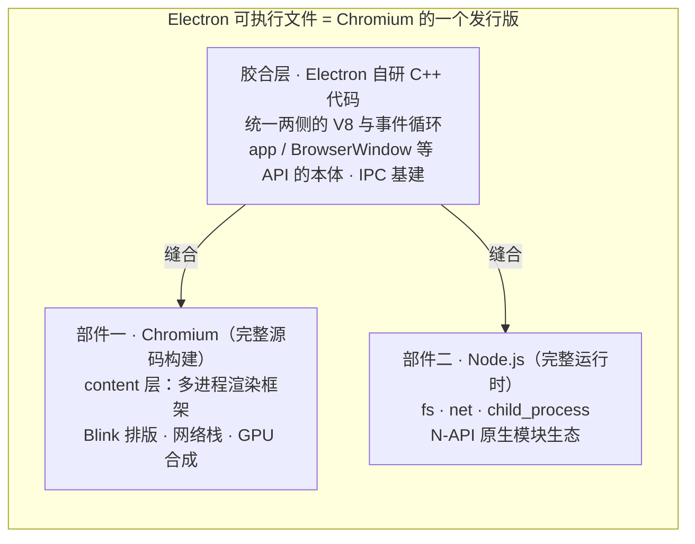

# 技术架构剖析

> **一句话本质：Electron 是「Chromium 的一个发行版」——用一层自研 C++ 胶合代码，把完整 Chromium 和完整 Node.js 构建成同一个可执行文件；三大部件怎么被缝在一起，决定了它的体积、版本节奏和安全模型为什么长这样。**

读完这一篇，你会得到一张三大部件的集成图，并由此获得四个判断力：能说出 Electron 与 CEF / NW.js / Tauri 在「集成方式」上的本质差异（而不只是参数表差异）；能用 `process.versions` 一眼看清版本对齐机制；能解释为什么 `npm install electron` 下载的是一个约 200MB 的预编译浏览器；能看懂大厂应用的三种架构形态——为下一篇[进程模型](/part1-background/04-process-model)做好铺垫。

## 心智模型：一个可执行文件，三大部件

[Electron 是什么](/part1-background/01-what-is-electron)里把应用按**职责**分成界面层、胶合层、能力层。本章换一个视角——按**来源**拆：这个可执行文件里的东西，分别是谁的代码。



| 部件 | 来源 | 提供什么 | 体量占比 |
| --- | --- | --- | --- |
| Chromium | 完整 Chromium 源码构建 | 渲染引擎、网络栈、GPU 合成、多进程框架、V8 | 绝对大头 |
| Node.js | 完整 Node 运行时 | 文件系统、进程管理、原生模块生态 | 小头 |
| 胶合层 | Electron 仓库的 C++ 代码 | 把两者缝成一个应用，暴露统一的 JavaScript API | 极薄的一层 |

三句结论先立于此：

- 它不是「嵌入了浏览器的应用」——**它本身就站在浏览器的位置上发版**
- 它不是「Node 带 UI」——**Node 只是三大部件之一**
- 胶合层的核心工作不是加功能，而是**让两个各自独立演进的庞然大物看起来像一个整体**

## 部件一：Chromium——完整源码构建，不是嵌入库

大多数「在桌面跑网页」的方案走的是**嵌入**路线。以 CEF（Chromium Embedded Framework）为例：它把 Chromium 打包成 `libcef` 库，你的 C++ 程序作为宿主调用它——宿主与内核之间，隔着一层明确的库边界。

Electron 走的是相反的路线：**直接用完整 Chromium 源码构建自己的发行版**，胶合代码与 Chromium 的 content 层在同一棵构建树里编译。Electron 团队因此可以打补丁、调构建参数、跟着每个 Chromium 大版本升级。

角色上，它类似某个 Linux 发行版之于 Linux 内核：不是内核的使用者，而是内核的下游打包者与集成者。

这个架构事实有三条直接推论，每一条都会在后续章节用到：

1. **`chrome://` 内部页面全部可用**。`chrome://gpu`、`chrome://tracing`、`chrome://process-internals`、完整的 DevTools——完整 Chromium 有的调试武器，Electron 里一件不少。这是[调试体系](/part3-engineering/16-debugging)武器库的来源
2. **包里真的装着一个「浏览器」的全套零件**。Blink、V8、网络栈、GPU 合成、多进程框架一个不缺——这就是安装包体积的来源（下文「分发形态」一节展开）
3. **渲染内核版本被锁定**。你的页面永远跑在 Electron 捆绑的那个 Chromium 上，不存在「用户浏览器太旧」的问题，但存在「Electron 版本太旧」的问题——后者回到[发展历史](/part1-background/02-history)讲的版本节奏

## 部件二：Node.js——完整运行时，且共享同一个 V8

Electron 里的 Node 不是裁剪版：`fs`、`net`、`child_process`、N-API 原生模块，完整运行时的能力一个不少。主进程就跑在它上面（[进程模型](/part1-background/04-process-model)一章的主角）。

这里藏着全项目最难的一件缝合活：**Chromium 和 Node 都依赖 V8，而两者的 V8 版本各自演进**。

Electron 的解法是让两者共享同一个 V8 实例——构建时把 Node 对齐到 Chromium 使用的 V8 版本，而不是各带一份。这是胶合层工程量最大的部分之一，也是「你不能任选 Node 版本」的根本原因：Node 的版本由 Electron 版本决定，因为 V8 必须跟着 Chromium 走。

一个立刻能用的探针，任何 Electron 应用里都能跑：

```js
// 任意进程的 DevTools console 或主进程日志里
console.log(process.versions)
// {
//   electron: '22.3.25',      ← Electron 自己
//   chrome:  '108.0.5358.179', ← 捆绑的 Chromium 主版本
//   node:    '16.17.1',        ← 捆绑的 Node 主版本
//   v8:      '10.8.168.25',    ← 两边共享的同一个 V8
//   ...
// }
```

看到这四个字段，下一节的版本对齐机制就摆在眼前了。

## 部件三：胶合层——一层薄而关键的 C++

Electron 仓库里自己的 C++ 代码干的是「缝合」的活，职责清晰可数：

- **统一 V8 与事件循环**：让 Chromium 和 Node 共享同一个 V8 实例、同一个消息循环，两者的 JavaScript 世界才能互通
- **实现 API 的本体**：`app`、`BrowserWindow`、`Tray`、`ipcMain` 这些对象在 JavaScript 侧是接口，本体都是这层 C++ 实现的
- **IPC 基建**：主进程与渲染进程之间所有消息通道的底层实现

它的构建方式有一段演变史。早期 Electron 依赖两个中间库：

- **libchromiumcontent**：把 Chromium 的 content 层打包成可复用的静态库
- **brightray**：负责 Chromium 的集成初始化，2013 年从 Chromium 项目拆出、2017 年完成使命并回主仓库（见[发展历史](/part1-background/02-history)）

后来中间库路线被放弃，迁移到 Chromium 原生的 GN 构建系统——Electron 的代码直接长在 Chromium 的构建树里，少一层间接，跟上 Chromium 的节奏就更快。这次演进与 v6 之后「锁死 Chromium 节奏」的决策互为因果。

和 Chromium 源码的体量相比，这层胶水极薄。「一个完整发行版 + 一层薄胶合」——这就是 Electron 在千万行级的 Chromium 面前，真正的代码增量。

## 版本对齐：一个版本号，装着三个内核

每个 Electron major 版本都**锚定**一组固定的内核版本：某个 Chromium major + 某个 Node major。

以 Electron 22 为例：Chromium 108 + Node 16——正是上文 `process.versions` 探针的输出。今天最新的 44.x 对应哪一组数字，以 [Electron Releases](https://releases.electronjs.org/) 页为准——那里维护着每个版本组合的官方对照表，不要凭记忆写数字。

锚定机制有三条推论：

1. **升级 Electron = 同时换掉渲染引擎和 Node 大版本**。回归测试要覆盖两侧：页面行为可能因 Chromium 变化而变，构建链可能因 Node 大版本跨越而变（原生模块要重编，详见[.node 扩展开发](/part4-advanced/24-native-node)）
2. **Chromium 与 Node 的更新节奏不同步**。Chromium 是主动跟（8 周节奏），Node 是被动滚——每次对齐新的 Chromium V8 时，顺势升到基于该 V8 的 Node 版本。所以你等一个想要的 Node 特性，等的是「Electron 升到锚定那个 Node 的版本」，中间没有捷径
3. **安全补丁的粒度也是三件套**。一次 patch 更新里可能同时背着 Chromium 安全修复与 Node 安全修复——升级公告要三个项目一起看

## 分发形态：为什么 npm install 下载的是「一个浏览器」

理解了三大部件，就理解了新手最常见的困惑：为什么 `npm install electron` 要下载约 200MB（解压后）的东西，而 `npm install lodash` 只有几 MB？

因为 Electron 不是「源码库」，是「Chromium 的发行版」。从源码构建一次，等于构建整个 Chromium——即使官方用 Not Goma 分布式编译集群（见[发展历史](/part1-background/02-history)）也要跑上几分钟，普通开发者的笔记本根本不可行。

所以 npm 包 `electron` 本质上是一个**下载器**：按你的平台，从分发服务器拉取官方预编译好的完整二进制——里面是 Chromium 全套 + Node + V8 + Electron 的胶合层。

两条实战推论：

- **国内开发环境必配镜像**。跨国拉 200MB 二进制经常超时，官方支持 `ELECTRON_MIRROR` 环境变量指向国内镜像（如 npmmirror），配置方法见[安装指南](https://www.electronjs.org/docs/latest/tutorial/installation)。这一步没配好，是新手放弃 Electron 的第一名原因
- **这 200MB 是你安装包的底座**。无论你的业务代码有多少，分发产物都带着这个底座——「Electron 应用为什么这么大」的完整答案（以及能压掉多少、怎么压）在[打包与分发](/part3-engineering/19-packaging)一章展开

## 集成方式对比：同一目标，四条路线

「用 Web 技术做桌面应用」这个目标下，主流方案的根本差异不在参数表，而在**集成方向**——谁来当宿主、Node（或系统能力）从哪个方向进入网页。

[Electron 是什么](/part1-background/01-what-is-electron)的对比表回答「选哪个」；这张表回答「它们本质上差在哪」：

| 维度 | Electron | CEF | NW.js | Tauri |
| --- | --- | --- | --- | --- |
| 内核来源 | 自带完整 Chromium（自己构建） | Chromium 打包成嵌入库 | 自带完整 Chromium | 复用系统 WebView |
| 集成方向 | 胶合层把 Chromium 与 Node 缝成一个应用 | 你的 C++ 程序当宿主，嵌入 libcef | 让网页直接进入 Node 上下文 | Rust 程序当后端，WebView 只是 UI |
| 页面与 Node 的关系 | 进程隔离，页面默认无 Node，走 IPC | 页面无 Node，需自建桥接 | 页面可直接 `require`，与 Node 同上下文 | 页面无 Node，调 Rust 命令 |
| 安全边界形状 | 进程边界天然清晰，能力白名单分发 | 沙箱程度取决于宿主配置 | 页面拿到 Node 即拿到系统 | 由 Rust 命令层把关 |
| 渲染一致性 | 三平台一致（内核锁定） | 一致（自带内核） | 一致 | 取决于用户系统的 WebView 版本 |
| 典型代价 | 体积大 | 要写 C++ 宿主 | 安全模型先天吃亏 | 渲染差异要逐平台验证 |

其中最值得深看的是 **NW.js 与 Electron 的分叉**。两者起源于同一个想法（Node + Chromium），2013 年前后几乎同时起步，分野在于集成方向：

- NW.js 让网页直接获得 Node 上下文——写页面像写 Node 脚本，爽在当下
- Electron 让两者进程隔离、靠 IPC 通信——多一层麻烦，但页面可以被关进无 Node 的沙箱

这个 2013 年就埋下的分叉决定了两者安全模型的根本不同：NW.js 的页面一旦被注入恶意脚本就等于交出系统；Electron 可以把「不可信内容」隔离在只能画图的笼子里，能力经主进程白名单分发——[安全模型](/part2-core/10-security)的全部主题就建立在这个地基上。十年回头看，这条架构分叉是两者命运差异的重要原因。

Tauri 则代表第三条路：不自带内核、复用系统 WebView，换小体积的代价是「同一份代码在不同系统 WebView 上渲染不一致」。它不是 Electron 的升级版，而是另一种成本结构——01 章的选型对比表展开过，此处不重复。

## 架构谱系：三种生产形态

三大部件按默认分工组装，就是本站主线的「经典两层」结构。但生产世界的 Electron 应用长成一个谱系——看谱系的意义不是照抄大厂，而是知道自己的应用站在哪一级、什么时候才需要往上走。

### 形态一：经典两层——大多数应用的归宿

按默认分工：主进程（胶合层 + Node）管窗口与系统能力，渲染进程（Chromium）跑业务界面，重计算下放 UtilityProcess。

它简单、心智负担最小。工具类与效率类应用终其一生停在这一级就够，本站后续章节默认这个形态。

### 形态二：VS Code 三进程——后台服务集中化 + 渲染去 Node 化

[VS Code 团队官方博客](https://code.visualstudio.com/blogs/2022/11/28/vscode-sandbox)记录了他们的结构：main 与 renderer(s) 之外还有一个 **shared process**——一个隐藏的、带完整 Node 的后台服务进程，扩展安装、文件监视、集成终端这类资源密集且不需要窗口的工作，全部集中在它身上。

主进程因此保持极轻（它是单点，见[进程模型](/part1-background/04-process-model)），后台服务崩溃也只丢后台功能、不拖累任何窗口。

同一篇博客还记录了 2020 年启动、历时近三年的「沙箱化迁移」：把渲染进程的 Node 依赖全部移走，页面要的系统能力一律经 preload 暴露，跨进程改用 MessagePort 直连。一次迁移同时买到三件事：

- **安全收窄**：渲染层代码漏洞不再能摸到系统
- **主进程减负**：后台工作不再与用户输入抢同一个事件循环
- **架构对齐 Web**：渲染进程变成纯浏览器环境，进程可复用、无需重建

顺带一提：你后面会用到的 `utilityProcess` API，正是这次迁移中 VS Code 团队贡献给 Electron 上游的。

### 形态三：QQ NT——核心下沉，部件替换

QQ 团队在[公开分享](https://www.infoq.cn/article/99suibztx2be1fwvqjwg)中明确了 NT 架构的分工：Electron 仅作为 UI 跨平台层，是「较薄的一层」；登录、消息系统、关系链、长连接、数据库这些核心模块统称 NT 内核，完全用 C++ 实现并全平台共用。

这是「部件替换」式的架构：三大部件里真正参与工作的只剩「Chromium 画界面 + 薄胶合层」，Node 部件被架空成胶水。桌面端与移动端共享同一套 C++ 核心，才是这个形态的真实目的——Electron 只是桌面端的那层皮。

| 形态 | 三部件怎么组装 | 适用规模 | 代表 |
| --- | --- | --- | --- |
| 经典两层 | 默认分工：主进程管系统，渲染层跑业务 | 绝大多数应用 | 本站主线、多数工具类产品 |
| 三进程 + 沙箱化 | 加一个 shared process 集中后台服务，渲染进程去 Node 化 | 多窗口、后台服务重的大型应用 | VS Code |
| 核心下沉 | Node 部件被 C++ 内核替换，Electron 只剩 UI 层 | 超大规模、多端共享核心 | QQ NT |

选型建议一句话：**从经典两层做起，规模到了再演进**。

shared process 是「后台工作多到拖累主进程」时的解法；核心下沉是「多端必须共享一套 C++ 核心」时的解法——而它的前置条件是有专职客户端团队长期维护原生层。提前上任何一级，都是在为自己制造复杂度。

::: exp
**架构理解最终会投影成排障能力。**一个真实剧本：用户报「应用卡」。

拿着本章的部件图，定位路径是现成的两步——先判进程，再判部件：

1. **全部窗口一起冻结？**问题在主进程（查 Node 侧有没有同步 IO 卡住事件循环）或 GPU 合成（窗口绘制走 GPU 进程）
2. **只有单个窗口卡？**问题在渲染进程，打开 DevTools Performance 面板看页面 JS
3. **滚动和动画卡但交互正常？**打开 `chrome://gpu` 查这个窗口是不是被降级到了软件渲染

「进程 × 部件」就是排障的二维坐标系——没有坐标系的人排障靠猜，有坐标系的人按图索骥。而坐标系里每个落点的工具（`chrome://gpu`、`chrome://tracing`、Performance 面板）之所以存在，正是因为 Electron 是完整 Chromium 发行版——架构事实直接变成你手里的武器。[GPU 崩溃五步分析法](/cases/02-gpu-crash)就是这个坐标系的第一次实战。
:::

::: pitfall
两个高频认知误区，都源于没把三大部件装进脑子。

**误区一：「Electron 是个浏览器。」**不准确——它是完整的 Chromium 发行版。正面的推论：`chrome://gpu`、`chrome://tracing`、`chrome://process-internals` 与完整 DevTools 全部可用，调试能力与 Chrome 完全一致，放弃这些工具等于自废武功。负面的推论：你的攻击面也是完整 Chromium 的攻击面，旧版本 Electron 等于背着一整份公开漏洞清单在跑——这又回到[发展历史](/part1-background/02-history)讲的升级节奏。

**误区二：「Electron 是 Node 带 UI。」**Node 只是三大部件之一。渲染、HTTP 缓存、Cookie、证书、代理设置全是 Chromium 部件的私事。典型踩坑：想清「缓存」，用 Node 的 `fs` 删了自以为的目录，结果用户看到的缓存纹丝不动——HTTP 缓存归 Chromium 网络服务进程管理，在 `userData` 下的 Cache 目录，且进程可能持有句柄；页面里 `fetch` 走的也是 Chromium 网络栈而不是 Node 的 `net`。

排障口诀一句话：**先问「这事归哪个部件管」，再动手。**
:::

## 延伸阅读

- [进程模型（三大部件在运行期如何分布为进程）](https://www.electronjs.org/docs/latest/tutorial/process-model)
- [Electron Releases（版本与 Chromium / Node 的官方对照表）](https://releases.electronjs.org/)
- [版本支持时间线（各版本发布与 EOL 日期）](https://www.electronjs.org/docs/latest/tutorial/electron-timelines)
- [安装指南（预编译二进制下载与镜像配置）](https://www.electronjs.org/docs/latest/tutorial/installation)
- [VS Code 官方博客：进程沙箱化（shared process 与去 Node 化迁移）](https://code.visualstudio.com/blogs/2022/11/28/vscode-sandbox)
- [InfoQ：QQ NT 架构访谈（核心下沉 C++ 的实践）](https://www.infoq.cn/article/99suibztx2be1fwvqjwg)
