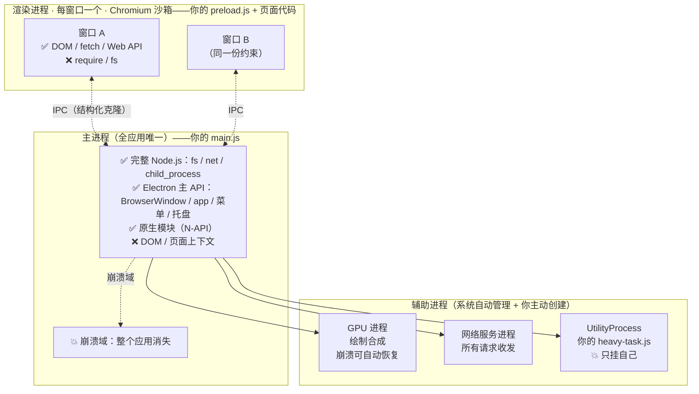

# 进程模型

> **一句话本质：Electron 是多进程架构——1 个主进程 + N 个渲染进程 + 一组 Chromium 辅助进程，你的每一行代码都活在某个特定进程里，进程边界决定了它能用什么 API、会被谁拖垮、崩了影响谁。**

这是全站最重要的一章。读完它，你遇到的八成怪问题都能找到坐标系：「为什么页面里 `require` 报错」「为什么一个窗口卡死全部窗口都不动」「为什么对象传过去方法没了」——它们全是进程边界问题。理解本章后，其余章节本质上都是查表。

## 心智模型：一张进程全景图



三个角色，记住各自的「能力面」：

| 角色 | 数量 | 运行环境 | 能做什么 | 崩了的后果 |
| --- | --- | --- | --- | --- |
| 主进程 | 1 | Node.js 完整环境 | 窗口管理、生命周期、系统 API、原生模块 | 整个应用消失 |
| 渲染进程 | 每窗口 1 个 | Chromium，**默认无 Node** | DOM、页面 JS、Web API | 只挂自己的窗口，主进程存活 |
| 辅助进程 | 若干 | 各自独立 | GPU 合成、网络收发、你指派的任务 | 视类型而定，多数可自动恢复 |

三条铁律从这里直接推出：

1. **主进程是单点**——它的事件循环被阻塞，所有窗口一起冻结
2. **渲染进程之间互相隔离**——A 窗口崩溃不影响 B 窗口，这是 Chromium 的进程模型带来的免费容错
3. **跨进程只能发消息**——任何数据跨进程都要序列化，函数、DOM、原型链都过不去

## 认知一：主进程为什么是「唯一且全能」的

主进程是你 `package.json` 里 `main` 指向的那个文件的执行环境。它拿到的是完整的 Node.js：`fs`、`net`、`child_process`、原生模块，一个不少。为什么把所有敏感能力集中在一个进程？**因为权限需要唯一的看门人**。窗口可以开一百个，但「谁能读写磁盘」这件事只在一个地方裁决，安全边界才画得出来。

```js
// main.js —— 这里能 require 任何 Node 模块
const { app, BrowserWindow } = require('electron')
const fs = require('node:fs')           // 完整文件系统
const { join } = require('node:path')

const createWindow = () => {
  const win = new BrowserWindow({
    width: 800,
    height: 600,
    webPreferences: {
      preload: join(__dirname, 'preload.js')
      // 注意：这里没有任何 nodeIntegration / sandbox 覆写，
      // 渲染进程保持现代 Electron 的安全默认值
    }
  })
  win.loadFile('index.html')
}

app.whenReady().then(createWindow)
```

## 认知二：渲染进程默认没有 Node，这是设计而不是缺陷

现代 Electron（20+ 起 `sandbox` 默认开启）的渲染进程里，页面 JS 只有一个浏览器环境：有 `document`、`fetch`、`window`，**没有** `require`、`process`、`Buffer`。

为什么砍掉？渲染进程的本职是执行「不可信内容」——你加载的任何页面、任何第三方脚本都可能包含恶意代码。Chromium 为此设计了层层沙箱，把页面代码关进「只能画图、不能碰系统」的笼子。一旦渲染进程有了 Node，这个笼子就形同虚设：一段 XSS 脚本 `require('child_process')` 直接执行任意命令，等于把用户整台电脑交出去。

所以安全的打开方式永远是：**页面要用系统能力，走 preload 桥接主进程**，而不是给页面解锁 Node。桥怎么搭、怎么限制，[安全模型](/part2-core/10-security)一章专门讲。

```js
// 渲染进程（页面里的 JS）——现代默认配置下的真实环境
typeof require     // 'undefined'
typeof process     // 'undefined'
typeof window      // 'object' —— 这是页面唯一的世界

// 想读文件？只能通过 preload 暴露的受控接口：
await window.desktop.readConfig('theme')
```

## 认知三：进程间只能 IPC，数据靠结构化克隆

主进程和渲染进程是两个操作系统级进程，地址空间不共享。唯一的官方对话方式是 IPC（Inter-Process Communication），所有消息走**结构化克隆算法**序列化——和 Web Worker 传消息同一套规则。

这决定了什么东西过不了边界：

```js
// 主进程（ipcMain.handle）返回给页面的数据，会经历一次结构化克隆
const { ipcMain } = require('electron')

ipcMain.handle('app:get-project', () => {
  return {
    name: '我的项目',          // ✅ 字符串
    files: ['a.js', 'b.js'],   // ✅ 数组
    createdAt: new Date(),     // ✅ Date（克隆后仍是 Date）
    // report: new ProjectReport()  // ⚠️ 能传，但只剩普通对象——
    //                                原型链丢失，所有类方法消失
    // callback: () => {}            // ❌ 函数直接报错，克隆失败
  }
})
```

| 能安全传递 | 传过去会变形 | 根本传不过 |
| --- | --- | --- |
| string / number / boolean / null | class 实例（变成普通对象） | 函数 |
| 普通对象 / 数组 | 带循环引用但可枚举的结构 | DOM 元素 |
| Date / RegExp / Map / Set | Error（自定义属性丢失） | Promise 之外的非克隆对象 |
| TypedArray / ArrayBuffer | | Proxy / Symbol |

这条规则的反面推论同样重要：**如果你发现自己在 IPC 里传大对象、传「带行为的对象」，说明架构分层错了**。行为留在各自进程，跨进程传的应该是纯数据。

## 你的代码应该放在哪个进程

| 代码类型 | 放哪里 | 理由 |
| --- | --- | --- |
| 窗口创建/销毁、生命周期处理 | 主进程 | 只有它能做 |
| 原生菜单、托盘、系统对话框、通知 | 主进程 | 系统 API 只在主进程可用 |
| 读写用户配置、本地数据库 | 主进程（被 IPC 调用） | 文件权限集中在看门人手里 |
| 原生模块（N-API / C++ SDK） | 主进程或 UtilityProcess | 需要 Node 环境 |
| 页面 UI 状态、组件逻辑、路由 | 渲染进程 | 这是它的本职 |
| 数据请求与展示加工 | 渲染进程发起，主进程代理（或直接 fetch） | 看是否涉及系统凭证 |
| 视频转码、文件哈希、大量计算 | UtilityProcess | 不能阻塞主进程（见下文） |
| 长驻后台服务（本地网关、索引器） | UtilityProcess | 隔离崩溃域 |

一个常用的判断口诀：**「碰系统的进主进程，碰像素的进渲染进程，费 CPU 的进 UtilityProcess」**。

顺带回答一个高频疑问：**Web Worker 占用渲染进程的内存吗？**——占。Worker 是渲染进程**内**的线程（`process.type === 'worker'`），与页面共享该进程的内存上限与崩溃域：Worker 疯狂吃内存照样把整个渲染进程拖到 OOM。它解决的是「JS 主线程阻塞」，不提供进程隔离。要隔离（崩溃不影响页面、内存独立计量），用 UtilityProcess——这正是两兄弟的本质区别。

## 判断「我现在在哪个进程」

Electron 给了最直接的探针：

```js
// 任意进程里都可用
console.log(process.type)
// 'browser'  —— 主进程
// 'renderer' —— 渲染进程
// 'utility'  —— UtilityProcess（Electron 22+）
// 'worker'   —— Web Worker

// 实战中最常见的用法：写一份两端共用的工具模块，
// 按环境自动选择行为
const isMain = process.type === 'browser'
module.exports = isMain ? require('./main-side') : require('./renderer-side')
```

另有一个更语义化的探针 `process.parentPort`：只在 UtilityProcess 里存在，是它与父进程（主进程）通信的端口。

## UtilityProcess：CPU 密集任务的正解（Electron 22+）

主进程是单点，那计算密集的活（给 2GB 文件算哈希、批量解压、图像处理）放哪？答案是 `utilityProcess`——Electron 官方的「带 Node 环境的子进程」，比 `child_process.fork` 更贴合：生命周期跟随应用、有消息端口、崩溃可观测。

```js
// 主进程：派发一个重计算任务
const { utilityProcess } = require('electron')
const { join } = require('node:path')

// heavy-task.js 是一个纯 Node 脚本，无需引 electron
const child = utilityProcess.fork(join(__dirname, 'heavy-task.js'), {
  serviceName: 'hash-worker',   // 出现在 chrome://process-internals 里，便于观测
  stdio: 'inherit'              // 子进程 stdout 直接透传，日志好排查
})

child.postMessage({ file: '/path/to/big-file.zip' })

child.on('message', (result) => {
  console.log('哈希计算完成', result.digest) // 主进程此刻依然流畅
})

child.on('exit', (code) => {
  console.log('worker 退出，code =', code)
})
```

```js
// heavy-task.js —— 跑在 UtilityProcess 里的 Node 环境
// process.parentPort 是与主进程通信的端口
process.parentPort.on('message', (e) => {
  const { file } = e.data
  const digest = computeBigHash(file) // 同步算多久都不影响任何窗口

  process.parentPort.postMessage({ digest })
})

function computeBigHash (file) {
  // 真实实现里用 crypto 流式计算，这里示意重计算
  return 'sha256-xxxx'
}
```

对比三条路的取舍：`utilityProcess`（Node 环境、官方集成、推荐）> Web Worker（渲染进程内、无 Node、页面级并行够用）> `child_process.fork`（通用但要自己管进程、无 Electron 集成观测）。

::: exp
生产环境里最常见的性能事故不是「算法慢」，而是**主进程被同步调用卡住**。症状非常有辨识度：某个操作一点，所有窗口同时白屏/点不动、窗口拖不动、菜单打不开——因为主进程这一个事件循环承担了所有窗口的系统事件分发。任何 `fs.readFileSync`、同步原生调用、几百毫秒以上的循环，只要发生在主进程就是全应用公敌。治理手段按序选择：改为异步 API；下放渲染进程（纯计算且不碰特权）；下放 UtilityProcess（费 CPU 且要 Node 环境）。判断标准很简单：凡是「单次执行可能超过 16ms 的同步代码」，都不该出现在主进程。
:::

::: pitfall
新手提问榜第一名：「为什么我的页面里 `require('fs')` 报 `require is not defined`？」——搜出来的答案往往是让你开 `nodeIntegration: true`。**不要照做。** 这个报错正是现代 Electron 安全默认值在起作用：渲染进程被刻意设计成无 Node 环境。开了 `nodeIntegration` 等于为了图省事拆掉防线，页面里任何一段被注入的脚本都能直接操作用户磁盘。正确姿势是接受这个设定：页面要什么能力，就在 preload 里用 `contextBridge` 暴露什么能力。记住一条公理：**Electron 的所有「不方便」，都是安全边界的形状**。
:::

## 延伸阅读

- [进程模型（官方教程，本章的权威来源）](https://www.electronjs.org/docs/latest/tutorial/process-model)
- [沙箱机制（渲染进程为何无 Node 的底层设计）](https://www.electronjs.org/docs/latest/tutorial/sandbox)
- [UtilityProcess API（CPU 密集任务官方方案）](https://www.electronjs.org/docs/latest/api/utility-process)
- [IPC 教程（三种通信模式的官方说明）](https://www.electronjs.org/docs/latest/tutorial/ipc)
- [app API（主进程的能力全集）](https://www.electronjs.org/docs/latest/api/app)
