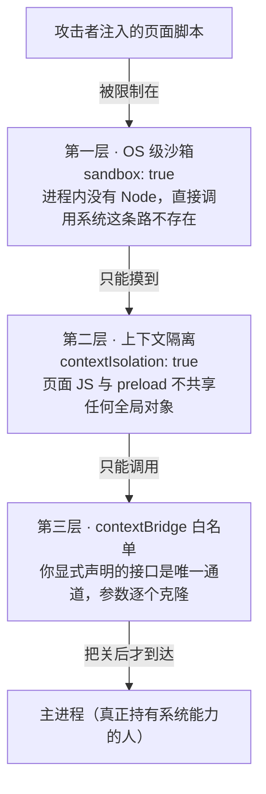

# 安全模型

> **一句话本质：Electron 安全的全部要义是「渲染进程不可信」这个假设——三层防线层层收窄攻击面：进程隔离（contextIsolation）把页面锁在笼子里，能力最小化（sandbox、禁 Node）把笼子焊死，显式桥（preload + contextBridge）只留一个带安检的门。**

读完这一篇，你将不再背诵「不要开哪些开关」的清单，而是理解每个开关背后的防线结构——从而能对任何一份 `webPreferences` 配置说出「它放弃了什么、剩什么在兜底」，包括接手历史项目时如何渐进治理。

## 心智模型：攻击者视角下的三层防线

理解安全的最好方式是站在攻击者视角走一遍。假设你的页面被注入了一段恶意脚本（XSS、被投毒的 npm 依赖、被劫持的 CDN），它要做的是摸到用户磁盘。它要连续突破三层：



三层防线的强度不同：第一层是**物理隔离**（进程边界，操作系统的地界）；第二层是**世界隔离**（同一进程内的两个 JS 世界，V8 的地界）；第三层是**代码边界**（你自己写的白名单，质量取决于你）。越靠外越坚固，越靠内越依赖你的自律——这就是为什么关掉外层防线、只靠内层「自觉」是危险的。

## 三开关的真实含义

`webPreferences` 里三个开关构成 Electron 安全的骨架。先看事实，再看每个开关「关掉会损失什么」：

| 开关 | 当前默认 | 默认始于 | 关掉它你损失哪层防线 |
| --- | --- | --- | --- |
| `nodeIntegration` | `false` | Electron 5 | 损失第一层的一半：页面 JS 直接获得完整 Node，XSS 即可 `require('child_process')` 执行任意命令 |
| `contextIsolation` | `true` | Electron 12 | 损失第二层：preload 与页面共享同一上下文，页面可覆盖原型链、篡改你桥上的一切 |
| `sandbox` | `true` | Electron 20 | 损失第一层的另一半：渲染进程逃出 OS 级沙箱，Chromium 未公开漏洞可被用来逃逸 |

三个默认值的演进史（5 → 12 → 20）本身就是官方把「曾经要手动配的安全项」逐个变成「不配置就安全」的过程。**现代 Electron 应用的 `webPreferences` 里，这三个开关一个都不该出现**——写出来就说明有某处在跟默认值对抗，值得一个 code review 追问。

一个容易混淆的细节：`sandbox: true` 时**preload 也不能用完整 Node**，只剩一个受限子集（`electron` 的 `ipcRenderer`/`contextBridge` 等、`node:events`、`node:timers`、`node:url` 和 polyfill 的 `Buffer`）。这经常让人误以为「我需要 preload 里 require 原生 SDK，所以必须关 sandbox」——第 10 章会给出正解（原生模块放主进程或 UtilityProcess，preload 只做转发），这里先记住：**关 sandbox 几乎从不是唯一解**。

## 为什么渲染进程不可信

因为渲染进程的天职就是执行「别人写的代码」。逐条列举威胁来源：

- **远程内容**：任何 `loadURL` 到线上地址的窗口，页面上跑的是服务器此刻返回的东西——服务端被攻破、账户被劫持、CDN 被投毒，页面立即变成敌占区
- **依赖供应链**：页面打包产物里的每一个 npm 包都可能在某次 `npm install` 后变成恶意代码，XSS 不需要你的代码有漏洞
- **富文本渲染**：聊天消息、评论、邮件正文——只要渲染 HTML，就存在注入面

在浏览器里，XSS 的损失上限是「这个网站的会话」；在开了 Node 的 Electron 里，损失上限是「用户的整台电脑」。**安全模型的全部设计，就是把桌面应用的 XSS 损失上限压回浏览器水平。**

## preload + contextBridge 的正确姿势

preload 是唯一横跨两个世界的脚本（它在隔离世界里，但能同时看到 `ipcRenderer` 和桥），所以它是安检门，也是唯一的必修课。正确姿势四条：

```js
// preload.js
const { contextBridge, ipcRenderer } = require('electron')

// 姿势一：只暴露语义化的窄接口，绝不暴露机制本身
contextBridge.exposeInMainWorld('desktop', {
  // 姿势二：参数在主进程侧校验，不信任任何来自页面的输入
  readConfig: (key) => {
    // 桥这一侧先做一次浅校验，把明显非法的挡在 IPC 之外
    if (typeof key !== 'string' || !/^[a-z-]{1,32}$/.test(key)) {
      throw new Error('非法的配置键')
    }
    return ipcRenderer.invoke('config:get', key) // 返回 Promise
  },

  // 姿势三：事件订阅返回「取消订阅」函数，不暴露频道名字符串
  onPushMessage: (callback) => {
    const listener = (_event, payload) => callback(payload)
    ipcRenderer.on('push:message', listener)
    return () => ipcRenderer.removeListener('push:message', listener)
  }
})
```

```js
// main.js —— 姿势四：主进程侧逐个频道注册，参数二次校验
const { ipcMain } = require('electron')

const ALLOWED_KEYS = new Set(['theme', 'locale', 'auto-launch'])

ipcMain.handle('config:get', (_e, key) => {
  if (!ALLOWED_KEYS.has(key)) throw new Error('未注册的配置键')
  return readConfigFromDisk(key) // 主进程才是真正的执行者
})
```

四条姿势背后的统一原则：**页面能看到的只是「动词白名单」，看不到任何机制**（不知道频道名、拿不到 ipcRenderer、更没有 Node）。攻击者注入的脚本面对的攻击面从「整个 Node 生态」缩小成「你声明的几个方法签名」。

## 反模式清单：每一条都在拆某层防线

以下配置在真实项目里反复出现。每条注明它拆的是哪层、为什么危险：

**1. `nodeIntegration: true`** —— 拆第一层。等于给页面脚本发了系统管理员钥匙。历史原因多是老教程（2019 年前）这么写，现代项目没有任何理由保留。

**2. `contextIsolation: false`** —— 拆第二层。preload 和页面共享全局对象，页面脚本可以 `Array.prototype.push = function () { 偷走你的数据 }`，你桥上去的每个函数调用都经过被篡改的原型链，「白名单」形同虚设。常伴随 nodeIntegration 一起出现在老代码里。

**3. `sandbox: false`** —— 拆第一层的 OS 侧。常见借口是「preload 要 require 原生模块」。正解：原生模块放主进程或 UtilityProcess，preload 通过 IPC 转发调用。确需关闭的场景（极少数，如 renderer 侧深度集成 C++ 组件），必须配套：内容 100% 本地、CSP 收紧、定期审计。

**4. `enableRemoteModule: true` / `@electron/remote`** —— remote 模块让渲染进程直接调用主进程对象（历史遗留设计），Electron 14 已从内核移除，社区包 `@electron/remote` 延续了它。它的问题不是「不能用」，而是它把「显式白名单」退化成「隐式全量代理」——每 import 一个 remote 对象，攻击面就多一截。新项目应直接用 IPC。

**5. `webSecurity: false`** —— 拆浏览器的同源策略。页面可以任意跨域读取、混合内容不再拦截。最常见的借口是「加载自签 HTTPS 的内网服务报错」——正解是配置证书白名单（`session.setCertificateVerifyProc`），而不是拆掉整个同源防线。

**6. `setWindowOpenHandler` 不设置** —— 页面里一行 `window.open('https://evil.example')` 就能让你的应用弹出任意站点（用户以为是你弹的）。必须显式接管：

```js
win.webContents.setWindowOpenHandler(({ url }) => {
  // 默认拒绝一切弹窗；确需打开的走系统浏览器并校验协议
  if (url.startsWith('https://')) {
    shell.openExternal(url)
  }
  return { action: 'deny' }
})
```

**7. `shell.openExternal` 不校验协议** —— `openExternal` 把 URL 交给操作系统，`file://`、`smb://` 乃至某些自定义协议会被系统直接执行。永远先验协议再放行：

```js
const SAFE_PROTOCOLS = new Set(['https:', 'mailto:'])

win.webContents.setWindowOpenHandler(({ url }) => {
  try {
    const parsed = new URL(url) // 解析失败的畸形 URL 走 catch，不放行
    if (SAFE_PROTOCOLS.has(parsed.protocol)) {
      shell.openExternal(url)
    }
  } catch {
    // 畸形 URL：什么都不做，静默拒绝
  }
  return { action: 'deny' } // 无论走哪条分支，都不允许应用内弹窗
})
```

**8. 远程内容无 CSP** —— 不设 CSP 时，注入的 `<script src="https://evil.example/x.js">` 就能执行。CSP 是渲染进程内的最后兜底（见下文）。

## 导航拦截：把「去哪儿」的决定权收回主进程

默认情况下页面可以随意跳转（`location.href = ...`、用户点链接）。本地应用不该允许页面导航到任意外部地址：

```js
const ALLOWED_ORIGIN = 'https://app.example.com'

// 拦截页面内导航（location 跳转、链接点击）
win.webContents.on('will-navigate', (e, url) => {
  if (!url.startsWith(ALLOWED_ORIGIN)) {
    e.preventDefault() // 本地应用只允许留在自己的域内
  }
})

// 拦截新窗口（window.open / target=_blank）——与上文 openExternal 配合
win.webContents.setWindowOpenHandler(({ url }) => {
  if (url.startsWith(ALLOWED_ORIGIN)) {
    return { action: 'allow' } // 确属业务需要的弹窗才放行
  }
  shell.openExternal(url)
  return { action: 'deny' }
})
```

## CSP：渲染进程内的最后兜底

内容安全策略（Content-Security-Policy）声明「本页面只允许从哪里加载什么资源」，即使被注入脚本，它也无法加载外部 payload、无法外传数据：

```html
<!DOCTYPE html>
<html lang="zh-CN">
<head>
  <meta charset="UTF-8" />
  <!-- 本地应用 CSP 原则：一切 'self'，按需逐项放开 -->
  <meta http-equiv="Content-Security-Policy" content="
    default-src 'self';
    script-src 'self';
    style-src 'self' 'unsafe-inline';
    img-src 'self' data:;
    connect-src 'self' https://api.example.com;
  " />
  <title>我的应用</title>
</head>
<body>
  <!-- 页面内容 -->
</body>
</html>
```

逐项读一遍这份策略：脚本只允许应用自身（杜绝外部脚本与内联脚本执行）；样式放开 `unsafe-inline`（打包器常生成内联样式，是常见折中）；图片额外放开 `data:`（图标 base64）；网络请求只放行自己的 API 域。**收紧顺序建议从 `default-src 'self'` 开始，遇到具体功能报错再逐项放开并记录理由**——反着来（先全开再收）没有成功案例。

::: exp
接手历史包袱沉重的大型客户端时，安全配置往往一片狼藉（nodeIntegration 开着、contextIsolation 关着、到处 webSecurity: false）。一次性整改全部窗口在工程上不现实——页面代码深度依赖了这些不安全能力。生产验证过的路径是**渐进治理**而非一步到位：第一步先打两个「零破坏」补丁：所有窗口 `setWindowOpenHandler` 全量 deny（弹窗需求迁移到显式接口）+ `shell.openExternal` 收紧为协议白名单（https/mailto）——这两个改动不碰任何页面逻辑，却封掉了最高频的两个外泄口；第二步新窗口一律用现代安全默认值开发（新旧窗口配置隔离），让安全面不再扩大；第三步按窗口逐个迁移老代码，迁移完成一个收窄一个。安全治理的现实解是「让攻击面单调递减」，而不是追求一夜完美。
:::

::: pitfall
contextBridge 的传输规则有一组反直觉限制，前端工程师最容易踩：**对象过桥是「深拷贝并冻结」，不是引用共享**——页面拿到的对象和 preload 侧的对象从此是两份，一边修改另一边毫无感知（别指望拿它做响应式通信）；**函数可以过桥但走的是代理**——可以在页面一侧调用并拿到返回值，但原型链丢失，传 class 实例或 constructor 过去会失效；**`Symbol` 直接被丢弃、Proxy 会报错**；**DOM 元素跨桥会丢原型变成残废对象**。以及一个专门的陷阱：把 `ipcRenderer` 整个对象往桥上传，对岸只会收到一个空对象（官方刻意为之，防止任何代码任意发任意消息）。跨桥的数据观就一句话：**只有纯数据是第一等公民，一切「带行为的东西」都会被剥离或代理**——按这个预期设计接口，就不会被克隆报错打断。
:::

## 安全基线核对清单

前面各节讲「为什么」，这一节收束成「发布前逐条打勾」。业界最有参考价值的公开基线来自 1Password 团队开源的 [electron-secure-defaults](https://github.com/1Password/electron-secure-defaults)——它既是新项目的起步模板，也是 1Password 桌面应用安全前端的地基（与 electron-hardener 配合使用）。它把官方安全清单逐条落成默认配置，核心立场一句话：**安全是默认值，不安全才需要显式写出来**。其要点提炼：

- **只加载安全内容**：可执行代码一律来自应用包内，远程内容必须 HTTPS 且被 CSP 声明
- **禁 Node 集成**：即使现代版本默认已关，也显式写明立场
- **远程内容开 contextIsolation**：渲染层只经 contextBridge 拿到窄接口
- **接管 session 权限请求**：所有权限请求默认拒绝，按业务逐项放行
- **导航、新窗口、webview 创建全部在主进程阻止**

对照它与本章各节，一份发布前 checklist：

- [ ] `webPreferences` 三开关未与默认值对抗（不开 `nodeIntegration`、不关 `contextIsolation`、不关 `sandbox`）
- [ ] `will-navigate` 已拦截，页面导航锁在白名单域内
- [ ] `setWindowOpenHandler` 已接管，默认 deny 一切弹窗
- [ ] `shell.openExternal` 前先过协议白名单（https/mailto）
- [ ] `setPermissionRequestHandler` 已显式接管，默认拒绝
- [ ] CSP 已定义，且从 `default-src 'self'` 起步收紧
- [ ] `webviewTag: false`——确需嵌入不可信内容时改用 iframe + sandbox 属性
- [ ] asar integrity 已启用（配合 [Electron Fuses](https://www.electronjs.org/docs/latest/tutorial/fuses)，防交付产物被篡改）
- [ ] 打包版已封 devtools 入口（开发期保留、生产禁用）
- [ ] Electron 保持当前稳定版本（安全修复随版本发布）

::: pitfall
permission handler 是最常被漏掉的一环。多数人记得三开关与弹窗拦截，但 Electron 对页面发起的权限请求（通知、剪贴板、定位、媒体设备）**默认自动批准**——被注入的脚本可以直接申请系统通知做钓鱼诱导。必须显式接管，一行起步全拒，再按业务放行：

```js
const { session } = require('electron')

session.defaultSession.setPermissionRequestHandler(
  (webContents, permission, callback) => callback(false) // 默认拒绝一切
)
```
:::

## 延伸阅读

- [安全教程（官方安全建议的权威清单）](https://www.electronjs.org/docs/latest/tutorial/security)
- [上下文隔离教程（两个世界的设计细节）](https://www.electronjs.org/docs/latest/tutorial/context-isolation)
- [沙箱教程（sandbox 下 preload 能用什么）](https://www.electronjs.org/docs/latest/tutorial/sandbox)
- [contextBridge API（桥的类型支持表格）](https://www.electronjs.org/docs/latest/api/context-bridge)
- [Electron Fuses（编译期开关，给交付产物上锁）](https://www.electronjs.org/docs/latest/tutorial/fuses)
- [webContents API（setWindowOpenHandler 与导航事件）](https://www.electronjs.org/docs/latest/api/web-contents)
