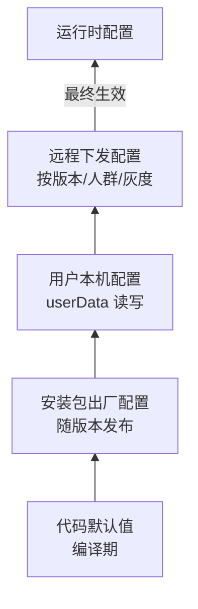

# 配置系统

> **一句话本质**：桌面应用的配置是四层金字塔——代码内默认值 → 安装包出厂配置 → 用户本机配置 → 远程下发配置，逐层覆盖、逐层可回滚；配置系统的全部设计问题都是「层与层怎么合并、什么时候生效、坏了怎么回退」。

读完本章你会获得：四层配置模型、原子化读写封装、环境分流机制、远程开关（feature flag）与灰度桶设计，以及「客户端版 GPU 规则引擎」这一进阶形态——它是存量应用无法升级时的自救通道。

## 心智模型：四层配置金字塔



| 层 | 存放 | 谁写 | 生命周期 |
|---|---|---|---|
| 代码默认值 | 源码常量 | 开发 | 随代码 |
| 出厂配置 | 安装包内只读文件（如 `config.json`） | 发布流水线 | 随版本 |
| 用户配置 | `userData` 下（JSON/DB） | 应用运行时 | 跨版本保留 |
| 远程配置 | 服务端 + 本地缓存 | 运营/后端 | 实时性最高 |

## 一、双轨读写：出厂配置 + 用户覆盖

生产验证的基线设计——**安装目录只读、用户目录覆盖**：

```js
// services/config.js（主进程）
const defaults = require('./defaults.json')          // 层 1：代码默认值
const factory = readJsonSafe(path.join(process.resourcesPath, 'config.json')) // 层 2：出厂配置
const userFile = path.join(app.getPath('userData'), 'settings.json')          // 层 3：用户配置

function readJsonSafe(file) {
  try { return JSON.parse(fs.readFileSync(file, 'utf8')) } catch { return {} }
}

const settings = { ...defaults, ...factory, ...readJsonSafe(userFile) }  // 后层覆盖前层

function set(key, value) {
  settings[key] = value
  atomicWrite(userFile, JSON.stringify(settings, null, 2))   // 原子写，见下节
}
```

升级不丢配置、卸载重装可复位到出厂——这是「双轨」的全部意义。

### 原子写：配置文件永远不写坏

```js
function atomicWrite(file, content) {
  const tmp = `${file}.${process.pid}.tmp`
  fs.writeFileSync(tmp, content)   // 先写临时文件
  fs.renameSync(tmp, file)         // rename 原子替换——中途断电只会留下完整旧文件或完整新文件
}
```

::: pitfall 坑位警报
直接 `writeFileSync(file, ...)` 写配置：进程在写入中途崩溃/断电，留下半个 JSON——下次启动解析失败，用户全部设置丢失。所有用户态持久化（配置/状态/缓存索引）都必须走「临时文件 + rename」原子写。读取侧同样要防御：解析失败回退默认值而不是崩溃（上面的 `readJsonSafe`）。
:::

## 二、渲染层读写：桥接而非直读

配置属于主进程管辖（跨窗口一致、崩溃后完整），渲染层通过 IPC 读写。两种成熟模式：

```js
// 模式 A：显式 get/set（低频配置）
ipcMain.handle('config:get', (_e, key) => settings[key])
ipcMain.handle('config:set', (_e, key, val) => set(key, val))

// 模式 B：共享对象 Proxy（写自动同步，见 IPC 章「跨进程共享对象」）
// 主进程 set 时向所有窗口广播 store:changed —— 适合需要「改了立刻全局生效」的配置
```

高频读取的配置（如初始路由、渠道号）走 **启动参数直传**（`additionalArguments`），避免渲染层启动早期的 IPC 时序问题。

## 三、环境分流：一套代码四个环境

dev / test / staging / prod 四环境的差异项全部集中到一张环境表，禁止散落判断：

```js
// env.js —— 环境的唯一事实源
const ENV = {
  dev:    { api: 'http://localhost:3000', dsn: '',        channel: 'dev' },
  test:   { api: 'https://test-api.example.com', dsn: TEST_DSN,    channel: 'test' },
  staging:{ api: 'https://pre-api.example.com',  dsn: STAGING_DSN, channel: 'pre' },
  prod:   { api: 'https://api.example.com',      dsn: PROD_DSN,    channel: 'stable' },
}
const current = ENV[process.env.NODE_ENV === 'production' ? (app.isPackaged ? 'prod' : 'dev') : 'dev']
```

配套纪律：

- **监控上报分流**：test 环境必须用独立 DSN/project——测试流量污染生产告警是真实团队每周都在发生的事故；
- **环境标识可被覆盖但仅限调试包**：命令行 `--env=test` 注入（生产包校验签名后才允许覆盖）；
- 打包产物按环境独立命名（`app_test_latest.exe`），见 [CI/CD 章](/part3-engineering/22-cicd)。

::: exp 实战经验
环境表里最常见的漏项是「更新通道」和「监控上报」——团队记得分流 API，却让测试环境的崩溃全进了生产 Sentry project，一次回归测试能把真实用户的关键告警淹没。环境表的验收标准：任何一项环境差异都能在这张表里找到，全仓 `grep` 不到第二个环境判断入口。
:::

## 四、远程配置：拉取、缓存与生效时机

第四层「远程下发」解决的是**不改代码改变行为**：功能开关、运营文案、降级策略。

```js
// 启动时序（生产验证的模式）：
// 1. 冷启动先读本地缓存 → 立即生效（0 网络延迟）
// 2. 异步拉取远端新配置 → 写缓存 → 为「下一次启动」或「实时推送」生效
async function initRemoteConfig() {
  Object.assign(settings, readJsonSafe(remoteCacheFile))       // 先用缓存
  try {
    const fresh = await fetch(`${current.api}/config?ver=${app.getVersion()}`, {
      headers: { 'x-channel': current.channel }, timeout: 3000,
    }).then(r => r.json())
    atomicWrite(remoteCacheFile, JSON.stringify(fresh))         // 拉新成功才覆盖缓存
    applyRuntime(fresh)                                          // 支持热生效的项立即应用
  } catch { /* 网络失败静默降级：继续用缓存，绝不阻塞启动 */ }
}
```

三个不可妥协的设计点：

1. **拉取超时 + 静默失败**——远程配置服务挂了，应用必须照常启动；
2. **缓存先写后用**——拉到不完整数据不落盘；
3. **配置 schema 版本化**——服务端下发带 `schemaVersion`，客户端不认识的版本丢弃，防止新配置格式打崩老客户端。

## 五、灰度桶：同一个人永远在同一桶

按百分比放量新功能时，最差的做法是纯随机——用户每次启动进不同的桶，功能忽有忽无。正确做法是**稳定哈希分桶**：

```js
function bucket(userId, machineId) {
  const seed = userId || machineId          // 未登录用机器标识兜底
  let h = 0
  for (const ch of String(seed)) h = (h * 31 + ch.charCodeAt(0)) >>> 0
  return h % 100                            // 0~99 的稳定桶号
}
// 服务端配置：{ feature: { rollout: 30 } } → 桶号 < 30 的用户开启
```

同一用户（或同一台机器）每次计算的桶号一致——灰度体验稳定，问题排查时也能按桶号聚类。

## 六、进阶形态：客户端版「规则引擎」

远程开关的最高形态：**把开关做成带条件的规则系统**。这是真实生产客户端从大量线上事故中长出来的架构（应对场景：Electron/Chromium 版本锁死，新硬件/新驱动上的渲染 bug 无法靠升级解决）：

```js
// 远程下发的规则（运营平台配置）：
const rules = [{
  key: 'disable-mpo-overlay',                    // 规则名
  conditions: {                                  // 全部满足才命中
    gpuVendorId: '0x8086',                       // 显卡厂商
    gpuDriverVersion: '< 31.0.101.2115',         // 驱动版本区间
    osVersion: '>= 10.0.19000',
    grayBucket: [0, 9],                          // 先 10% 灰度
  },
  action: 'appendSwitch',                        // 命中后执行的动作
  args: ['disable-direct-composition-video-overlays'],
}]
```

```js
// 主进程执行：app ready 前同步应用
for (const r of cachedRules) {
  if (matchAll(r.conditions, systemInfo)) applyAction(r)
}
// 系统信息：app.getGPUFeatureStatus / getGPUInfo 的 vendorId、deviceId、驱动版本 + os.release()
```

五条生产纪律（每条都对应真实教训）：

1. **冷启动同步读缓存立即生效**——规则影响渲染开关，必须在第一个窗口创建前应用；异步拉新规则「为下一次启动做准备」；
2. **四类异常全静默降级**——缓存读失败/条件匹配出错/开关注入出错/远端拉取失败，任何一环异常都不能影响启动；
3. **崩溃联动回滚**——GPU 进程崩溃事件里自动清空 GPU 类规则（防错误规则循环崩溃），见[监控章](/part3-engineering/23-observability)；
4. **规则可按用户/机器精准下发**——排查阶段给单个用户开规则，验证后再放量；
5. **数据驱动测试**——条件求值引擎是纯函数，用例全部放 fixtures JSON（见[测试章](/part3-engineering/17-testing)），参考 Chromium GPU Control List 的真实用例组织。

::: exp 实战经验
这套机制的本质是**把 Chromium 官方 gpu_control_list 的思想搬到应用层**——官方列表解决「已知硬件 + 已知版本」的组合问题，应用层规则引擎解决「锁死版本 + 不断上市的新硬件」。它让「不能升级 Electron」从死局变成可运营的问题：线上渲染事故的止损时间从「发版 3 天」缩短到「下发规则 5 分钟」。
:::

## 延伸阅读

- [app.getPath](https://www.electronjs.org/docs/latest/api/app) —— userData 与资源目录
- [app.getGPUFeatureStatus / getGPUInfo](https://www.electronjs.org/docs/latest/api/app) —— 规则条件的系统信息来源
- [app.commandLine](https://www.electronjs.org/docs/latest/api/command-line) —— 规则动作的执行载体
- [Chromium GPU Control List 设计](https://chromium.googlesource.com/chromium/src/+/main/docs/gpu/software_rendering_list.md) —— 规则引擎的思想源头
- [LaunchDarkly feature flag 概念](https://docs.launchdarkly.com/sdk/concepts/flags)（商业参照，理解 flag 生命周期）
