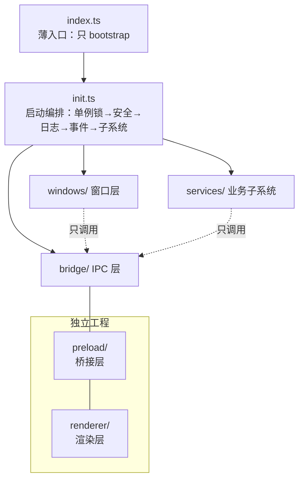

# 工程脚手架

> **一句话本质**：脚手架的价值不是「生成一堆文件」，而是**提前把结构性决策定死**——目录即架构、入口即边界、构建即契约。之后每个功能都长在既定骨架上，而不是每个需求都重新发明一次结构。

读完本章你会获得：一套中大型项目可直接套用的主进程/渲染层分离目录结构（含逐目录理由）、一张按决策维度组织的技术选型表、dev 模式下「主进程热重启 + 渲染层 HMR」共存的最小方案、三环境变量注入与防泄露纪律，以及 VS Code 三配置调试。这是第二部分的开篇——第一部分讲清了进程模型与安全边界，从本章起开始动手：拿到需求后，怎么把工程立起来。

## 心智模型：一薄一专三层

把一个 Electron 应用主仓拆开看，是「一个薄入口 + 一个编排中枢 + 三个互不横穿的模块层」，外加两个独立成工程的特殊产物：



| 层 | 职责 | 禁止事项 |
| --- | --- | --- |
| 入口 `index.ts` | 引导启动 | 出现任何业务逻辑 |
| 编排 `init.ts` | 启动顺序、生命周期接线 | 出现任何窗口/IPC 细节实现 |
| `windows/` | 窗口的创建与生命周期 | 直接操作业务数据 |
| `bridge/` | IPC 通道注册与转发 | 写业务规则 |
| `services/` | 更新、配置、日志等子系统 | 持有窗口引用细节 |
| `preload/` 独立工程 | 白名单桥接 API | 透传 `ipcRenderer` |
| `renderer/` 独立工程 | 全部 UI | 感知主进程实现 |

两条依赖纪律：**箭头单向**（上层调下层，`services` 与 `windows` 互不引用，需要对话时经 `bridge` 或事件）；**副作用集中**（所有「启动时做点什么」都收进 `init.ts`，模块自身只导出可被调用的能力）。

## 生产级目录结构

```text
app/
├── src/                      # 主进程源码
│   ├── index.ts              # 入口：只做 bootstrap，逻辑全在 init
│   ├── init.ts               # 启动编排：单例锁→安全策略→日志→事件→拉起子系统
│   ├── windows/              # 窗口模块：每窗口一个文件 + 注册表
│   │   ├── win.ts            # 抽象基类：统一创建/销毁/守卫（见多窗口章）
│   │   ├── main.ts           # 主窗口
│   │   ├── loading.ts        # 启动窗口
│   │   └── wins.ts           # 命名注册表：单例 map，全进程唯一取窗口入口
│   ├── bridge/               # IPC 层：通道定义 + handler 按域分组
│   ├── services/             # 业务子系统：更新/配置/日志/监控，各自一个目录
│   ├── utils/
│   └── constants/events.ts   # IPC 通道常量枚举（域前缀命名，见 IPC 章）
├── preload/                  # 独立的 preload 工程（有自己的 tsconfig 与构建产物）
├── renderer/                 # 渲染层工程（可独立仓库、独立 asar 产物）
├── scripts/                  # 构建/打包辅助脚本
└── resources/                # 静态资源：图标、原生库、预置文件
```

### 入口薄：index.ts 只做一件事

```ts
// src/index.ts —— 全文件就这几行，五年后它也不该长
import { init } from './init'

init()
```

为什么值得单独一节：入口是全项目最常被「顺手加两行」的地方——加个环境变量打印、补个 try/catch、塞个临时 hack。入口一旦发胖，「谁在什么时候初始化了什么」就再也说不清了。把入口缩到一个函数调用，等于把这个问题永久锁死：**想在启动时做事，只能去 `init.ts`，于是所有启动副作用集中可见**。

### 启动编排：init.ts 定顺序

```ts
// src/init.ts
import { app } from 'electron'

export async function init(): Promise<void> {
  // 1. 单例锁：抢不到说明已有实例，立刻退出，任何初始化都别做
  if (!app.requestSingleInstanceLock()) {
    app.quit()
    return
  }

  // 2. 安全策略与进程级开关：在第一个窗口出现前生效
  app.setAppUserModelId('com.example.app')   // Windows 通知栏归属
  // 渲染层默认值自 Electron 20 起即为 sandbox + contextIsolation，
  // 这里只显式声明兜底，不逐窗口散落配置

  // 3. 日志与崩溃上报：必须是「第三顺位」——晚于退出判断，早于一切可能出错的代码
  //    更早的 1、2 步若崩溃，只能靠系统日志；从第 3 步起崩了都有案可查

  // 4. 顶层事件注册：window-all-closed、second-instance、渲染进程崩溃处理
  app.on('window-all-closed', () => process.platform !== 'darwin' && app.quit())
  app.on('second-instance', () => {/* 聚焦已有主窗口 */})

  // 5. ready 之后拉起各子系统，再开窗口
  await app.whenReady()
  // await Promise.all([initLogger(), initUpdater(), initConfig()])
  // registerBridgeHandlers()
  // wins.open('loading')  →  预加载完成后再切主窗口
}
```

顺序本身是需求：单例锁抢在一切之前（第二个实例连日志都不必写）；日志与崩溃上报必须在第一个窗口创建前就绪（窗口初始化正是崩溃高发区）；子系统在 `ready` 后、开窗前完成注册。把这条顺序写在一个文件里，评审启动问题时就只需要读一个文件。

### 通道常量集中：constants/events.ts

```ts
// src/constants/events.ts —— 全项目 IPC 通道唯一登记处
export const IPC = {
  FsChooseFile: 'fs:chooseFile',
  WinMinimizeSelf: 'win:minimizeSelf',
  UpdaterProgress: 'updater:progress',
} as const
```

通道名是主进程与渲染层共享的「协议字面量」，散落在各文件里等于协议无登记处。集中在常量枚举（域前缀命名的理由见 [IPC 通信体系](/part2-core/09-ipc)），preload 工程通过相对路径或共享包引用同一份定义，两端永不各写一份字符串。

### 为什么 preload 与 renderer 要独立成工程

`preload/` 和 `renderer/` 各有自己的 `tsconfig` 与构建产物，不只是「文件夹分类」，而是交付策略的伏笔：

- **preload 跟主进程走**：它运行在渲染进程里，但安全身份属于主进程一侧（白名单的定义者）。它的变更意味着安全边界变更，应该与主进程同节奏构建、同节奏发版。
- **renderer 可以独立产物**：当渲染层被打成独立的 `renderer.asar`（与主进程产物分离安装），UI 侧 bug 修复就能不重装整包地下发——这正是[自动更新与热修复](/part3-engineering/21-releases-updates)中「渲染层热更新」层的落地前提。目录上不分家，产物上就永远分不了家。

工程立起来的第一天就把这个分离留好，后面就只是「启用」；反之，等主渲染耦合定型再拆，等于重写。

## 技术栈决策：维度，不是答案

| 决策点 | 候选 | 关键维度 | 倾向 |
| --- | --- | --- | --- |
| 语言 | TS / JS | 主进程代码的错误大多在「运行很久之后」才爆发（窗口销毁后调用、时序竞争），类型是唯一便宜的防线 | 主进程必须 TS；渲染层跟随团队 |
| 主进程构建 | tsc 增量 / esbuild / 打包器 | 主进程没有 HMR 需求，编译量小，**可调试性优先于速度** | `tsc -b --watch` 起步，够用就不换 |
| 渲染层构建 | Vite / 其他 | HMR 体验、生态 | Vite |
| 仓库形态 | 单仓 / pnpm workspace | 是否多端复用渲染层（同构 Web 版）、是否要共享类型包给独立 preload 工程 | 有任一需求即上 workspace，否则单仓 |
| 状态管理 | 渲染层库 / 主进程也用 | 状态管理库解决的是「视图响应式」，主进程没有视图 | 渲染层随意；**主进程只用模块级单例 + 事件** |
| 模块体系 | CJS / ESM | Electron 28+ 起主进程支持 ESM，但生态中的原生模块、老工具链仍以 CJS 假设为主 | 新项目定死一个，全链路统一（见下方实战经验） |

这张表的用法是「拿维度去套你的项目」，而不是抄倾向列——倾向只是无额外信息时的缺省值。

## 引入前端框架：Vue / React 与 Electron 的组合模式

渲染层就是一个普通 Web 页面——Vue/React 的接入与纯 Web 项目完全一致（Vite 脚手架 + 框架插件），差异只在与主进程的三处交界：

```text
1. 构建产物入口：渲染层 build 出 index.html + assets → 主进程 loadFile/loadURL 加载
2. Electron API 访问：一律经 preload 桥（window.xxx），框架代码不感知 electron 模块
3. 类型共享：preload 暴露 API 的 .d.ts 是渲染层 TS 项目的依赖（桥的类型契约）
```

```ts
// Vue 3 组合式 API 里的标准访问模式（React 同理用 hook 包一层）
// renderer/src/api.ts —— 框架无关的桥访问层
export const desktop = window.api ?? null   // 纯浏览器环境下降级（同构代码跑双端）

// 组件里
const save = async () => {
  if (desktop?.chooseFile) await desktop.chooseFile()
  else fallbackWebDownload()                // 能力位探测：见 SDK 集成章
}
```

组合形态决策表：

| 形态 | 适用 | 要点 |
|---|---|---|
| 单仓库（主进程 + 渲染层同仓） | 中小项目 | 一个 Vite 配置双 target（main 用 lib 模式，renderer 用 app 模式） |
| 双工程 / pnpm workspace | 渲染层要独立热更新（asar 热更前提） | 渲染层产物独立成包，见[更新章](/part3-engineering/21-releases-updates) |
| 远程加载（壳 + Web 站点） | Web 与桌面共享一套业务 | 能力位契约探测 + 分区存储，见[SDK 集成](/part4-advanced/25-sdk-integration) |

::: pitfall 坑位警报
框架路由（vue-router/react-router）用 history 模式时，`loadFile` 加载本地文件会 404——要么 hash 模式，要么自定义协议（`app://`）+ `protocol.handle` 映射，见[系统能力章](/part2-core/11-system)。框架的 HMR websocket 与 Electron 的 CSP 策略冲突时，开发环境要给 CSP 加 `ws://localhost:*` 白名单。
:::

## 开发工作流

### 双层热更新：主进程热重启 + 渲染层 HMR

dev 模式的核心矛盾：渲染层想要 HMR（毫秒级、不丢状态），主进程只能整体重启（进程重启，必然关窗重开）。两者共存的最小方案是**各管各的**：

```json
// package.json（scripts 节选）
{
  "scripts": {
    "dev": "run-p dev:renderer dev:main",
    "dev:renderer": "vite",
    "dev:main": "node scripts/watch-main.mjs",
    "build:main": "tsc -p tsconfig.main.json",
    "build:preload": "tsc -p tsconfig.preload.json"
  }
}
```

```js
// scripts/watch-main.mjs —— 20 行内实现「编译完成才启动，变更后重启」
import { spawn } from 'node:child_process'

let electron = null
const start = () => {
  if (electron) electron.kill()          // 主进程热重启：旧进程退出，窗口随之关闭
  electron = spawn('electron', ['.'], {
    stdio: 'inherit',
    env: { ...process.env, VITE_DEV_SERVER_URL: 'http://localhost:5173' }
  })
}

// 主进程加载逻辑：开发态直接加载 dev server（HMR 生效），生产态加载打包文件
// const url = process.env.VITE_DEV_SERVER_URL
// url ? win.loadURL(url) : win.loadFile(join(__dirname, '../renderer/index.html'))
```

思路拆开就三步：`tsc --watch`（或 esbuild watch）编译主进程；首次编译完成再启动 Electron（避免启动时产物还是旧的）；监听到产物变更就杀掉 Electron 进程重启。渲染层的 HMR 由 Vite dev server 自己完成，主进程只负责加载 dev server URL。不值得为此引入重型封装——两个 watch 进程 + 一个环境变量，就是这个方案的全部。

### 环境变量：三环境注入与防泄露

dev / test / prod 三环境，变量要在两个世界流转：

**主进程侧**（运行时读取）：`.env.development` / `.env.test` / `.env.production` 不进 git（`.env.example` 进 git 记录字段名），按 `NODE_ENV` 加载对应文件。

**渲染层侧**（构建时注入）：渲染层没有 `process.env`，Vite 用 `import.meta.env.VITE_*` 在构建期替换。运行时才确定的变量（后端地址按环境切换），由主进程经 `additionalArguments` 传入（用法见 [IPC 通信体系](/part2-core/09-ipc)）。

```text
# .env.example —— 只有键名与格式说明，没有值
UPDATE_SERVER_URL=
SENTRY_DSN=
```

防泄露三条纪律：**凡是带 `VITE_` 前缀的都会进渲染层 bundle**，密钥类（服务端 token、签名密钥）永远不给这个前缀，它们只活在主进程或后端；`.env*` 全部进 `.gitignore`；打包产物发布前 grep 一遍 `dist/` 里的敏感键名——构建期的泄露无法靠运行时权限补救。

### VS Code 调试三配置

```json
// .vscode/launch.json
{
  "version": "0.2.0",
  "configurations": [
    {
      "name": "Main",
      "type": "node",
      "request": "launch",
      "runtimeExecutable": "${workspaceFolder}/node_modules/.bin/electron",
      "runtimeArgs": ["."],
      "env": { "VITE_DEV_SERVER_URL": "http://localhost:5173" }
    },
    {
      "name": "Renderer",
      "type": "chrome",
      "request": "attach",
      "port": 9222,
      "webRoot": "${workspaceFolder}/renderer/src"
    }
  ],
  "compounds": [
    { "name": "Both", "configurations": ["Main", "Renderer"] }
  ]
}
```

`Main` 断点直接落在 TS 源码（source map）；`Renderer` 需要 Electron 以 `--remote-debugging-port=9222` 启动后 attach；日常用 `Both` 一键双端。F5 之外不再需要「加 console.log 再编译」这种原始调试。主进程与渲染层的完整调试体系（DevTools、崩溃定位、日志）见第五部分调试章节。

## 实战经验：两条用伤换来的规则

::: exp 实战经验
**主进程的模块体系，从第一行代码就定死一个。** Electron 28+ 的主进程已支持 ESM，理论上可以 `import`，但实践中真正的成本来自「混」：依赖的原生模块还在 `require`、构建工具按 CJS 假设生成产物、动态加载的补丁脚本按另一种体系书写——任何一处不一致都是运行时才爆的 `ERR_REQUIRE_ESM` 或 `require is not defined`。决策原则只有一条：**全链路（主进程、preload、scripts、动态加载物）统一到同一体系，并把 `"type"` 明确写进 package.json**。新项目无历史包袱，选定后用 lint 规则禁止另一体系的写法混入。
:::

::: exp 实战经验
**启动编排集中在一个 init 文件，是主进程可控性的分水岭。** 分散在各模块顶层的副作用初始化（import 即执行）是失控之源：初始化顺序取决于 import 顺序，重构一次排序就变一次。三条铁律——**单例锁、崩溃上报、日志**——必须排在任何窗口创建之前就绪：第二实例判断晚了会双开窗口；上报晚了，最早的崩溃（恰恰是启动崩溃）无迹可寻。把顺序显式写在一个文件里，新子系统接入就是加一行，谁先谁后一眼可查。
:::

## 坑位警报

::: pitfall 坑位警报
两个高发于「开发环境一切正常、打包后才爆发」的坑：

1. **`process.cwd()` 打包后不可用。** 开发时 cwd 是项目根目录，路径拼接恰好能跑；打包后从桌面/开始菜单启动，cwd 会指向系统目录（Windows 常见 `C:\Windows\System32`），所有基于 `cwd` 的相对路径全部落空，表现为「资源找不到」而非报错崩溃。规则：资源定位永远用 `__dirname`（CJS）或 `import.meta.dirname`（ESM）做锚点，打包后落在 `resources/` 下的外部资源用 `process.resourcesPath` 解析。
2. **dev 依赖打进生产包的体积事故。** 打包器默认应只收运行时依赖，但一份 `files: ["**/*"]` 的「图省事」配置会把 `node_modules` 整目录收进安装包——构建工具、类型定义、测试框架全部入包，几十上百 MB 的膨胀就这么来的，而且不报错、只在用户下载时被发现。规则：`files` 显式白名单；构建工具全部放 `devDependencies`；每次动依赖后比对一次安装包体积。
:::

## 延伸阅读

- [Boilerplates and CLIs](https://www.electronjs.org/docs/latest/tutorial/boilerplates-and-clis) —— 官方脚手架与模板清单：先看业界共识结构，再决定自建哪些部分
- [ESM in Electron](https://www.electronjs.org/docs/latest/tutorial/esm) —— 主进程/preload 的 ESM 支持边界与版本要求
- [Debugging with VS Code](https://www.electronjs.org/docs/latest/tutorial/debugging-vscode) —— 官方版主进程/渲染进程调试配置
- [Electron Forge 文档](https://www.electronforge.io/) —— 官方推荐的一体化脚手架与打包链
- [electron-builder 文档](https://www.electron.build/) —— 当需要更细的产物控制（asar 拆分、多平台矩阵）时的主流选择
