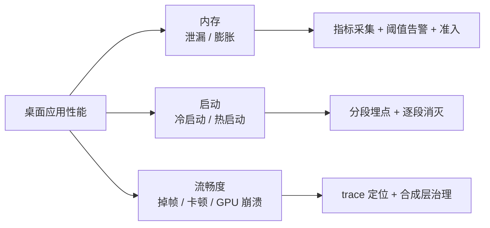

# 性能优化

> **一句话本质**：桌面应用的性能 = 内存不涨 + 启动够快 + 画面不卡——三个目标对应三套完全不同的测量与治理手段，混为一谈是性能工作失败的开始。

读完本章你会获得：多进程内存的正确口径与 API 全景、一套生产级「三支柱」内存监控体系、启动性能的拆解埋点法、GPU/合成层问题的治理工具箱（含没有官方 API 时的实战技巧），以及「后台运行」应用的降载策略。

## 心智模型：三类性能，三条战线



## 一、内存：先搞对口径

### 先懂 V8 怎么管内存：分代与 GC

Electron 里 JS 堆的涨跌全由 V8 的分代 GC 决定，排查前先建立这张图：

```text
JS 堆（v8.getHeapSpaceStatistics() 可逐区观测）
├── new space（新生代）——短命对象，Scavenger 半区复制回收，频繁且便宜
├── old space（老生代）——熬过两次回收的对象，Mark-Sweep/Mark-Compact，触发时可能出现明显停顿
├── code space / large object space —— 代码对象与超大对象（直接进老生代）
```

三个与排障直接相关的结论：

1. **rss 只涨不跌是常态**——V8 归还内存给 OS 是惰性的（GC 后内存留在进程内复用），看 `heapUsed` 而不是 rss 判断 JS 泄漏；
2. **老生代 GC 停顿是卡顿源之一**——`new v8.GCProfiler().start()` 导出的序列里，单次 Mark-Compact 超过 50ms 就值得追查（通常是老生代过大 = 对象该死没死）；
3. **堆上限可以调但别先调**——`--max-old-space-size` 是给「正常工作集真的大」的场景（大文件处理），用它掩盖泄漏只是推迟 OOM 时间。

### 多进程架构下，「应用占多少内存」怎么算

Electron 是多进程的：主进程、每窗口一个渲染进程、GPU 进程、网络服务进程各自独立。任务管理器里你看到的是**一组进程**。

关键概念——working set 的三分法：

| 口径 | 含义 | 用途 |
|---|---|---|
| **private working set** | 仅该进程独占的物理内存 | **进程内存的基准口径**：多进程间不重复计算 |
| sharable | 可共享（共享库等），别进程已驻留部分不计 | 理解「为什么两个窗口没有翻倍」 |
| shared | 实际已共享部分 | 分析总量时避免重复统计 |

::: exp 实战经验
①评估「应用总内存」用 private working set 求和——把 shared 加进去会把同一块内存数 N 次。②Windows 任务管理器显示的是 private bytes（含已换出），mac 活动监视器是 working set——跨平台对比要注明口径。③`getAppMetrics` 的返回值与任务管理器有常量级偏移（各进程十几 MB 的固定差），做「与用户实际感受对齐」的看板时先校准基准。
:::

### 内存 API 全景（按进程分层）

**Node 层（主/渲染/preload 通用）**：

```js
process.memoryUsage()
// heapUsed  JS 堆已用 —— V8 管理的对象，泄漏排查主指标
// heapTotal JS 堆总量
// rss       进程驻留物理内存 —— 含 native，只会涨很难跌（OS 惰性回收）

const v8 = require('v8')
v8.getHeapStatistics()          // 更细的堆统计
new v8.GCProfiler().start()     // GC 耗时序列化导出：分析 GC 压力
process.on('warning', w => {})  // MaxListenersExceededWarning 常是泄漏前兆
```

**主进程专属**：

```js
app.getAppMetrics()
// 返回每个进程的 ProcessMetric：
// process.type = 'Browser' | 'Renderer' | 'GPU' ...
// memory.workingSetSize / peakWorkingSetSize（KB）
// cpu.percentCPUUsage  —— CPU 火苗
// pid + creationTime   —— 注意：pid 会被 OS 复用，
//                          「pid + creationTime」才是进程唯一标识

app.getSystemMemoryInfo()
// free / total / swapTotal / swapFree
// swap 持续下降 = 系统级内存压力，别只盯自己进程
```

**渲染进程专属**：

```js
performance.memory            // usedJSHeapSize 等（需--enable-precise-memory-info 更准）
require('electron').webFrame.getResourceUsage()  // 缓存/编码缓存占用量
// Blink 层视角：document 计数、资源缓存、JS 编码缓存
```

### 三支柱监控体系

生产环境内存治理的完整架构——**常态监控 + 异常采集 + 准入预检**，三者缺一不可：

```text
支柱一 · 常态监控（知道"正常"长什么样）
  主进程每 5 分钟轮询 getAppMetrics，渲染层每 10 分钟上报自身
  → 建立基线：各进程内存 P50/P90 曲线
  → 告警只对"偏离基线"触发，而不是拍脑袋的绝对值

支柱二 · 异常采集（出事时自动拿到证据）
  事件驱动：render-process-gone 的 reason === 'oom'、
           child-process-gone、uncaughtException
  阈值驱动：主进程超警戒线（示例阈值：主 500MB / 渲染 800MB）触发
           一次 detailed 快照上报（getProcessMemoryInfo + 渲染层资源用量）

支柱三 · 准入预检（防止劣化合入）
  CI 跑 memlab 类工具：标准操作序列跑 N 轮，堆增量断言
  → 新代码引入泄漏在 MR 阶段拦截，而不是上线后
```

::: exp 实战经验
①轮询频率别太高：5 分钟粒度足够看趋势，秒级轮询本身就有 CPU 成本且数据毛刺严重。②多开识别：同一用户开多个窗口时，渲染进程数 >1，内存数据要「打标」区分单开/多开场景，否则基线互相污染。③阈值触发上报时**带上页面 URL 与操作轨迹**——数值只能告诉你「涨了」，轨迹才能告诉你「在干什么时涨的」。
:::

## 大厂内存治理参照

把三支柱放到真实标尺下看看。QQ 团队在新版桌面 QQ（Electron UI 层 + C++ NT 内核）上做过一次完整的内存专项，其公开方法论（[QQ 团队内存优化实践](https://www.cnblogs.com/imteck4713/p/17701800.html)，另见 [InfoQ 访谈](https://www.infoq.cn/article/99suibztx2be1fwvqjwg)）与本章三支柱几乎逐条对应：

**工具分析**：QQ 的代码既有 V8 的 JS、也有大量 C++ 模块，单靠 DevTools 不够——从 V8 堆、进程级到整个应用多维度拆解，先定位瓶颈再动手。Windows 上做进程级拆解的标配是 [VMMap](https://learn.microsoft.com/en-us/sysinternals/downloads/vmmap)（Sysinternals 出品）：把一个进程的内存按提交类型（镜像/堆/托管堆/栈/共享等）分解到位，配合过滤与定时刷新观察某块内存的涨落。

**定向优化**：代码瘦身与按场景分包（窗口池只预载基础代码，搜索、表情面板等功能点击时才加载）、渲染层「所见才占用」（虚拟列表把大账号 DOM 从 13000 压到 4000，图片按展示尺寸先压成缩略图再上屏）、动画缓存定量压缩（Lottie 缓存帧降采样，单个超级表情从 144MB 压到 35MB）。

**线上监控闭环**：`app.getMetrics` 等 API 采集上报（他们甚至 patch 了 Electron，让指标对齐任务管理器口径），prometheus + grafana 观测线上真实分布；再配定时 e2e 采集内存指标做防劣化门禁，劣化在合入阶段被拦下。

结果：整体内存平均约 228MB、中位数约 211MB，长时间挂机稳定在 300MB 以内——Electron 应用的内存不是「不可控」，而是需要一套工程体系去治理。

对照三支柱，三条可操作的启示：

1. **先测后优**：不拆解 private/shared、不知道大头在 JS 堆还是 native 模块，优化就是玄学——支柱一的基线就是为拆解服务的
2. **按需加载是一等公民，不是优化项**：分包、窗口池、缩略图策略在设计期就定了位，不是「以后再优化」——评审新功能时就该问「这块内存什么时候释放」
3. **线上监控是治理的闭环，不是事后补救**：本地达标只是半程，挂机一个月的长周期泄漏只有线上数据能暴露——支柱二监控 + 支柱三准入合起来才是完整防线

## 二、启动性能：分段埋点 + 逐段消灭

不测量就优化是玄学。先把冷启动切成可观测的段：

```js
// 主进程：进程创建 → ready
const t0 = process.getCreationTime()      // 进程创建时刻（ms）
app.whenReady().then(() => {
  const readyAt = Date.now() - t0         // 段1：主进程启动

  const createStart = performance.now()
  const win = new BrowserWindow({})
  // 段2：窗口创建耗时（ready-to-show 时刻 - createStart）

  win.webContents.once('did-finish-load', () => {
    // 段3：页面加载
  })
})

// 渲染层首帧可交互时上报段4；业务数据就绪为段5
// 六段法：进程启动 → ready → 窗口创建 → 页面加载 → 首帧 → 可交互
```

::: exp 实战经验
①埋点 handler 设计成「一次性」：`ipcMain.handle('getAppLoadTime', ...)` 取一次即 `removeHandler`，渲染层读完即删全局函数——防止被反复调用导致重复上报。②首屏依赖远程配置（域名探测、配置拉取、更新检查）的应用，用 **Loading 小窗 + 主窗口延迟创建**：网络决策全部前置到启动壳里，主窗口就绪即开即用，用户感知的「白屏时间」直接消失。
:::

常见优化手段按收益排序：延迟加载非首屏模块（主进程 require 是同步阻塞）、预加载关键配置缓存（冷读缓存同步、拉新异步）、窗口 `show:false` + `ready-to-show` 再显示、V8 code cache（`v8-compile-cache` 类方案）。

## 三、流畅度与 GPU：合成层治理

掉帧问题的完整分析方法论见[案例库 · GPU 崩溃五步分析法](/cases/02-gpu-crash)。本章讲治理工具箱：

```js
// 1. 验证法：怀疑 GPU 合成问题时，关硬件加速对照
app.disableHardwareAcceleration()   // 现象消失 = GPU 链路问题实锤

// 2. 让滚动动画不阻塞主线程（进合成层）
/* CSS: will-change: transform 或 transform: translateZ(0)
   长列表滚动卡顿 + 视频同屏时优先试这个 */

// 3. 长列表虚拟滚动（DOM 数量是渲染进程内存与 Layout 耗时的双重杀手）
```

::: exp 实战经验（没有官方 API 时的两个实战技巧）
**技巧一 · GPU 内存主动释放**：长挂机应用 GPU 进程内存只涨不跌，官方没有释放 API。实测有效的方法——制造一轮轻量合成任务把旧纹理「顶出去」：
```js
// 10x10 画布，把 1px 黑色 GIF 用 rAF 连画 15 帧
// 原理：驱动 LRU 淘汰不活跃纹理，实测可回收数百 MB
const c = document.createElement('canvas') /* 10x10 */
let i = 0
const draw = () => { c.getContext('2d').drawImage(blackGif, 0, 0); if (++i < 15) requestAnimationFrame(draw) }
requestAnimationFrame(draw)
```
**技巧二 · 强制重新合成**：`document.body.style.transform = 'scale(1)'` 触发整页重合成，旧合成层（常驻弹窗、轮播图累积出来的）被丢弃，idle 时恢复。配合 `webFrame.clearCache()` + 主进程 `webContents.clearCodeCache()` 是一组「页面级 GC」组合拳。
:::

### 后台运行的降载策略

默认 `backgroundThrottling` 会在窗口失焦时降计时器频率——但如果你**需要**后台持续运行（加速器、挂机工具），要关掉它换来自建精细控制：

```js
new BrowserWindow({
  webPreferences: { backgroundThrottling: false }  // 拿回控制权
})

// 失焦 500ms 后主动降载：停 GIF 动画、通知渲染层停非关键刷新
win.on('blur', () => setTimeout(() => {
  win.webContents.setImageAnimationPolicy('noAnimation')
  send(win, 'app:background', true)      // 渲染层自停动画/轮询
}, 500))
win.on('focus', () => send(win, 'app:background', false))
```

::: exp 实战经验
系统级内存回收的时机选择：窗口失焦是对进程工作集做修剪（trim working set）的最佳时机——用户主动切走了，正说明此刻不缺你。触发要节流（如 60s 一次），且任一窗口仍有焦点时跳过（游戏场景：用户全屏游戏中，好友列表窗口失焦回收自己，别动主程序）。Windows 上可用系统 API 对各子进程做 SetProcessWorkingSetSize 类修剪。
:::

## OOM 的最后一道防线：降配重建

低配机器上渲染进程 V8 堆分配失败是必现问题（默认堆上限约 4GB 的 32 位场景更早爆）。与其崩溃，不如降档重建：

```js
// 建窗口时预设堆上限
new BrowserWindow({
  webPreferences: { additionalArguments: ['--max-old-space-size=2048'] }
})

// 渲染进程 OOM 崩溃回调里（render-process-gone, reason 'oom'）：
// 用更小的堆（-512MB）重建窗口 → 销毁旧窗 → 上报
// 阶梯：2048 → 1536 → 1024，低于 1024 不再拦截（避免无限循环）
```

完整的崩溃恢复决策树见[监控章节](/part3-engineering/23-observability)。

## 延伸阅读

- [Performance 官方指南](https://www.electronjs.org/docs/latest/tutorial/performance)
- [app.getAppMetrics](https://www.electronjs.org/docs/latest/api/app) / [process-metric 结构](https://www.electronjs.org/docs/latest/api/structures/process-metric)
- [Chromium 内存.infra 文档](https://chromium.googlesource.com/chromium/src/+/main/docs/memory_infra.md) —— trace 内存快照的权威解读
- [Perfetto](https://ui.perfetto.dev/) —— trace 分析
- [memlab](https://facebook.github.io/memlab/)（Meta 开源）—— JS 堆泄漏自动化检测
