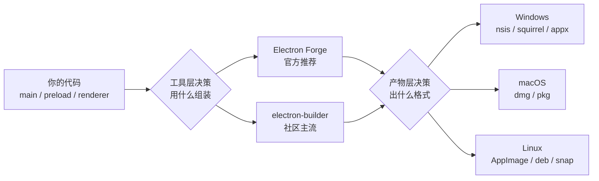

# 打包与分发

> **一句话本质**：打包 = 把「Electron 运行时（约 200MB）+ 你的代码（几 MB）」组装成各平台安装包——「用什么工具」和「出什么产物」是两个正交决策，别混在一起选。

读完本章你会获得：两大打包工具（Electron Forge / electron-builder）的选型判断与最小配置、asar 的正确认知（它是什么、不是什么、什么时候要 unpack）、多平台产物格式矩阵，以及体积优化与路径基准的实战要点。

## 心智模型：两个正交决策



工具选型对比：

| 维度 | Electron Forge | electron-builder |
|---|---|---|
| 官方支持 | Electron 官方维护，文档进主站教程 | 社区维护（electron-userland） |
| 配置复杂度 | 低，约定优于配置，开箱即用 | 中，单文件集中配置，粒度更细 |
| 多目标产物 | maker 体系，一个 maker 一种格式 | 一份配置出全平台全格式 |
| 自动更新集成 | 内置 Squirrel，update.electronjs.org 开箱用 | 内置 electron-updater，支持 generic/S3/GitHub 等多源 |
| 签名集成 | 官方签名链（windowsSign / macOS notarize） | afterSign 钩子 + 各平台 sign 配置 |
| 增量更新可定制性 | 钩子较少，需自行扩展 | afterPack 等钩子丰富，便于注入自定义产物处理 |
| 生态 | 官方模板、CLI 体验统一 | 国内客户端、大量商业软件实战积累 |

**选型建议**：个人项目、开源工具、想紧跟官方最佳实践 → Forge；需要精细控制产物形态（多渠道安装包、增量更新、自定义 NSIS 行为）→ electron-builder。两者都底层调用 `@electron/packager` 做资源组装，核心产物结构一致，切换成本没有想象中大。

## 工具一：Electron Forge 最小配置

```js
// forge.config.js —— 最小可用配置
module.exports = {
  // packagerConfig 对应底层 @electron/packager 的选项
  packagerConfig: {
    asar: true,               // 默认开启 asar 归档（见下文专节）
    executableName: 'myapp'   // 生成可执行文件名
  },
  // makers 决定最终安装包格式：一个 maker = 一种产物
  makers: [
    {
      name: '@electron-forge/maker-squirrel',  // Windows：Squirrel 安装器
      config: { name: 'myapp' }
    },
    {
      name: '@electron-forge/maker-nsis',      // Windows：NSIS 安装器（Forge 7+）
      config: { oneClick: false }              // 关闭一键安装，允许选目录
    },
    {
      name: '@electron-forge/maker-dmg',       // macOS：dmg 磁盘镜像
      config: {}
    },
    {
      name: '@electron-forge/maker-deb',       // Linux：deb 包
      config: { options: { maintainer: 'you@example.com' } }
    }
  ]
}
```

执行 `npx electron-forge make`，Forge 会先用 packager 生成平台目录（`out/myapp-win32-x64/`），再逐个跑 maker 出安装包。

官方教程：[Forge 概览](https://www.electronjs.org/docs/latest/tutorial/forge-overview)。

## 工具二：electron-builder 最小配置

```yaml
# electron-builder.yml —— 一份配置覆盖三平台
appId: com.example.myapp        # 应用唯一标识（反向域名），更新与签名都以它为准
productName: MyApp              # 用户可见的安装名
directories:
  output: dist                  # 产物输出目录

files:                          # 进入 app.asar 的内容（相对项目根）
  - package.json
  - main/**
  - preload/**
  - renderer/**
asar: true
asarUnpack:                     # 必须以真实文件形态存在的资源
  - '**/*.node'                 # 原生模块（加载时需要真实文件路径）

extraResources:                 # 不进 asar，落到 resources/ 目录
  - from: build/bin             # 构建期原生工具（转码、加速等外部可执行文件）
    to: bin                     # 运行时用 process.resourcesPath + '/bin' 访问

win:
  target: nsis                  # Windows 出 NSIS 安装器
nsis:
  oneClick: false               # 非一键安装：允许改目录
  allowToChangeInstallationDirectory: true
  artifactName: ${productName}-${version}-${arch}-setup.${ext}

mac:
  target: dmg
  category: public.app-category.productivity

linux:
  target: [AppImage, deb]
```

执行 `npx electron-builder --win --mac --linux` 即按配置出包。配置全量字段见 [electron-builder 配置文档](https://www.electron.build/configuration)。

## asar 专节：它不是加密

**是什么**：asar 把成百上千个散文件合并成单个归档文件 `app.asar`。Electron 的文件系统模块内置了对 asar 的支持——`fs.readFile`、`require` 读 asar 内的文件时无需解压，像读普通目录一样。收益有三：文件数量骤减（Windows 上大量小文件的 IO 与目录遍历开销很可观）、规避超长路径、应用目录结构干净。

**不是什么**：asar **不是加密，更不是版权保护**。它是公开的归档格式，一行命令即可完整解包出你的全部源码：

```bash
# 解包任何 Electron 应用的 asar（用来检查自己的产物结构也非常有用）
npx @electron/asar extract app.asar ./source-out
```

::: pitfall
把 asar 当防逆向手段是常见误判。它连「提高逆向成本」都算不上——解包工具是官方提供的。真正的防线是：敏感逻辑放服务端、密钥不落客户端、关键校验在主进程且配合签名完整性校验（见[签名与公证](/part3-engineering/20-signing)）。
:::

**asarUnpack 的场景**：`.node` 原生模块必须解包（动态加载器要真实文件路径）；需要被外部进程或子进程直接访问的文件（ffmpeg 等可执行文件、需要在文件系统上以独立文件存在的配置模板）。electron-builder 默认就把 `**/*.node` 解包；Forge 在 packagerConfig 里配置同义选项。

## 多平台产物矩阵

| 平台 | 格式 | 适合场景 | 备注 |
|---|---|---|---|
| Windows | NSIS | 通用首选 | 安装向导可精调，支持静默安装参数（企业批量部署） |
| Windows | Squirrel | 自动更新体验优先 | 无安装向导，后台静默升级 |
| Windows | Appx / MSIX | 微软商店分发 | 沙箱权限模型，需商店审核 |
| macOS | DMG | 通用首选 | 拖入 Applications 的标准分发形态 |
| macOS | PKG | 需管理员权限的安装器 | 系统级组件安装场景 |
| macOS | App（MAS 版） | Mac App Store | 需单独构建并过审 |
| Linux | AppImage | 通用免安装 | 单文件可执行，全发行版通用 |
| Linux | deb / rpm | 发行版包管理器 | apt / dnf 安装，适合企业内网源 |
| Linux | snap / flatpak | 沙箱化商店 | 权限模型需单独适配，坑较多 |

## 安装包体积优化

**双架构取舍（Windows）**：

| 选项 | 优势 | 代价 |
|---|---|---|
| ia32（32 位） | 兼容极老旧机器，体积略小 | 单进程内存寻址上限约 2~4GB，Chromium 是内存大户，渲染层稍重就触顶崩溃 |
| x64（64 位） | 内存上限不再是约束 | 不支持纯 32 位系统（如今已极罕见） |
| x64 + ia32 双包 | 各取所需 | 构建与分发成本翻倍 |

除非有明确的 32 位用户数据支撑，默认 x64。

**locales 裁剪**：Chromium 自带几十种语言的 locale 资源文件，绝大多数应用只用得到中英文：

```yaml
# electron-builder：只保留中英文 locale
electronLanguages: [zh-CN, en-US]
```

**运行时版本影响**：Electron 大版本升级会改变运行时体积（内置 Node / ICU / Chromium 组件变化）。升级前后各出一个包 diff 一下 `resources` 目录，避免「升级一次胖 30MB」的事故悄悄发生。

::: exp
一套在大量国内 Windows 客户端上验证过的组合：electron-builder 先出**目录产物**（不直接出安装包）+ 在 `afterPack` 钩子里做自定义处理（把版本号 / 构建信息写入文件、生成增量更新补丁）+ NSIS 脚本精调（卸载残留清理、静默安装参数、安装目录策略）——最后再出安装包。

安装包命名带足溯源信息：`MyApp_2.1.0_20260902_master_b1024_a1b2c3d.exe`（版本-日期-分支-构建号-commit 短 hash）。线上排查问题时，从用户手里的文件名就能直接反查出确切的代码版本，不用回查构建系统。
:::

::: pitfall
三个高频打包坑：

1. **extraResources 与 extraFiles 的路径基准不同**：`extraResources` 落在 resources/ 目录（用 `process.resourcesPath` 定位）；`extraFiles` 落在应用内容根（Windows 是安装目录、macOS 是 `Contents/`）。名字只差一个词，基准完全不同，混淆后运行时必然找不到文件。
2. **node_modules 的两个暗坑**：dev 依赖默认不会打进包，但 `node_modules/.bin` 下的符号链接在 Windows 打包时可能失效；含多平台二进制的包（通过可选依赖分发全平台预编译产物）会把所有平台的二进制都带进安装包，需要按平台过滤或用 afterPack 清理。
3. **Windows 长路径与中文安装目录是 NSIS 经典雷区**：默认安装路径已经不浅，用户名是中文、再叠加深层 node_modules 嵌套，很容易撞上 260 字符路径限制导致安装/运行时随机失败。提供自定义安装目录选项，并控制打包后的目录深度。
:::

## 延伸阅读

- [应用分发官方教程](https://www.electronjs.org/docs/latest/tutorial/application-distribution) —— 分发的整体视图与各平台规则
- [Electron Forge 概览](https://www.electronjs.org/docs/latest/tutorial/forge-overview) —— 官方推荐的构建工具链
- [asar 归档](https://www.electronjs.org/docs/latest/tutorial/asar-archives) —— asar 机制与 unpack 语义的权威说明
- [Electron Forge 仓库](https://github.com/electron/forge) —— maker / plugin 生态与版本路线
- [electron-builder 配置参考](https://www.electron.build/configuration) —— 全量配置字段（含 NSIS 细节见 [Windows 页](https://www.electron.build/win)）
