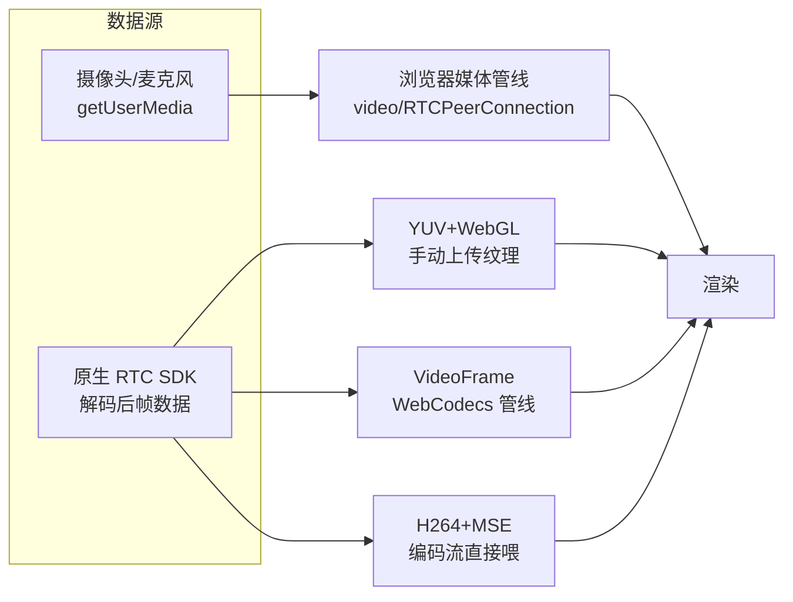

# 音视频与 RTC

> **一句话本质**：Electron 里的音视频 = 「浏览器能力（getUserMedia/WebCodecs/WebRTC）+ 原生 SDK（专业 RTC 场景）」的双轨——渲染方案的决定性问题是「帧数据从哪来、以什么形态进浏览器渲染管线、每一帧的成本是多少」。

读完本章你会获得：设备与权限的完整处理、WebRTC 在 Electron 的边界、原生 RTC SDK 的三种渲染方案对比（YUV+WebGL / VideoFrame / H264+MSE，来自高分辨率高帧率场景的生产实测）、SDK 放置与数据通路设计。

## 心智模型：帧数据的三条进窗路径



**判断树**：纯浏览器生态（会议轻量场景）→ getUserMedia + WebRTC 原生；接专业 RTC SDK（低延迟/大房间/美颜混流）→ 原生 SDK 解码，然后从三种渲染方案里选。

## 一、设备与权限：先跑通最小闭环

```js
// macOS：必须在 app 打包时声明用途（Info.plist），运行期首次弹窗
systemPreferences.askForMediaAccess('camera')   // 'camera' | 'microphone'
// Windows：无系统级弹窗，默认可用
// preload 暴露后渲染层：
const stream = await navigator.mediaDevices.getUserMedia({ video: true, audio: true })
```

设备热插拔监听：

```js
navigator.mediaDevices.addEventListener('devicechange', refreshDeviceList)
// 应用切后台/锁屏恢复后设备序号可能变化——每次使用前按 deviceId 重新枚举
```

::: pitfall 坑位警报
macOS 上没在打包配置里声明 `NSCameraUsageDescription` / `NSMicrophoneUsageDescription`，调用摄像头直接**崩溃**（不是报错）。electron-builder 的 mac 配置 `extendInfo: { NSCameraUsageDescription: '视频通话需要摄像头' }`。屏幕录制权限是另一套（无主动请求 API，见[截屏章](/part2-core/08-screenshot)）——三类权限（摄像头/麦克风/屏幕）三套处理方式，一张矩阵表贴在团队 wiki 上能省无数来回。
:::

## 二、WebRTC 原生路线：Electron 桌面端的天然优势

Electron 的渲染进程就是 Chromium——标准 WebRTC 全量可用，且比浏览器**多**两项能力：

1. `desktopCapturer` 源直接进 `getUserMedia`（浏览器被安全策略挡住的整屏/跨应用窗口采集）；
2. 无浏览器 UI 竞争（没有标签页节流，配 `backgroundThrottling: false` 后台会议不降质）。

生产要点：

```js
// 静音/取消静音：直接操作 track，避免 renegotiation
track.enabled = false        // 采集继续，发黑帧/静音帧，恢复零延迟
// 设备切换：replaceTrack，不重建 PeerConnection
sender.replaceTrack(newTrack)
```

音频回声消除在「播放自己的扬声器声音」场景要显式处理：Electron 默认音频输出不走系统通讯链路，Windows 上需要 `audio: { mandatory: { chromeMediaSource: 'desktop' } }` 采集系统声（macOS 无系统环回，需虚拟音频驱动——这是产品决策点，提前告知用户）。

## 三、原生 SDK 的三种渲染方案（生产实测对比）

接入自研/三方 RTC SDK（C++ 解码层）后，**解码后的帧怎么进浏览器**是架构核心决策。以下对比在 1080p60 / 2K 高负载场景实测（来自真实生产客户端）：

### 方案 A：YUV + WebGL（手动纹理上传）

```js
// SDK 回调给出 YUV 三平面 → WebGL shader 转 RGB 渲染
const yPlane = gl.texImage2D(gl.TEXTURE_2D, 0, gl.LUMINANCE, w, h, 0, gl.LUMINANCE, gl.UNSIGNED_BYTE, yBuffer)
// U/V 平面同理；fragment shader 做 YUV→RGB 矩阵变换
```

| 维度 | 评价 |
|---|---|
| 兼容性 | 最好——纯 WebGL，任何版本 Electron 可用 |
| 性能 | 高负载下受内存带宽约束（每帧三平面上传） |
| 控制力 | 最强——像素级可控，可叠加美颜/水印/自定义合成 |
| 成本 | 实现最重（shader、纹理管理、多路渲染管理全自己写） |

### 方案 B：VideoFrame（WebCodecs 管线）

```js
// SDK 帧 → WebCodecs VideoFrame → video 或 canvas 绘制
const frame = new VideoFrame(frameData, { format: 'I420', timestamp, codedWidth, codedHeight })
ctx.drawImage(frame, 0, 0)     // 走浏览器硬件加速绘制路径
frame.close()                    // 用完必须 close，否则 GPU 内存泄漏
```

| 维度 | 评价 |
|---|---|
| 性能 | 像素数据进入浏览器媒体管线，能吃到硬件加速与零拷贝路径 |
| 兼容性 | 依赖 Electron 的 Chromium 版本实现，**优化收益跨版本不稳定**（实测过版本升级后性能曲线变化） |
| 成本 | 中——帧生命周期管理（close 纪律）是主要心智负担 |

### 方案 C：H264 + MSE（编码流直喂）

```js
// SDK 输出 H264 编码流（不解码）→ MediaSource Extensions 喂给 <video>
const mse = new MediaSource()
videoEl.src = URL.createObjectURL(mse)
mse.addEventListener('sourceopen', () => {
  const sb = mse.addSourceBuffer('video/mp4; codecs="avc1.42E01E"')
  sb.appendBuffer(h264Chunk)     // SDK 的编码 chunk 直接进
})
```

| 维度 | 评价 |
|---|---|
| 性能 | 解码完全交给浏览器硬解管线，JS 侧成本最低 |
| 延迟 | 三者最高（MSE 有缓冲队列，秒级而非百毫秒级） |
| 稳定性 | 依赖关键帧对齐，SDK 必须配合输出合适 GOP |
| 成本 | 接入最简单（链路成熟），但延迟敏感场景不可用 |

### 选型结论

```text
会议主画面（要求延迟低 + 多路 + 自定义布局）→ YUV+WebGL
播放型场景（延迟容忍、追求省电省 CPU）      → H264+MSE
已有 WebCodecs 基础设施 / 版本可控          → VideoFrame
生产客户端的常见落地：A 为主、C 兜底（弱机降级到播放模式）
```

::: exp 实战经验
①三方案**不是互斥**而是分场景共存——生产客户端同时实现 A（互动主画面）与 C（弱机器降级/回放），按机器性能动态切换；②渲染方案的评审别只看峰值帧率——「多路并发时的总内存」「连续 8 小时的纹理增长」「版本升级后的回归」三个维度才是生产分水岭；③SDK 帧 → 渲染层的过桥方式与[截屏章](/part2-core/08-screenshot)同理：传 `ArrayBuffer` 零拷贝，不序列化成数组。
:::

## 四、SDK 放置与数据通路

RTC SDK 放哪个进程？延续[原生集成章](/part4-advanced/25-sdk-integration)的决策框架，音视频场景的特化结论：

| 职责 | 放置 | 理由 |
|---|---|---|
| 采集/编解码/网络传输 | 原生层（主进程 require 或独立进程） | CPU 密集、需要系统能力 |
| 解码帧渲染 | 渲染进程（三种方案之一） | 帧数据最终要进浏览器绘制管线 |
| 房间状态/信令事件 | 主进程 → IPC 批量下发渲染层 | JSON 可序列化，天然适合 IPC（150ms 批量，见 [IPC 章](/part2-core/09-ipc)） |

```js
// 信令与媒体分离的桥接设计：
// 事件流（进房/退房/说话者变更）→ 单通道 + 节流批量（IPC 章 throttledSender）
// 媒体流（帧数据）→ 渲染侧直连（preload 实例化渲染句柄），不过 IPC 序列化
```

::: exp 实战经验
「信令走 IPC、媒体走直连」的双通路是大流量 SDK 桥接的定式。把视频帧也塞进 ipcMain.handle 的 JSON 通道是新手最大的性能事故——每帧几 MB 的序列化直接打爆主进程事件循环（主进程阻塞 = 全应用冻结，见[进程模型](/part1-background/04-process-model)）。
:::

::: pitfall 坑位警报
音视频是 **GPU/合成层问题的高发区**：多路视频 + 滚动/动画同屏时，纹理反复重上传会引发显存暴涨与 GPU 崩溃——完整诊断走[案例库 · GPU 崩溃五步分析法](/cases/02-gpu-crash)。预防手段：视频容器 `will-change: transform` 独立合成层、多路画面虚拟化只渲染可视路数、后台路数降帧。
:::

## 五、常用配套能力

- **音量指示（说话波形）**：WebAudio `AnalyserNode` 挂在 stream 上轮询 `getByteFrequencyData`——UI 驱动用 rAF 而非 setInterval（避免与渲染节流打架）；
- **全局快捷键静音**：`globalShortcut` 注册 + 系统托盘状态联动（见[系统能力章](/part2-core/11-system)）；
- **防止息屏/休眠**：通话期间 `powerSaveBlocker.start('prevent-display-sleep')`，结束 `stop()`——忘了 stop 是「合盖不灭屏」类用户投诉的根源；
- **离屏渲染**（视频缩略图/后台预览）：见[嵌入 Web 内容章](/part2-core/14-webview)的 offscreen 一节。

## 延伸阅读

- [WebRTC 官网](https://webrtc.org/) —— 协议与浏览器实现总览
- [WebCodecs 规范](https://developer.mozilla.org/docs/Web/API/WebCodecs_API) —— VideoFrame 的标准文档
- [MediaSource Extensions](https://developer.mozilla.org/docs/Web/API/Media_Source_Extensions_API) —— MSE 编码流直喂
- [getUserMedia](https://developer.mozilla.org/docs/Web/API/MediaDevices/getUserMedia) 与 [安全上下文要求](https://developer.mozilla.org/docs/Web/Security/Secure_Contexts)
- [powerSaveBlocker](https://www.electronjs.org/docs/latest/api/power-save-blocker) —— 通话保活
