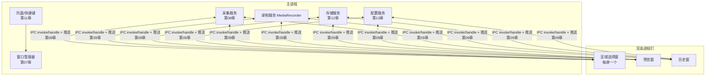

# 项目一：截屏录屏工具——从需求到发布包的完整走读

> **一句话本质**：这是前 28 章的第一次全员合练——用一个真实够用的截屏录屏工具，把窗口、IPC、截屏采集、存储、配置、快捷键、打包签名全部串成一条线。

读完本章你会得到一个可运行的产品级项目骨架：需求拆解 → 架构决策（每一步引用对应章节）→ 六轮迭代开发 → 打包发布 checklist。建议对照[用例集](/examples/)边读边搭。

## 一、需求与范围控制

```text
产品：SnapShot —— 桌面截屏录屏工具
M1  截全屏 / 截当前窗口（快捷键）→ 预览 → 复制到剪贴板 / 保存 PNG
M2  区域截屏（框选）
M3  录屏（全屏，含系统声音-仅 Windows）→ 保存 MP4（WebM）
M4  托盘常驻 + 历史记录（最近 20 条）
不做（明确出范围）：OCR、云同步、视频编辑——范围控制本身就是架构决策
```

## 二、架构设计（引用前面章节）



关键决策表（每条都是前面某章的结论落地）：

| 决策 | 选择 | 依据 |
|---|---|---|
| 窗口形态 | 托盘常驻 + 按需弹窗，无主窗口 | [11 章](/part2-core/11-system)托盘模式 |
| 区域选择 | 每显示器一个透明全屏窗 | [08 章](/part2-core/08-screenshot)区域截图骨架 |
| 截屏路径 | capturePage（自窗）/ desktopCapturer（屏幕） | [08 章](/part2-core/08-screenshot)三路径决策 |
| 录屏 | getUserMedia 桌面流 + MediaRecorder | [26 章](/part4-advanced/26-av-rtc)浏览器管线 |
| 历史记录 | 主进程 JSON + 缩略图目录 + 原子写 | [12 章](/part2-core/12-storage) |
| IPC | invoke/handle 白名单桥 | [09 章](/part2-core/09-ipc) |
| 安全基线 | 默认值全开 + 发布前 checklist | [10 章](/part2-core/10-security) |

## 三、六轮迭代

### 迭代 1：托盘 + 快捷键 + 最小截屏（跑通主链路）

```js
// main/index.ts —— 启动编排（15 章的骨架）
app.whenReady().then(() => {
  initConfig()          // 13 章：缓存先读
  initTray()            // 托盘：截图/录屏/历史/退出
  initShortcuts()       // globalShortcut: Ctrl+Shift+A 截屏
  initIpc()
})
```

```js
// 截全屏核心（08 章 desktopCapturer 路径）
async function captureScreen(displayId) {
  const sources = await desktopCapturer.getSources({
    types: ['screen'], thumbnailSize: { width: 3840, height: 2160 },
  })
  const src = sources.find(s => s.display_id === String(displayId)) ?? sources[0]
  return src.thumbnail            // NativeImage，全屏缩略图即成品
}
```

**本迭代验收**：快捷键按下 → 截图进剪贴板（`clipboard.writeImage`）。行数 ~80。

### 迭代 2：预览窗（第一次多窗口协作）

预览窗收到图片 Buffer 展示，提供「复制 / 保存 / 取消」。数据传输走 [09 章](/part2-core/09-ipc)的规则——**传 Buffer 不传 base64**：

```js
ipcMain.handle('shot:capture', async () => {
  const img = await captureScreen(screen.getCursorScreenPoint() ? focusedDisplay().id : 0)
  return img.toPNG()                       // Buffer 零成本跨进程
})
```

### 迭代 3：区域选择（多显示器 + DPI）

直接采用 [08 章](/part2-core/08-screenshot)的区域选择骨架：每屏透明全屏窗 → 框选回传 rect → 按 scaleFactor 换算裁剪。这一迭代最容易踩 DPI 坑——低分屏选区的坐标直接用到高分屏截图上会偏移，裁剪前 `rect.x *= display.scaleFactor`。

### 迭代 3.5：编辑器内核（标注工具的实现原理）

截屏工具的护城河在编辑器。以下内核设计来自生产 SDK（泛化摘录），四个组件够撑起一个完整标注工具：

**① 双层 History 栈（undo/redo 的正解）**——「一次创建」与「一次修改」分型，撤销只是移动游标：

```ts
enum HistoryItemType { Edit, Source }

// Source：创建型操作（一个矩形/一笔画笔/一个文字），自带 draw 函数
interface HistoryItemSource<S, E> {
  type: HistoryItemType.Source
  data: S                                   // 坐标/颜色/点集
  editHistory: HistoryItemEdit<E, S>[]      // 事后每次移动/缩放的增量
  draw: (ctx, action) => void               // 把自己画上 canvas
  isHit?: (ctx, action, point) => boolean   // 命中检测（选中已有图形用）
}
// Edit：修改型操作，只记位移增量 (x1,y1)→(x2,y2)，指回它的 Source
// History = { index, stack }——undo/redo = 移动 index；
// undo 到 Edit 时同步从 source.editHistory pop；重绘 = stack.slice(0, index+1).forEach(i => i.draw())
```

**② 马赛克 = 取色块平铺**（零滤镜 API 依赖）：鼠标轨迹每隔 `size` 步长取一次原图像素色，`fillRect` 画实心方块——效果等价网格化取色，且天然作为一条 Source 进 History 可撤销。

**③ 文字 = DOM 输入 + canvas 持久化双轨**：点击处挂真实 `textarea`（原生输入法体验），blur 时有内容才 push 进 History；渲染时逐行 `ctx.fillText`，`fontFamily` 取自 canvas 的 computedStyle 保证与输入框一致。

**④ 合成导出三细节**（选区原图 + 全部标注重放，一次离屏绘制）：

```ts
canvas.width = bounds.width * devicePixelRatio    // 1. 尺寸乘 DPR，retina 不糊
canvas.height = bounds.height * devicePixelRatio
ctx.setTransform(dpr, 0, 0, dpr, 0, 0)            // 标注按 DPR 缩放
ctx.imageSmoothingQuality = 'low'                 // 2. 反直觉：'high' 反而模糊（源已是目标分辨率）
const rx = image.naturalWidth / displayWidth      // 3. rx/ry 把 DIP 选区映射回源图物理像素
ctx.drawImage(image,
  bounds.x * rx, bounds.y * rx, bounds.width * rx, bounds.height * rx,  // 源：物理像素
  0, 0, bounds.width, bounds.height)                                     // 目标：选区尺寸
history.stack.slice(0, history.index + 1).forEach(i => i.type === Source && i.draw(ctx, i))
canvas.toBlob(resolve, 'image/png')
```

交互约定补充：双击 = 确认（有选区导选区、无选区导整屏）、右键 = 取消；放大镜用 100×80 小 canvas 按**原图物理像素 1:1** 画鼠标周围区域（等效放大）+ 中心点取色显示 HEX。

### 迭代 4：录屏（MediaRecorder 管线）

```js
// 渲染进程（预览窗内的隐藏录制上下文）
const stream = await navigator.mediaDevices.getUserMedia({
  audio: process.platform === 'win32'
    ? { mandatory: { chromeMediaSource: 'desktop' } }   // Windows 系统声
    : false,                                            // macOS 出范围提示
  video: { mandatory: { chromeMediaSource: 'desktop', chromeMediaSourceId, maxWidth: 3840 } },
})
const recorder = new MediaRecorder(stream, { mimeType: 'video/webm;codecs=vp9' })
recorder.start(1000)                    // 1s 一个 chunk
recorder.ondataavailable = e => chunks.push(e.data)
recorder.onstop = () => saveBlob(new Blob(chunks, { type: 'video/webm' }))
```

::: pitfall 坑位警报
三个真实坑：①**录制期间必须 `powerSaveBlocker.start('prevent-display-sleep')`**，否则系统息屏直接中断录制（[26 章](/part4-advanced/26-av-rtc)）；②录屏期间隐藏预览窗时不要销毁——`getUserMedia` 的流挂在窗口上下文，窗口销毁流即断；③MediaRecorder 的 mimeType 要按平台探测 `MediaRecorder.isTypeSupported`，VP9 不支持时降 VP8/H264。
:::

### 迭代 5：历史记录（存储 + 缩略图）

```text
userData/
├── config.json          # 13 章四层配置（快捷键、保存目录偏好）
└── shots/
    ├── 2026-09-02_14-30-05.png
    └── thumbs/2026-09-02_14-30-05.png   # 240 宽缩略图
history.json             # [{file, thumb, at, type}] 上限 20 条，原子写
```

缩略图用 `NativeImage.resize({ width: 240 })` 生成——历史窗加载缩略图列表，点击打开原文件。

### 迭代 6：打磨清单（生产化的最后一公里）

- 单实例锁（防止两个实例抢快捷键——[05 章](/part1-background/05-lifecycle)）
- 快捷键冲突处理：`globalShortcut.register` 返回 false 时引导用户改键（配置界面）
- macOS 权限引导：首次截屏检测 `getMediaAccessStatus('screen')`（[08 章](/part2-core/08-screenshot)）
- 退出清理：`will-quit` 注销全部快捷键
- 崩溃留证：`process.on('uncaughtException')` 写日志（[23 章](/part3-engineering/23-observability)最小版）

## 四、打包与发布（第 19-22 章的实操）

```yaml
# electron-builder.yml（本项目最小可用）
appId: site.zenheart.snapshot
productName: SnapShot
files: ['out/**']            # 15 章的构建产物
mac: { target: [dmg, zip], extendInfo: { NSMicrophoneUsageDescription: 录屏需要 } }
win: { target: [nsis] }
```

发布 checklist（20 章结论直接套用）：

1. mac：签名 + 公证（`notarytool`）+ stapler——不做公证用户打开即被拦
2. win：无证书也要 `signtool verify` 自查；有证书签 exe 与卸载器
3. 跑一遍 [10 章安全 checklist](/part2-core/10-security)
4. [17 章](/part3-engineering/17-testing) 的 Playwright 冒烟：启动 → 托盘存在 → 触发一次截屏（`--no-sandbox` + 测试专用快捷键注入）

## 五、复盘：这个项目教会你什么

| 你踩到的 | 它的学名 | 章节 |
|---|---|---|
| 快捷键偶尔失灵 | 全局快捷键生命周期与冲突 | 11 |
| 高分屏选区偏移 | DPI/scaleFactor 换算 | 08 |
| 录屏息屏中断 | powerSaveBlocker | 26 |
| 两个实例快捷键打架 | 单实例锁 | 05 |
| 预览窗白一瞬 | show:false + ready-to-show | 07 |

做完本项目，建议接着做[项目二](/part5-projects/30-project-multiwindow)——它补充「多窗口协作与账号隔离」这条你没有练到的线。

## 延伸阅读

- [08 章截屏](/part2-core/08-screenshot) / [26 章音视频](/part4-advanced/26-av-rtc) —— 采集 API 全量
- [MediaRecorder](https://developer.mozilla.org/docs/Web/API/MediaRecorder) / [powerSaveBlocker](https://www.electronjs.org/docs/latest/api/power-save-blocker)
- [用例集](/examples/) —— 09（窗口截图）、10（deep link）可直接复用
